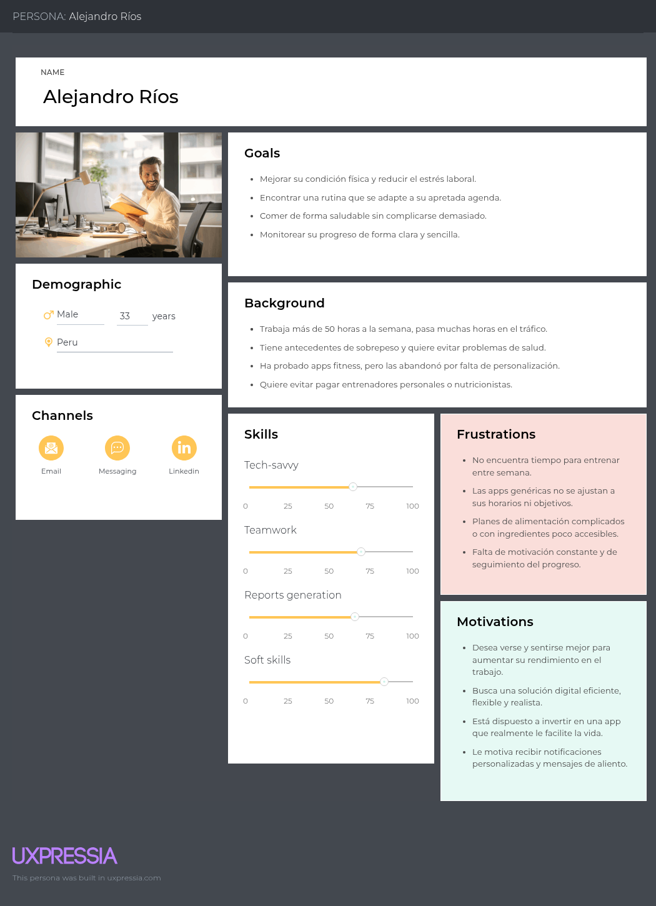
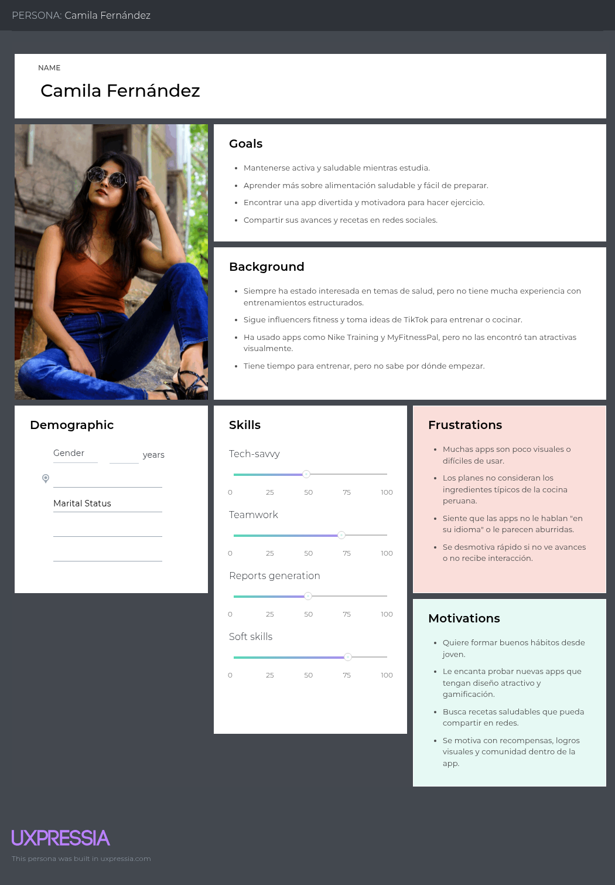
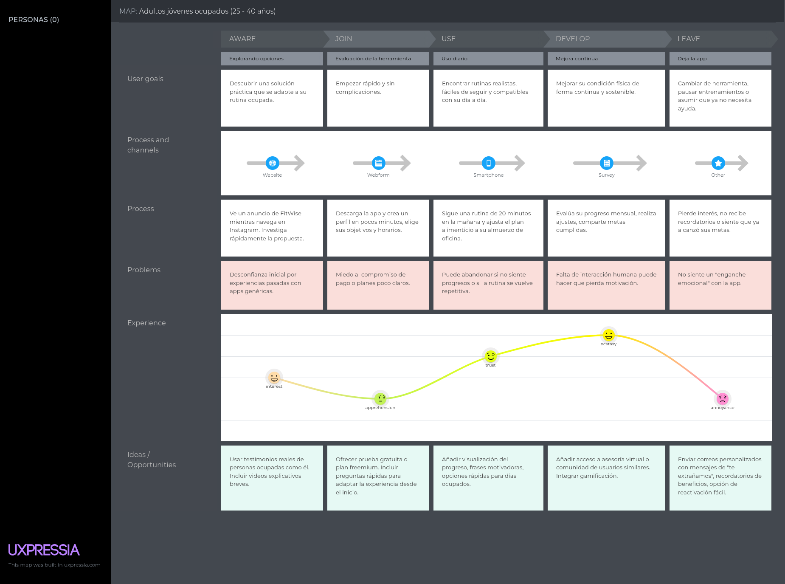
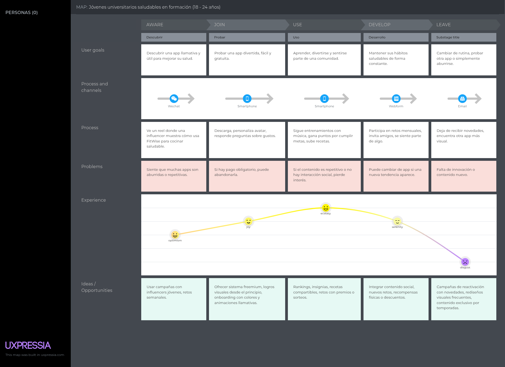
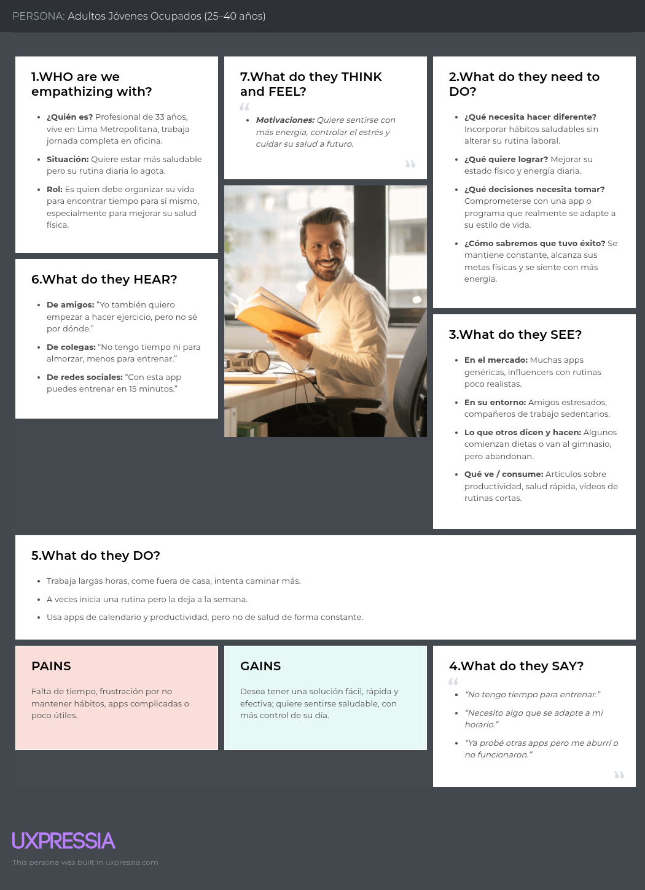
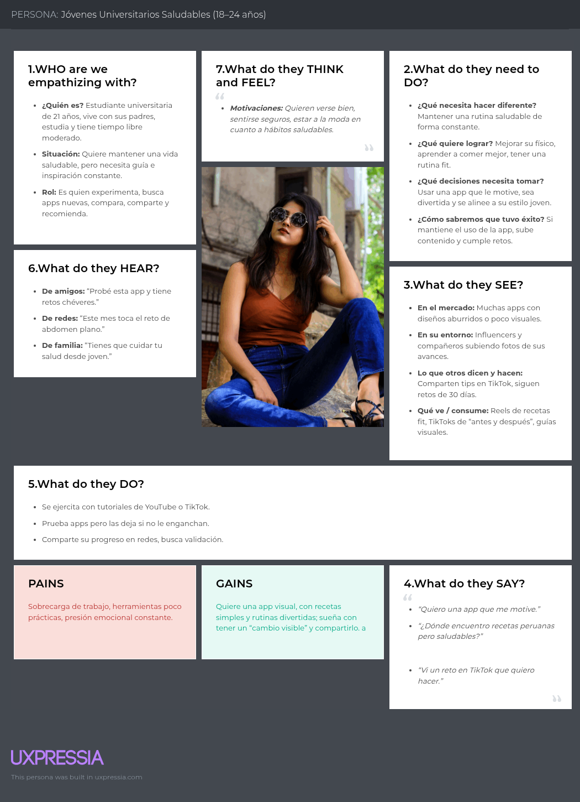

# VibeFit  
**Producto: FitWise**  

# Universidad Peruana de Ciencias Aplicadas

  

### Carrera: Ingeniería de Software  
### Ciclo: 7° ciclo  
### Curso: Diseño de Experimentos de Ingeniería de Software  
### Sección: 1ASI0732  
### Profesor: Julio Manuel Noriega Melendez  

## Informe de Trabajo Final

**Startup:** VibeFit  
**Producto:** FitWise  

## Integrantes:

- **Ramiro Alexander Guzman Chavez** - U202217062  
- **Farid Sebastian Briceño De La Cruz** - U20211F211  
- **Muñoz Vilcapoma Mauricio Rigoberto** - U202217212  
- **David Alexander Perez Garcia** - U202222942  
- **Jhon Alexander Galvez Chambi** - U202323270

**Fecha:** Abril 2025  
**URL del proyecto:** [https://github.com/MauricioMVilcapoma/OpenSource-4328](https://github.com/MauricioMVilcapoma/OpenSource-4328)

---

# Registro de Versiones del Informe

| Versión | Fecha       | Autor | Descripción |
|---------|-------------|-------|-------------|
| TB1     | 12/04/2025  |  Ramiro Guzman     |   Desarrollé la carátula, la tabla de contenidos, la descripción de la Startup, la Solution Profile que abarca los Antecedentes y Problemática, definí los Segmentos Objetivos y el Diseño de las entrevistas.          |
| TB1     | XX/XX/XXXX  |       |             |
| TB1     | XX/XX/XXXX  |       |             |
| TB1     | XX/XX/XXXX  |       |             |
| TB1     | XX/XX/XXXX  |       |             |
| TB1     | XX/XX/XXXX  |       |             |
| TB1     | XX/XX/XXXX  |       |             |
| TB1     | XX/XX/XXXX  |       |             |
| TB1     | XX/XX/XXXX  |       |             |
| TB1     | XX/XX/XXXX  |       |             |
| TB1     | XX/XX/XXXX  |       |             |
| TB1     | XX/XX/XXXX  |       |             |
| TB1     | XX/XX/XXXX  |       |             |

# Contenido

- [Universidad Peruana de Ciencias Aplicadas](#universidad-peruana-de-ciencias-aplicadas)
- [Informe de Trabajo Final](#informe-de-trabajo-final)
- [Registro de Versiones del Informe](#registro-de-versiones-del-informe)
- [Contenido](#contenido)
- [Student Outcome](#student-outcome)

## Capítulo I: Introducción
- [1.1. Startup Profile](#11-startup-profile)
  - [1.1.1. Descripción de la Startup](#111-descripción-de-la-startup)
  - [1.1.2. Perfiles de integrantes del equipo](#112-perfiles-de-integrantes-del-equipo)
- [1.2. Solution Profile](#12-solution-profile)
  - [1.2.1. Antecedentes y problemática](#121-antecedentes-y-problemática)
  - [1.2.2. Lean UX Process](#122-lean-ux-process)
    - [1.2.2.1. Lean UX Problem Statements](#1221-lean-ux-problem-statements)
    - [1.2.2.2. Lean UX Assumptions](#1222-lean-ux-assumptions)
    - [1.2.2.3. Lean UX Hypothesis Statements](#1223-lean-ux-hypothesis-statements)
    - [1.2.2.4. Lean UX Canvas](#1224-lean-ux-canvas)
- [1.3. Segmentos objetivo](#13-segmentos-objetivo)

## Capítulo II: Requirements Elicitation & Analysis
- [2.1. Competidores](#21-competidores)
  - [2.1.1. Análisis competitivo](#211-análisis-competitivo)
  - [2.1.2. Estrategias y tácticas frente a competidores](#212-estrategias-y-tácticas-frente-a-competidores)
- [2.2. Entrevistas](#22-entrevistas)
  - [2.2.1. Diseño de entrevistas](#221-diseño-de-entrevistas)
  - [2.2.2. Registro de entrevistas](#222-registro-de-entrevistas)
  - [2.2.3. Análisis de entrevistas](#223-análisis-de-entrevistas)
- [2.3. Needfinding](#23-needfinding)
  - [2.3.1. User Personas](#231-user-personas)
  - [2.3.2. User Task Matrix](#232-user-task-matrix)
  - [2.3.3. User Journey Mapping](#233-user-journey-mapping)
  - [2.3.4. Empathy Mapping](#234-empathy-mapping)
  - [2.3.5. As-is Scenario Mapping](#235-as-is-scenario-mapping)
- [2.4. Ubiquitous Language](#24-ubiquitous-language)

## Capítulo III: Requirements Specification
- [3.1. To-Be Scenario Mapping](#31-to-be-scenario-mapping)
- [3.2. User Stories](#32-user-stories)
- [3.3. Product Backlog](#33-product-backlog)
- [3.4. Impact Mapping](#34-impact-mapping)

## Capítulo IV: Product Design
- [4.1. Style Guidelines](#41-style-guidelines)
  - [4.1.1. General Style Guidelines](#411-general-style-guidelines)
  - [4.1.2. Web Style Guidelines](#412-web-style-guidelines)
  - [4.1.3. Mobile Style Guidelines](#413-mobile-style-guidelines)
    - [4.1.3.1. iOS Mobile Style Guidelines](#4131-ios-mobile-style-guidelines)
    - [4.1.3.2. Android Mobile Style Guidelines](#4132-android-mobile-style-guidelines)
- [4.2. Information Architecture](#42-information-architecture)
  - [4.2.1. Organization Systems](#421-organization-systems)
  - [4.2.2. Labeling Systems](#422-labeling-systems)
  - [4.2.3. SEO Tags and Meta Tags](#423-seo-tags-and-meta-tags)
  - [4.2.4. Searching Systems](#424-searching-systems)
  - [4.2.5. Navigation Systems](#425-navigation-systems)
- [4.3. Landing Page UI Design](#43-landing-page-ui-design)
  - [4.3.1. Landing Page Wireframe](#431-landing-page-wireframe)
  - [4.3.2. Landing Page Mock-up](#432-landing-page-mock-up)
- [4.4. Mobile Applications UX/UI Design](#44-mobile-applications-uxui-design)
  - [4.4.1. Mobile Applications Wireframes](#441-mobile-applications-wireframes)
  - [4.4.2. Mobile Applications Wireflow Diagrams](#442-mobile-applications-wireflow-diagrams)
  - [4.4.3. Mobile Applications Mock-ups](#443-mobile-applications-mock-ups)
  - [4.4.4. Mobile Applications User Flow Diagrams](#444-mobile-applications-user-flow-diagrams)
- [4.5. Mobile Applications Prototyping](#45-mobile-applications-prototyping)
  - [4.5.1. Android Mobile Applications Prototyping](#451-android-mobile-applications-prototyping)
  - [4.5.2. iOS Mobile Applications Prototyping](#452-ios-mobile-applications-prototyping)
- [4.6. Web Applications UX/UI Design](#46-web-applications-uxui-design)
  - [4.6.1. Web Applications Wireframes](#461-web-applications-wireframes)
  - [4.6.2. Web Applications Wireflow Diagrams](#462-web-applications-wireflow-diagrams)
  - [4.6.3. Web Applications Mock-ups](#463-web-applications-mock-ups)
  - [4.6.4. Web Applications User Flow Diagrams](#464-web-applications-user-flow-diagrams)
- [4.7. Web Applications Prototyping](#47-web-applications-prototyping)
- [4.8. Domain-Driven Software Architecture](#48-domain-driven-software-architecture)
  - [4.8.1. Software Architecture Context Diagram](#481-software-architecture-context-diagram)
  - [4.8.2. Software Architecture Container Diagrams](#482-software-architecture-container-diagrams)
  - [4.8.3. Software Architecture Components Diagrams](#483-software-architecture-components-diagrams)
- [4.9. Software Object-Oriented Design](#49-software-object-oriented-design)
  - [4.9.1. Class Diagrams](#491-class-diagrams)
  - [4.9.2. Class Dictionary](#492-class-dictionary)
- [4.10. Database Design](#410-database-design)
  - [4.10.1. Entity Relationship Diagrams](#4101-entity-relationship-diagrams)
  - [4.10.2. Relational Database Schemas](#4102-relational-database-schemas)

## Capítulo V: Product Implementation
- [5.1. Software Configuration Management](#51-software-configuration-management)
  - [5.1.1. Software Development Environment Configuration](#511-software-development-environment-configuration)
  - [5.1.2. Source Code Management](#512-source-code-management)
  - [5.1.3. Source Code Style Guide & Conventions](#513-source-code-style-guide--conventions)
  - [5.1.4. Software Deployment Configuration](#514-software-deployment-configuration)
- [5.2. Product Implementation & Deployment](#52-product-implementation--deployment)
  - [5.2.1. Sprint Backlogs](#521-sprint-backlogs)
  - [5.2.2. Implemented Landing Page Evidence](#522-implemented-landing-page-evidence)
  - [5.2.3. Implemented Frontend-Web Application Evidence](#523-implemented-frontend-web-application-evidence)
  - [5.2.4. Implemented Native-Mobile Application Evidence](#524-implemented-native-mobile-application-evidence)
  - [5.2.5. Implemented RESTful API and/or Serverless Backend Evidence](#525-implemented-restful-api-andor-serverless-backend-evidence)
  - [5.2.6. RESTful API documentation](#526-restful-api-documentation)
  - [5.2.7. Team Collaboration Insights](#527-team-collaboration-insights)
- [5.3. Video About-the-Product](#53-video-about-the-product)

## Capítulo VI: Conclusiones, Bibliografía y Anexos
- [6.1. Conclusiones](#61-conclusiones)
- [6.2. Bibliografía](#62-bibliografía)
- [6.3. Anexos](#63-anexos)
  
---

# Student Outcome

El curso contribuye al cumplimiento del Student Outcome ABET:  
**ABET – EAC - Student Outcome 4**

**Criterio:**  
La capacidad de reconocer responsabilidades éticas y profesionales en situaciones de ingeniería y hacer juicios informados, que deben considerar el impacto de las soluciones de ingeniería en contextos globales, económicos, ambientales y sociales.

| Criterio específico                                                                                                                                   | Acciones realizadas | Conclusiones |
|------------------------------------------------------------------------------------------------------------------------------------------------------|---------------------|--------------|
| 4.c.1 Reconoce responsabilidad ética y profesional en situaciones de ingeniería de software                                                          |                     |              |
| 4.c.2 Emite juicios informados considerando el impacto de las soluciones de ingeniería de software en contextos globales, económicos, ambientales y sociales |          

---

## Capítulo I: Introducción

### 1.1. Startup Profile
#### 1.1.1. Descripción de la Startup

**VibeFit** es una startup tecnológica enfocada en el bienestar físico y mental, cuya misión es facilitar y personalizar el camino hacia una vida saludable mediante el uso de tecnología inteligente.

Su producto principal, **FitWise**, es una aplicación web y móvil que genera rutinas de entrenamiento y planes nutricionales personalizados, adaptándose al estilo de vida, objetivos y nivel de cada usuario.

La propuesta de valor de VibeFit se basa en la **adaptabilidad**, la **personalización** y el **acompañamiento constante**, abordando una de las principales barreras para adoptar hábitos saludables: la falta de tiempo y de una guía clara para empezar.

#### 1.1.2. Perfiles de integrantes del equipo

---

#### **Muñoz Vilcapoma Mauricio – Ingeniería de Software – U202217212**  

Soy xxxxxxxxxxxxxxxxxxxxxxxxxxxxxxxxxxxxxxx.

---

#### **Ramiro Alexander Guzman Chavez – Ingeniería de Software – U202217062**  

Mi perfil se basa en ser una persona responsable, disciplinada en todo aspecto y comprometida con las actividades que me puedan tocar.
Considero que tengo una experiencia altamente capacitada para este tipo de tareas. Suelo desarrollarme de manera positiva en los trabajos grupales y tengo conocimientos en bases de datos, lo cual puede aportar de manera importante al equipo.
Además, cuento con conocimientos en lenguajes de programación como Java y JavaScript, lo que me permite desarrollar soluciones tanto del lado del backend como del frontend, contribuyendo a proyectos de desarrollo de software de manera integral.

---

#### **Farid Sebastian Briceño De La Cruz – Ingeniería de Software – U20211F211**  
<*(Sin imagen disponible)*

Soy estudiante de Ingeniería de Software con un fuerte interés en el desarrollo de productos digitales y la tecnología. En mi tiempo libre, me gusta jugar videojuegos. También tengo un interés especial en la música, lo que me ayuda a equilibrar mi vida académica y personal. Cuento con habilidades en gestión de bases de datos y tengo experiencia en análisis de datos, lo que me ayuda a tomar decisiones informadas y crear soluciones efectivas.

---

#### **David Alexander Perez Garcia – Ingeniería de Software – U202222942**

*(Sin imagen disponible)*

Soy xxxxxxxxxxxx

---

#### **Jhon Alexander Galvez Chambi – Ingeniería de Software – U202323270**  
*(Sin imagen disponible)*

Soy xxxxxxxxx

---

### 1.2. Solution Profile
#### 1.2.1. Antecedentes y problemática

- **Who (¿Quiénes son los afectados?)**  
  Personas entre 18 y 40 años interesadas en mejorar su estado físico o mantener una vida saludable, pero que enfrentan obstáculos como la falta de tiempo, desconocimiento sobre rutinas de ejercicio y dificultad para seguir planes alimenticios realistas.

- **What (¿Qué sucede?)**  
  Existe una creciente demanda de soluciones fitness personalizadas; sin embargo, muchas aplicaciones actuales son genéricas, poco flexibles y no consideran la realidad del usuario en cuanto a tiempo, nivel, objetivos y cultura alimentaria. Esto genera frustración, abandono y poco progreso.

- **Where (¿Dónde ocurre?)**  
  Principalmente en contextos urbanos, especialmente en ciudades como Lima, donde factores como el tráfico, las largas jornadas laborales y el escaso acceso a asesoría personalizada dificultan la constancia en la actividad física y en la alimentación saludable.

- **When (¿Cuándo sucede?)**  
  De forma cotidiana, cuando las personas intentan adoptar una rutina saludable pero no encuentran un plan realista que se ajuste a su disponibilidad de tiempo y recursos personales.

- **Why (¿Por qué es un problema?)**  
  Porque afecta directamente la salud física y mental. Sin una guía adecuada y adaptada, las personas pierden motivación rápidamente, lo que impide la adquisición de hábitos saludables sostenibles en el tiempo.

- **How (¿Cómo se manifiesta?)**
  - Rutinas genéricas que no consideran el tiempo real disponible del usuario.  
  - Planes de nutrición no adaptados a la gastronomía local.  
  - Falta de seguimiento y visualización de progreso.  
  - Escasa interacción humana o profesional en las plataformas actuales.

- **How Much (¿Cuán grande es el problema?)**  
  Según el Ministerio de Salud del Perú:
  - Más del **60%** de la población adulta presenta sobrepeso u obesidad.  
  - Más del **70%** no realiza actividad física suficiente.

  Esto representa un problema de salud pública y una gran **oportunidad de mercado** para soluciones tecnológicas efectivas y accesibles como FitWise.
  
#### 1.2.2. Lean UX Process
##### 1.2.2.1. Lean UX Problem Statements
##### 1.2.2.2. Lean UX Assumptions
##### 1.2.2.3. Lean UX Hypothesis Statements
##### 1.2.2.4. Lean UX Canvas

### 1.3. Segmentos objetivo

### 1. Adultos jóvenes ocupados (25 - 40 años)

**Descripción**  
Hombres y mujeres que trabajan tiempo completo, viven en zonas urbanas como Lima Metropolitana y desean mejorar su salud física. Tienen poco tiempo libre y buscan soluciones prácticas, rápidas y efectivas que se integren fácilmente a su rutina.

**Características clave**  
- Profesionales con agendas ajustadas.  
- Nivel socioeconómico medio a alto.  
- Acceso constante a smartphones.  
- Metas de salud definidas, pero necesitan guía y motivación.  
- Buscan flexibilidad y personalización en sus entrenamientos y dietas.

**Datos de sustento**  
- Más del **65%** de personas en Lima trabajan más de 40 horas semanales (INEI).  
- El **70%** no realiza actividad física regular.  
- Penetración de smartphones: **91.6%** (INEI, 2022).

### 2. Jóvenes universitarios saludables en formación (18 - 24 años)

**Descripción**  
Estudiantes o egresados recientes que están formando sus hábitos saludables. Cuentan con mayor disponibilidad de tiempo, pero menos conocimiento técnico y un menor poder adquisitivo. Son nativos digitales, influidos por redes sociales y tendencias fitness, y buscan una app atractiva, visual y que los motive constantemente.

**Características clave**  
- Alta actividad en redes sociales.  
- Aprecian el contenido interactivo y la gamificación.  
- Tienen tiempo para entrenar, pero requieren orientación.  
- Interesados en recetas saludables peruanas y fáciles de preparar.

**Datos de sustento**  
- El **45%** de jóvenes en Perú busca llevar una vida más saludable (Ipsos, 2023).  
- El **94%** accede a internet desde su celular.  
- Alta disposición a probar nuevas apps si son visuales, gratuitas o freemium.

## Capítulo II: Requirements Elicitation & Analysis
### 2.1. Competidores
<table> <thead> <tr> <th>Nombre del Competidor</th> <th>Descripción</th> </tr> </thead> 
    <tbody>
        <tr>
            <td rowspan align="center">MyFitnessPal
            <td>App de seguimiento nutricional y calorías con base de datos extensa, enfocada en usuarios que desean controlar su alimentación y objetivos de salud 
            Página web:<a href="https://www.myfitnesspal.com/es">https://www.myfitnesspal.com/es</a>
        </tr>
        <tr>
            <td align="center">Freeletics
            <td>Entrenamientos personalizados sin equipo, con enfoque en la flexibilidad del usuario y coaching mediante inteligencia artificial. 
            Página web:<a href="https://www.freeletics.com/es/"> https://www.freeletics.com/es/</a>
        </tr>
        <tr>
           <td rowspan align="center">8fit  
           <td>App que combina rutinas de ejercicio y planes alimenticios personalizados, con enfoque en principiantes y personas con tiempo limitado. 
           Página web:<a href="https://8fit.com/"> https://8fit.com/</a>
    </tbody>
</table>

#### 2.1.1. Análisis competitivo

<table style="width: 100%;"> <tr> <th colspan="6" style="padding: 8px; text-align: center;">Competitive Analysis Landscape</th> </tr> <tr> <td>¿Por qué llevar a cabo este análisis?</td> <td colspan="5">Para identificar ventajas comparativas y oportunidades de posicionamiento de FitWise frente a otras aplicaciones de fitness, mejorando su estrategia de producto y marketing hacia usuarios que inician su camino hacia un estilo de vida saludable.</td> </tr>
 <tr> <td colspan="2"></td> <td align="center"><strong>MyFitnessPal</strong></td> <td align="center"><strong>Freeletics</strong>
 </td> <td align="center"><strong>8fit</strong></td> <td align="center"><strong>FitWise</strong></td> </tr> <tr> <td rowspan="2" align="center">Perfil</td> <td>Overview</td> <td>App veterana en control de calorías y macronutrientes, centrada en autogestión del usuario.</td> <td>Entrenamiento personalizado con IA y sin necesidad de equipo, ideal para rutinas en casa.</td> <td>Planes de fitness y nutrición en un mismo lugar, dirigido a personas ocupadas.</td> <td>Asistente personalizado para fitness y nutrición, con enfoque en personas sin experiencia previa ni conocimientos técnicos.</td> </tr> <tr> <td>Ventaja competitiva
¿Qué valor ofrece a los clientes?</td> <td>Base de datos alimenticia muy amplia, historial comprobado y comunidad activa.</td> <td>Enfoque motivacional, rutinas adaptativas, coach digital.</td> <td>Combinación de entrenamiento + alimentación con interfaz amigable para novatos.</td> <td>Personalización profunda según estilo de vida, metas, tiempo disponible y acompañamiento constante para empezar desde cero.</td> </tr> <tr> <td rowspan="2" align="center">Perfil de Marketing</td> <td>Mercado objetivo</td> <td>Usuarios con experiencia en dietas y fitness que desean control detallado.</td> <td>Personas motivadas que buscan progresar desde casa con estructura y motivación.</td> <td>Usuarios principiantes con poco tiempo y ganas de hábitos saludables.</td> <td>Personas que desean mejorar su salud pero no saben por dónde empezar; estilo de vida ocupado.</td> </tr> <tr> <td>Estrategias de marketing</td> <td>SEO, comunidad online, integración con otras apps (Strava, Fitbit), contenido de expertos.</td> <td>Publicidad digital con mensajes aspiracionales, storytelling de usuarios, retos en redes.</td> <td>Anuncios orientados a principiantes, recomendaciones en tiendas de apps, testimonios.</td> <td>Marketing educativo, redes sociales con enfoque motivacional, onboarding guiado y testimonios de transformación real.</td> </tr> <tr> <td rowspan="3" align="center">Perfil del Producto</td> <td>Productos & Servicios</td> <td>Seguimiento calórico, macros, planes de comida, escáner de código de barras.</td> <td>Rutinas HIIT, coaching digital, planes progresivos.</td> <td>Ejercicios y recetas personalizadas, rutinas breves.</td> <td>App web y móvil con planes dinámicos de alimentación y entrenamiento según objetivos, nivel y estilo de vida.</td> </tr> <tr> <td>Precios & Costos</td> <td>Gratuita con funciones premium desde $9.99/mes</td> <td>Suscripción mensual desde $12.99/mes</td> <td>Freemium con planes desde $7.50/mes</td> <td>Modelo freemium, suscripción desde $5.99/mes (estimado)</td> </tr> <tr> <td>Canales de distribución</td> <td>iOS, Android, Web, integraciones con dispositivos</td> <td>iOS, Android, Web</td> <td>iOS, Android</td> <td>iOS, Android, Web, campañas en redes, alianzas con gimnasios locales</td> </tr> <tr> <td rowspan="4" align="center">Análisis SWOT</td> <td>Fortalezas</td> <td>Gran base de usuarios, amplia data nutricional, experiencia acumulada</td> <td>Entrenamientos adaptables sin equipo, coaching motivacional</td> <td>Fácil de usar, buena combinación entre nutrición y ejercicio</td> <td>Enfoque empático, personalización real, solución integral para novatos</td> </tr> <tr> <td>Debilidades</td> <td>Curva de aprendizaje, no apta para principiantes sin guía</td> <td>Poca personalización en planes nutricionales</td> <td>Limitada en métricas y seguimiento profesional</td> <td>App nueva en el mercado, aún sin comunidad consolidada</td> </tr> <tr> <td>Oportunidades</td> <td>Mayor integración con wearables y servicios de salud</td> <td>Gamificación y expansión a wellness mental</td> <td>Expansión con coaches humanos o retos grupales</td> <td>Capturar segmento desatendido que busca guía inicial sin complicaciones</td> </tr> <tr> <td>Amenazas</td> <td>Competencia con apps más simples o gratuitas</td> <td>Dependencia de motivación del usuario</td> <td>Mercado saturado de apps similares</td> <td>Dificultad para diferenciarse frente a marcas ya posicionadas</td> </tr> </table>

#### 2.1.2. Estrategias y tácticas frente a competidores

**Estrategias:**  
- **Diferenciación por personalización y acompañamiento inicial:**  
  Mientras muchas apps de salud y fitness ofrecen planes genéricos, **FitWise** se posiciona como un guía real para personas que no saben por dónde empezar. Desde el primer día, el usuario recibe orientación paso a paso, ayudándolo a establecer metas realistas, entendiendo su estado actual de salud y hábitos. Esto reduce la tasa de abandono en las primeras semanas y genera confianza desde el inicio.  

- **Enfoque en usuarios con poco tiempo y sin experiencia previa:**  
  La mayoría de las aplicaciones se centran en usuarios que ya tienen motivación o experiencia previa en fitness. **FitWise** rompe con ese enfoque y prioriza a quienes tienen jornadas exigentes, familias que atender, o inseguridad sobre cómo entrenar o comer mejor. El producto se adapta al usuario, no al revés, con rutinas de minutos, ajustes diarios y sin tecnicismos.

- **Mejora continua centrada en la experiencia del usuario:**  
  A diferencia de competidores que lanzan versiones estáticas, **FitWise** evoluciona con sus usuarios. Se recopila feedback constante para adaptar planes, eliminar fricciones de navegación, y reforzar aspectos motivacionales como avances visibles, recompensas y mensajes personalizados. Esta iteración rápida genera una experiencia más humana y cercana.

**Tácticas:**  
- **Campañas de retos “Empieza sin presión”:**  
  Se lanzarán desafíos accesibles para nuevos usuarios como “7 días para comenzar”, que combinan hábitos simples (caminar 10 min, hidratarse bien, cenar ligero) con mensajes motivacionales. Estos retos estarán integrados con notificaciones diarias, logros desbloqueables y recompensas virtuales (como niveles, stickers, badges) que refuercen la constancia sin agobiar.

- **Contenido educativo y emocional:**  
  Se desarrollará contenido multimedia centrado en eliminar la culpa, el miedo o la frustración asociada con el cambio de hábitos. Videos de 1 minuto, reels, posts y artículos con lenguaje amigable, comparaciones simples (“comer mejor no es comer menos”, “moverte no es ir al gym”), y testimonios reales que conecten emocionalmente con el usuario.

- **Alianzas con profesionales y centros de salud:**  
  Para reforzar la credibilidad y dar valor extra, se buscarán colaboraciones con nutricionistas, médicos, entrenadores y psicólogos. Estos expertos validarán el contenido de la app, brindarán webinars abiertos para usuarios activos, y generarán materiales especializados (ej. guías para diabéticos, personas con ansiedad alimentaria o movilidad limitada). También se explorará la integración con centros de salud o clínicas como canal de recomendación.
### 2.2. Entrevistas
#### 2.2.1. Diseño de entrevistas

#### Segmento: Adultos jóvenes ocupados (25 - 40 años)

**Preguntas Generales**  
- ¿Cuál es su nombre completo?  
- ¿Cuántos años tienes?  
- ¿Cuál es su situación actual? ¿Trabaja, estudia o ambos?  
- ¿En qué ciudad resides?  

**Preguntas sobre Personalidad**  
- ¿Te consideras una persona extrovertida o introvertida? ¿Por qué?  
- ¿Eres una persona que toma decisiones racionales o emocionales? ¿Por qué?  

**Preguntas específicas del segmento**  
- ¿Cuáles son tus principales obstáculos para mantener una vida saludable en tu rutina diaria?  
- ¿Has intentado seguir alguna rutina de ejercicios o dieta antes? ¿Qué funcionó y qué no?  
- ¿Qué tipo de herramientas digitales utilizas actualmente (si alguna) para mejorar tu salud física o alimentación?  
- ¿Estarías dispuesto/a a pagar por una asesoría personalizada y flexible dentro de una app si resuelve tus problemas de tiempo o motivación?

---

#### Segmento: Jóvenes universitarios saludables en formación (18 - 24 años)

**Preguntas Generales**  
- ¿Cuál es su nombre completo?  
- ¿Cuántos años tienes?  
- ¿Cuál es su situación actual? ¿Trabaja, estudia o ambos?  
- ¿En qué ciudad resides?  

**Preguntas sobre Personalidad**  
- ¿Te consideras una persona extrovertida o introvertida? ¿Por qué?  
- ¿Eres una persona que toma decisiones racionales o emocionales? ¿Por qué?  

**Preguntas específicas del segmento**  
- ¿Qué te motiva a comenzar una rutina de ejercicios o una dieta saludable?  
- ¿Qué te gustaría que una app de fitness haga por ti para mantenerte motivado y constante?  
- ¿Te interesaría que la app incluya retos, logros o niveles? ¿Qué tipo de recompensas o elementos te mantendrían comprometido?  
- ¿Qué tan importante es para ti que la app se adapte a tus horarios, metas y preferencias alimenticias locales (como recetas peruanas saludables)?

#### 2.2.2. Registro de entrevistas
#### 2.2.3. Análisis de entrevistas

### 2.3. Needfinding
#### 2.3.1. User Personas

- **Adultos Jóvenes Ocupados (25–40 años)**

  

- **Jóvenes Universitarios Saludables en Formación (18–24 años)**

  

#### 2.3.2. User Task Matrix

En esta sección se presentan las tareas que los User Persona realizan para alcanzar sus objetivos de salud y bienestar. Las tareas listadas son independientes de la existencia de una aplicación, y reflejan acciones comunes realizadas por los usuarios en su vida cotidiana al momento de intentar adoptar hábitos saludables.  
Los segmentos considerados son:

- **Adultos Jóvenes Ocupados (25–40 años)**
- **Jóvenes Universitarios Saludables en Formación (18–24 años)**

| **Tarea / Task**                                 | **Alejandro Ríos (Adulto Joven Ocupado)** |              | **Camila Fernández (Universitaria Saludable)** |              |
|--------------------------------------------------|-------------------------------------------|--------------|------------------------------------------------|--------------|
|                                                  | **Frecuencia**                             | **Importancia** | **Frecuencia**                                  | **Importancia** |
| Buscar recetas saludables adaptadas al tiempo    | Media                                      | Alta         | Alta                                           | Alta         |
| Planificar tiempos para hacer ejercicio          | Baja                                       | Alta         | Media                                          | Media        |
| Probar rutinas cortas en YouTube/TikTok          | Baja                                       | Media        | Alta                                           | Alta         |
| Comer saludable fuera de casa                    | Alta                                       | Alta         | Baja                                           | Media        |
| Medir o visualizar su progreso físico            | Media                                      | Alta         | Alta                                           | Alta         |
| Compartir avances en redes sociales              | Baja                                       | Baja         | Alta                                           | Alta         |
| Buscar motivación o inspiración                  | Media                                      | Media        | Alta                                           | Alta         |
| Probar nuevas apps de fitness                    | Media                                      | Media        | Alta                                           | Alta         |
| Pedir consejos a conocidos sobre salud/bienestar | Baja                                       | Media        | Media                                          | Media        |
| Mantener constancia en rutinas de entrenamiento  | Baja                                       | Muy Alta     | Media                                          | Alta         |
| Seguir influencers o cuentas fitness             | Baja                                       | Baja         | Alta                                           | Media        |

- **Tareas con mayor frecuencia e importancia para ambos segmentos:**
  - **Medir o visualizar el progreso físico:** ambas personas valoran poder ver resultados tangibles.
  - **Buscar recetas saludables:** aunque difieren en contexto (tiempo vs. presupuesto), es una tarea clave para ambos.

- **Tareas especialmente relevantes para Alejandro Ríos (Adulto Joven Ocupado):**
  - **Planificar tiempo para entrenar y comer sano fuera de casa**, tareas que requieren mayor organización debido a su carga laboral.
  - **Mantener constancia**, aunque su frecuencia es baja, su importancia es muy alta, lo que representa una oportunidad para diseñar soluciones que fomenten hábitos.

- **Tareas especialmente relevantes para Camila Fernández (Universitaria):**
  - **Compartir avances, probar nuevas apps y rutinas de TikTok**, muestra una fuerte necesidad de interacción visual y motivación social.
  - **Buscar inspiración** es parte de su rutina, influenciada por redes sociales y contenido fitness moderno.

- **Coincidencias:**
  - Ambos buscan herramientas o estrategias para **mantener la motivación**, **organizar su alimentación** y **visualizar progreso**, aunque desde diferentes niveles de conocimiento, tiempo y objetivos.

#### 2.3.3. User Journey Mapping

- **Adultos Jóvenes Ocupados (25–40 años)**

  
  
- **Jóvenes Universitarios Saludables en Formación (18–24 años)**
  

  
    
#### 2.3.4. Empathy Mapping

- **Adultos Jóvenes Ocupados (25–40 años)**

  
  
- **Jóvenes Universitarios Saludables en Formación (18–24 años)**
  

  

#### 2.3.5. As-is Scenario Mapping

### 2.4. Ubiquitous Language

## Capítulo III: Requirements Specification

### 3.1. To-Be Scenario Mapping
### 3.2. User Stories
### 3.3. Product Backlog
### 3.4. Impact Mapping
# Capítulo III: Requirements Specification
## 3.3. Impact Mapping.

El Impact Mapping de FitWise es una herramienta estratégica que alinea los objetivos de negocio con los comportamientos deseados en sus principales usuarios: personas sin experiencia en fitness y profesionales de la salud. La técnica permite identificar los impactos necesarios, los entregables que los habilitan y las historias de usuario que aseguran una implementación centrada en la experiencia. Así, FitWise busca facilitar el inicio de hábitos saludables sostenibles y ofrecer herramientas útiles para el seguimiento y mejora continua, fomentando la adopción de la app como un aliado diario en el bienestar personal y profesional.

  
## Avance de Conclusiones, Bibliografía y Anexos

## Capítulo IV: Product Design

### 4.1. Style Guidelines
#### 4.1.1. General Style Guidelines
#### 4.1.2. Web Style Guidelines
#### 4.1.3. Mobile Style Guidelines
##### 4.1.3.1. iOS Mobile Style Guidelines
##### 4.1.3.2. Android Mobile Style Guidelines

### 4.2. Information Architecture
#### 4.2.1. Organization Systems
#### 4.2.2. Labeling Systems
#### 4.2.3. SEO Tags and Meta Tags
#### 4.2.4. Searching Systems
#### 4.2.5. Navigation Systems

### 4.3. Landing Page UI Design
#### 4.3.1. Landing Page Wireframe
#### 4.3.2. Landing Page Mock-up

### 4.4. Mobile Applications UX/UI Design
#### 4.4.1. Mobile Applications Wireframes
#### 4.4.2. Mobile Applications Wireflow Diagrams
#### 4.4.3. Mobile Applications Mock-ups
#### 4.4.4. Mobile Applications User Flow Diagrams

### 4.5. Mobile Applications Prototyping
#### 4.5.1. Android Mobile Applications Prototyping
#### 4.5.2. iOS Mobile Applications Prototyping

### 4.6. Web Applications UX/UI Design
#### 4.6.1. Web Applications Wireframes
#### 4.6.2. Web Applications Wireflow Diagrams
#### 4.6.3. Web Applications Mock-ups
#### 4.6.4. Web Applications User Flow Diagrams

### 4.7. Web Applications Prototyping

### 4.8. Domain-Driven Software Architecture
#### 4.8.1. Software Architecture Context Diagram
#### 4.8.2. Software Architecture Container Diagrams
#### 4.8.3. Software Architecture Components Diagrams

### 4.9. Software Object-Oriented Design
#### 4.9.1. Class Diagrams
#### 4.9.2. Class Dictionary

### 4.10. Database Design
#### 4.10.1. Relational/Non-Relational Database Diagram

## Capítulo V: Product Implementation

### 5.1. Software Configuration Management
#### 5.1.1. Software Development Environment Configuration
#### 5.1.2. Source Code Management
#### 5.1.3. Source Code Style Guide & Conventions
#### 5.1.4. Software Deployment Configuration

### 5.2. Product Implementation & Deployment
#### 5.2.1. Sprint Backlogs
#### 5.2.2. Implemented Landing Page Evidence
#### 5.2.3. Implemented Frontend-Web Application Evidence
#### 5.2.4. Implemented Native-Mobile Application Evidence
#### 5.2.5. Implemented RESTful API and/or Serverless Backend Evidence
#### 5.2.6. RESTful API documentation
#### 5.2.7. Team Collaboration Insights

### 5.3. Video About-the-Product

### 6.1. Conclusiones
### 6.2. Bibliografía
### 6.3. Anexos
