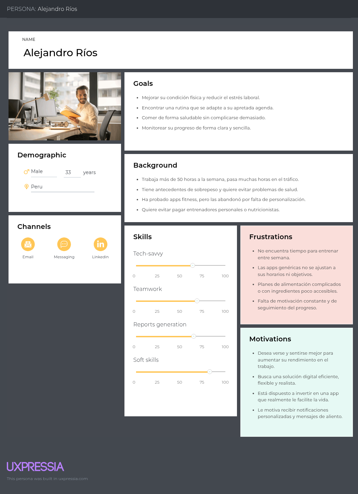
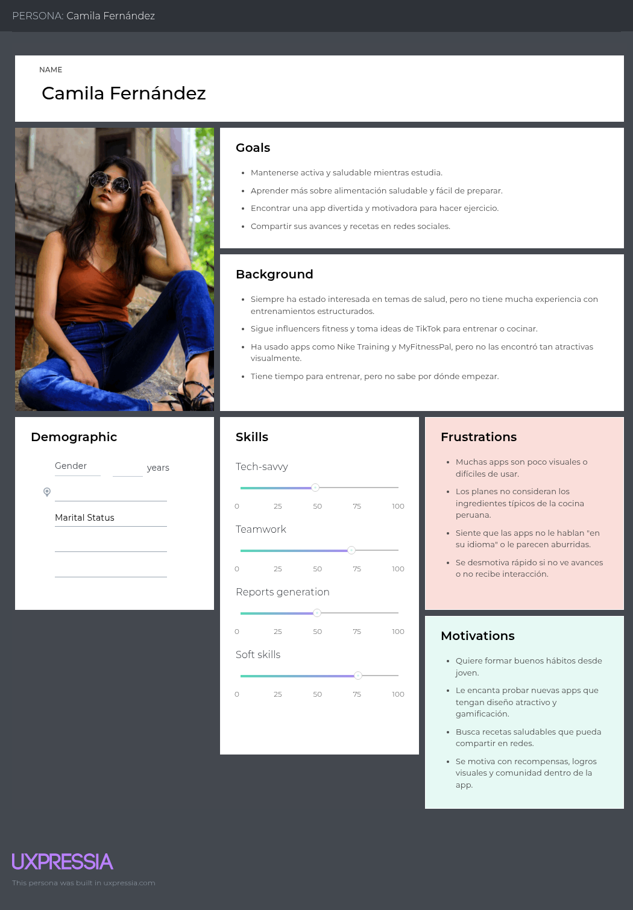
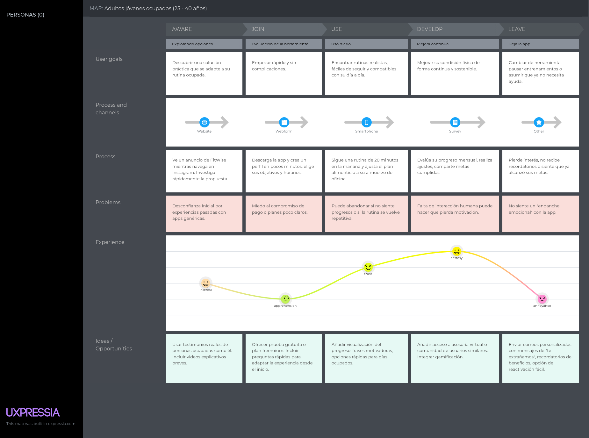
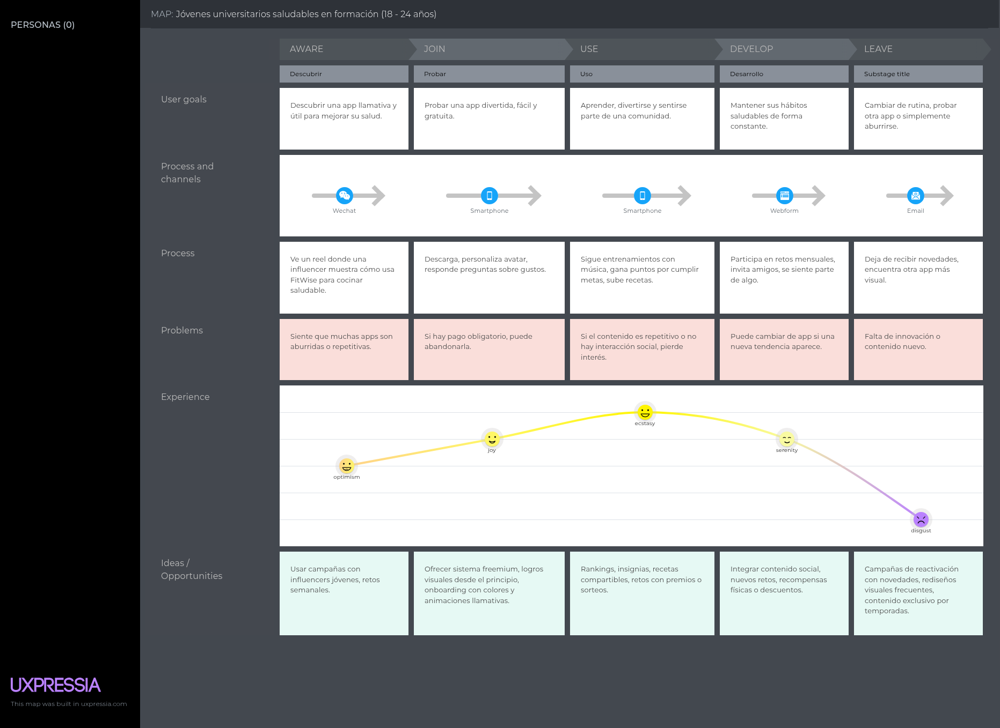
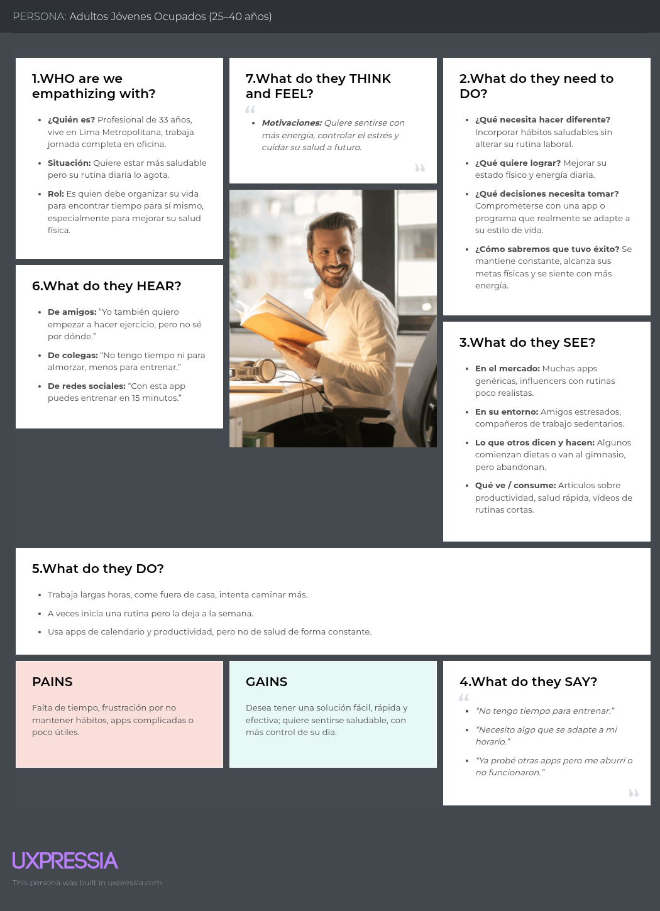
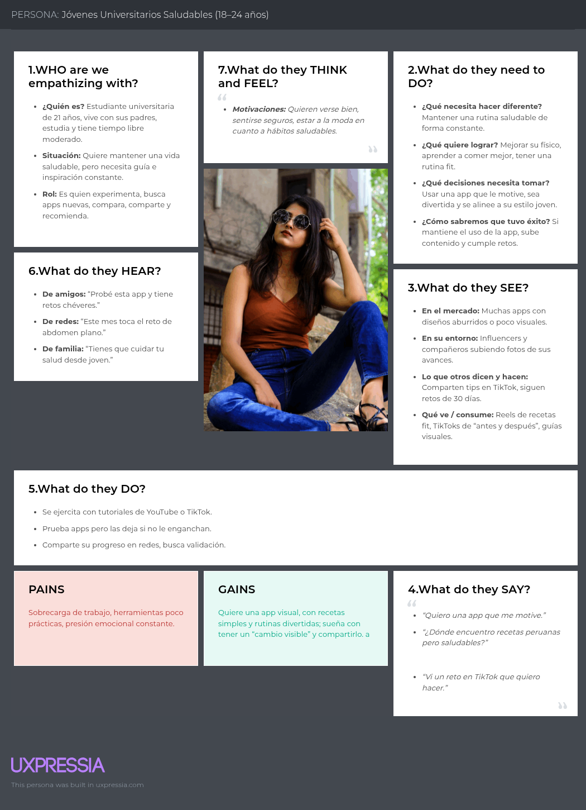

# VibeFit

**Producto: FitWise**

# Universidad Peruana de Ciencias Aplicadas

  

### Carrera: Ingeniería de Software

### Ciclo: 7° ciclo

### Curso: Diseño de Experimentos de Ingeniería de Software

### Sección: 1ASI0732

### Profesor: Julio Manuel Noriega Melendez

## Informe de Trabajo Final

**Startup:** VibeFit  
**Producto:** FitWise

## Integrantes:

- **Ramiro Alexander Guzman Chavez** - U202217062
- **Farid Sebastian Briceño De La Cruz** - U20211F211
- **Muñoz Vilcapoma Mauricio Rigoberto** - U202217212
- **David Alexander Perez Garcia** - U202222942
- **Jhon Alexander Galvez Chambi** - U202323270

**Fecha:** Abril 2025  
**URL del proyecto:** [https://github.com/MauricioMVilcapoma/OpenSource-4328](https://github.com/MauricioMVilcapoma/OpenSource-4328)

---

# Registro de Versiones del Informe

| Versión | Fecha      | Autor         | Descripción                                                                                                                                                                                                  |
| ------- | ---------- | ------------- | ------------------------------------------------------------------------------------------------------------------------------------------------------------------------------------------------------------ |
| TB1     | 12/04/2025 | Ramiro Guzman | Desarrollé la carátula, la tabla de contenidos, la descripción de la Startup, la Solution Profile que abarca los Antecedentes y Problemática, definí los Segmentos Objetivos y el Diseño de las entrevistas. |
| TB1     | XX/XX/XXXX |               |                                                                                                                                                                                                              |
| TB1     | XX/XX/XXXX |               |                                                                                                                                                                                                              |
| TB1     | XX/XX/XXXX |               |                                                                                                                                                                                                              |
| TB1     | XX/XX/XXXX |               |                                                                                                                                                                                                              |
| TB1     | XX/XX/XXXX |               |                                                                                                                                                                                                              |
| TB1     | XX/XX/XXXX |               |                                                                                                                                                                                                              |
| TB1     | XX/XX/XXXX |               |                                                                                                                                                                                                              |
| TB1     | XX/XX/XXXX |               |                                                                                                                                                                                                              |
| TB1     | XX/XX/XXXX |               |                                                                                                                                                                                                              |
| TB1     | XX/XX/XXXX |               |                                                                                                                                                                                                              |
| TB1     | XX/XX/XXXX |               |                                                                                                                                                                                                              |
| TB1     | XX/XX/XXXX |               |                                                                                                                                                                                                              |

# Contenido

- [Universidad Peruana de Ciencias Aplicadas](#universidad-peruana-de-ciencias-aplicadas)
- [Informe de Trabajo Final](#informe-de-trabajo-final)
- [Registro de Versiones del Informe](#registro-de-versiones-del-informe)
- [Contenido](#contenido)
- [Student Outcome](#student-outcome)

## Capítulo I: Introducción

- [1.1. Startup Profile](#11-startup-profile)
  - [1.1.1. Descripción de la Startup](#111-descripción-de-la-startup)
  - [1.1.2. Perfiles de integrantes del equipo](#112-perfiles-de-integrantes-del-equipo)
- [1.2. Solution Profile](#12-solution-profile)
  - [1.2.1. Antecedentes y problemática](#121-antecedentes-y-problemática)
  - [1.2.2. Lean UX Process](#122-lean-ux-process)
    - [1.2.2.1. Lean UX Problem Statements](#1221-lean-ux-problem-statements)
    - [1.2.2.2. Lean UX Assumptions](#1222-lean-ux-assumptions)
    - [1.2.2.3. Lean UX Hypothesis Statements](#1223-lean-ux-hypothesis-statements)
    - [1.2.2.4. Lean UX Canvas](#1224-lean-ux-canvas)
- [1.3. Segmentos objetivo](#13-segmentos-objetivo)

## Capítulo II: Requirements Elicitation & Analysis

- [2.1. Competidores](#21-competidores)
  - [2.1.1. Análisis competitivo](#211-análisis-competitivo)
  - [2.1.2. Estrategias y tácticas frente a competidores](#212-estrategias-y-tácticas-frente-a-competidores)
- [2.2. Entrevistas](#22-entrevistas)
  - [2.2.1. Diseño de entrevistas](#221-diseño-de-entrevistas)
  - [2.2.2. Registro de entrevistas](#222-registro-de-entrevistas)
  - [2.2.3. Análisis de entrevistas](#223-análisis-de-entrevistas)
- [2.3. Needfinding](#23-needfinding)
  - [2.3.1. User Personas](#231-user-personas)
  - [2.3.2. User Task Matrix](#232-user-task-matrix)
  - [2.3.3. User Journey Mapping](#233-user-journey-mapping)
  - [2.3.4. Empathy Mapping](#234-empathy-mapping)
  - [2.3.5. As-is Scenario Mapping](#235-as-is-scenario-mapping)
- [2.4. Ubiquitous Language](#24-ubiquitous-language)

## Capítulo III: Requirements Specification

- [3.1. To-Be Scenario Mapping](#31-to-be-scenario-mapping)
- [3.2. User Stories](#32-user-stories)
- [3.3. Product Backlog](#33-product-backlog)
- [3.4. Impact Mapping](#34-impact-mapping)

## Capítulo IV: Product Design

- [4.1. Style Guidelines](#41-style-guidelines)
  - [4.1.1. General Style Guidelines](#411-general-style-guidelines)
  - [4.1.2. Web Style Guidelines](#412-web-style-guidelines)
  - [4.1.3. Mobile Style Guidelines](#413-mobile-style-guidelines)
    - [4.1.3.1. iOS Mobile Style Guidelines](#4131-ios-mobile-style-guidelines)
    - [4.1.3.2. Android Mobile Style Guidelines](#4132-android-mobile-style-guidelines)
- [4.2. Information Architecture](#42-information-architecture)
  - [4.2.1. Organization Systems](#421-organization-systems)
  - [4.2.2. Labeling Systems](#422-labeling-systems)
  - [4.2.3. SEO Tags and Meta Tags](#423-seo-tags-and-meta-tags)
  - [4.2.4. Searching Systems](#424-searching-systems)
  - [4.2.5. Navigation Systems](#425-navigation-systems)
- [4.3. Landing Page UI Design](#43-landing-page-ui-design)
  - [4.3.1. Landing Page Wireframe](#431-landing-page-wireframe)
  - [4.3.2. Landing Page Mock-up](#432-landing-page-mock-up)
- [4.4. Mobile Applications UX/UI Design](#44-mobile-applications-uxui-design)
  - [4.4.1. Mobile Applications Wireframes](#441-mobile-applications-wireframes)
  - [4.4.2. Mobile Applications Wireflow Diagrams](#442-mobile-applications-wireflow-diagrams)
  - [4.4.3. Mobile Applications Mock-ups](#443-mobile-applications-mock-ups)
  - [4.4.4. Mobile Applications User Flow Diagrams](#444-mobile-applications-user-flow-diagrams)
- [4.5. Mobile Applications Prototyping](#45-mobile-applications-prototyping)
  - [4.5.1. Android Mobile Applications Prototyping](#451-android-mobile-applications-prototyping)
  - [4.5.2. iOS Mobile Applications Prototyping](#452-ios-mobile-applications-prototyping)
- [4.6. Web Applications UX/UI Design](#46-web-applications-uxui-design)
  - [4.6.1. Web Applications Wireframes](#461-web-applications-wireframes)
  - [4.6.2. Web Applications Wireflow Diagrams](#462-web-applications-wireflow-diagrams)
  - [4.6.3. Web Applications Mock-ups](#463-web-applications-mock-ups)
  - [4.6.4. Web Applications User Flow Diagrams](#464-web-applications-user-flow-diagrams)
- [4.7. Web Applications Prototyping](#47-web-applications-prototyping)
- [4.8. Domain-Driven Software Architecture](#48-domain-driven-software-architecture)
  - [4.8.1. Software Architecture Context Diagram](#481-software-architecture-context-diagram)
  - [4.8.2. Software Architecture Container Diagrams](#482-software-architecture-container-diagrams)
  - [4.8.3. Software Architecture Components Diagrams](#483-software-architecture-components-diagrams)
- [4.9. Software Object-Oriented Design](#49-software-object-oriented-design)
  - [4.9.1. Class Diagrams](#491-class-diagrams)
  - [4.9.2. Class Dictionary](#492-class-dictionary)
- [4.10. Database Design](#410-database-design)
  - [4.10.1. Entity Relationship Diagrams](#4101-entity-relationship-diagrams)
  - [4.10.2. Relational Database Schemas](#4102-relational-database-schemas)

## Capítulo V: Product Implementation

- [5.1. Software Configuration Management](#51-software-configuration-management)

  - [5.1.1. Software Development Environment Configuration](#511-software-development-environment-configuration)
  - [5.1.2. Source Code Management](#512-source-code-management)
  - [5.1.3. Source Code Style Guide & Conventions](#513-source-code-style-guide--conventions)
  - [5.1.4. Software Deployment Configuration](#514-software-deployment-configuration)

- [5.2. Product Implementation & Deployment](#52-product-implementation--deployment)

  - [5.2.1. Sprint Backlogs](#521-sprint-backlogs)
  - [5.2.2. Implemented Landing Page Evidence](#522-implemented-landing-page-evidence)
  - [5.2.3. Implemented Frontend-Web Application Evidence](#523-implemented-frontend-web-application-evidence)
  - [5.2.4. Implemented Native-Mobile Application Evidence](#524-implemented-native-mobile-application-evidence)
  - [5.2.5. Implemented RESTful API and/or Serverless Backend Evidence](#525-implemented-restful-api-andor-serverless-backend-evidence)
  - [5.2.6. RESTful API documentation](#526-restful-api-documentation)
  - [5.2.7. Team Collaboration Insights](#527-team-collaboration-insights)

- [5.3. Video About-the-Product](#53-video-about-the-product)

---

# Student Outcome

El curso contribuye al cumplimiento del Student Outcome ABET:  
**ABET – EAC - Student Outcome 4**

**Criterio:**  
La capacidad de reconocer responsabilidades éticas y profesionales en situaciones de ingeniería y hacer juicios informados, que deben considerar el impacto de las soluciones de ingeniería en contextos globales, económicos, ambientales y sociales.

| Criterio específico                                                                                                                                          | Acciones realizadas | Conclusiones |
| ------------------------------------------------------------------------------------------------------------------------------------------------------------ | ------------------- | ------------ |
| 4.c.1 Reconoce responsabilidad ética y profesional en situaciones de ingeniería de software                                                                  |                     |              |
| 4.c.2 Emite juicios informados considerando el impacto de las soluciones de ingeniería de software en contextos globales, económicos, ambientales y sociales |

---

## Capítulo I: Introducción

### 1.1. Startup Profile

#### 1.1.1. Descripción de la Startup

**VibeFit** es una startup tecnológica enfocada en el bienestar físico y mental, cuya misión es facilitar y personalizar el camino hacia una vida saludable mediante el uso de tecnología inteligente.

Su producto principal, **FitWise**, es una aplicación web y móvil que genera rutinas de entrenamiento y planes nutricionales personalizados, adaptándose al estilo de vida, objetivos y nivel de cada usuario.

La propuesta de valor de VibeFit se basa en la **adaptabilidad**, la **personalización** y el **acompañamiento constante**, abordando una de las principales barreras para adoptar hábitos saludables: la falta de tiempo y de una guía clara para empezar.

#### 1.1.2. Perfiles de integrantes del equipo

- Jhon Alexander Galvez Chambi - u202323270 (Ingeniería de Software)

    

Soy una persona responsable y comprometida con la consecución de los mejores resultados en trabajo en equipo. Poseo experiencia en diversos lenguajes de programación, incluyendo Python, JavaScript y C++, así como en varios de los frameworks asociados a estos lenguajes. Además, tengo conocimientos en tecnologías emergentes como Cloud Computing e Internet de las Cosas (IoT), y estoy dispuesto a aportar mi experiencia en estas áreas para contribuir al éxito de los proyectos en los que participo.

### 1.2. Solution Profile

#### 1.2.1. Antecedentes y problemática

- **Who (¿Quiénes son los afectados?)**  
  Personas entre 18 y 40 años interesadas en mejorar su estado físico o mantener una vida saludable, pero que enfrentan obstáculos como la falta de tiempo, desconocimiento sobre rutinas de ejercicio y dificultad para seguir planes alimenticios realistas.

- **What (¿Qué sucede?)**  
  Existe una creciente demanda de soluciones fitness personalizadas; sin embargo, muchas aplicaciones actuales son genéricas, poco flexibles y no consideran la realidad del usuario en cuanto a tiempo, nivel, objetivos y cultura alimentaria. Esto genera frustración, abandono y poco progreso.

- **Where (¿Dónde ocurre?)**  
  Principalmente en contextos urbanos, especialmente en ciudades como Lima, donde factores como el tráfico, las largas jornadas laborales y el escaso acceso a asesoría personalizada dificultan la constancia en la actividad física y en la alimentación saludable.

- **When (¿Cuándo sucede?)**  
  De forma cotidiana, cuando las personas intentan adoptar una rutina saludable pero no encuentran un plan realista que se ajuste a su disponibilidad de tiempo y recursos personales.

- **Why (¿Por qué es un problema?)**  
  Porque afecta directamente la salud física y mental. Sin una guía adecuada y adaptada, las personas pierden motivación rápidamente, lo que impide la adquisición de hábitos saludables sostenibles en el tiempo.

- **How (¿Cómo se manifiesta?)**

  - Rutinas genéricas que no consideran el tiempo real disponible del usuario.
  - Planes de nutrición no adaptados a la gastronomía local.
  - Falta de seguimiento y visualización de progreso.
  - Escasa interacción humana o profesional en las plataformas actuales.

- **How Much (¿Cuán grande es el problema?)**  
  Según el Ministerio de Salud del Perú:

  - Más del **60%** de la población adulta presenta sobrepeso u obesidad.
  - Más del **70%** no realiza actividad física suficiente.

  Esto representa un problema de salud pública y una gran **oportunidad de mercado** para soluciones tecnológicas efectivas y accesibles como FitWise.

#### 1.2.2. Lean UX Process

##### 1.2.2.1. Lean UX Problem Statements

Nuestra plataforma (FitWise) fue diseñada para facilitar el acceso a rutinas de entrenamiento y planes nutricionales personalizados, adaptándose al estilo de vida, objetivos y nivel de experiencia de cada usuario. A través de nuestra solución, buscamos ofrecer una experiencia motivadora, intuitiva y basada en datos para ayudar a las personas a adoptar hábitos saludables de manera sostenible.

HHemos observado que los usuarios no logran mantener la constancia en sus rutinas debido a la falta de motivación inmediata y planes que se adapten a sus cambios de horarios o progreso. Asimismo, la oferta de apps genéricas de fitness (ej: planes no personalizados, recomendaciones estáticas) genera frustración en usuarios que buscan resultados específicos.

_¿Cómo podríamos mejorar FitWise para que los usuarios mantengan una adherencia constante a sus rutinas y planes nutricionales, aumentando así la retención y los resultados tangibles en salud?_

##### 1.2.2.2. Lean UX Assumptions

**Business Assumptions**

1. Creemos que nuestros clientes necesitan mantener hábitos saludables de manera sostenible, pero les falta motivación y orientación personalizada.
2. Estas necesidades se resuelven con una plataforma web/movil que centralice las actividades fisica y nutricionales, adaptadas a las preferencias establecidas por el usuario.
3. Nuestros clientes iniciales serán adultos de 25-40 años, que buscan mejorar su salud pero no tienen tiempo para planificar rutinas o dietas.
4. El valor más importante de lo que el cliente requiere de nuestro servicio es un plan de entrenamiento y nutrición 100% adaptado a sus horarios, nivel físico y metas, sin necesidad de tomar decisiones complejas.
5. El cliente puede tener los siguientes beneficios adicionales: Comunidad de apoyo, descuentos en productos saludables (a través de puntos) y seguimiento automatizado de su progreso.
6. Vamos a adquirir clientes mediante estrategias de marketing digital (SEO, redes sociales, influencers de fitness), alianzas con gimnasios locales y referencias de usuarios satisfechos.
7. Haremos dinero a través de suscripciones premium (planes avanzados + coaches certificados) y comisiones por partnerships con marcas de salud.
8. Nuestra competencia principal serán las apps genéricas de fitness (como Freeletics o MyFitnessPal) y la oferta de entrenadores en redes sociales.
9. Los venceremos ya que nuestra plataforma tiene capacidad de personalización dinámica (no solo planes estáticos) y la integración de tecnología pensada en motivar continuamente al usuario.
10. Nuestro mayor riesgo es que los usuarios no perciban valor en la adaptabilidad automática y prefieran soluciones más simples (aunque menos efectivas)
11. Resolveremos esto mediante estrategias de onboarding amigables, incentivos iniciales, experimentos continuos (A/B testing) para validar qué features generan más engagement en nuestro producto.
12. Qué otras suposiciones tenemos que, si resultan falsas, harán que nuestro negocio/proyecto fracase?
    - Que los usuarios no estén dispuestos a pagar por personalización

**User Assumptions**

1. ¿Quién será nuestro usuario?
   - Personas con poco conocimiento de fitness que buscan empezar, o intermedios que quieren mejorar su rendimiento.
2. ¿Dónde encaja nuestro producto en su vida?
   - En su rutina diaria: al despertar (para ver planes del día), durante breaks (para micro-entrenamientos) y por las noches (para registrar progreso)
3. ¿Qué problemas resuelve nuestro producto?
   - Falta de tiempo para planificar dietas o rutinas de ejercicio
   - Desmotivación por resultados lentos.
   - Desconocimiento de técnicas adecuadas para ejercitarse.
4. ¿Cómo y Cuándo es usado nuestro producto?
   - Antes del viaje (exploración y reservas) y durante el viaje (gestión de itinerarios y asistencia).
   - En dispositivos móviles y de escritorio, principalmente mediante el navegador web.
5. ¿Qué características son importantes?
   - Personalización automática, recordatorios inteligentes, comunidad motivacional y seguimiento visual del progreso (gráficos, badges).
6. ¿Cómo luce y se comporta nuestro producto?
   - Con una interfaz limpia, intuitiva y confiable, accesible para distintos niveles de experiencia tecnológica.
   - Mostrar colores energéticos (verde/azul), lenguaje cercano ("¡Vamos, María!") y flujos rápidos (máximo 3 clics para acciones clave).

##### 1.2.2.3. Lean UX Hypothesis Statements

- **Creemos que**, si ofrecemos a los usuarios una plataforma donde puedan explorar rutinas de ejercicio y dietas de acuedos a su nivel de experiencia, objetivos, disponibilidad e informacion fisica, entonces podrán alcanzar sus objetivos con mayor facilidad, mejorando su estado de forma. **Sabremos que** hemos logrado este resultado **cuando** observemos un incremento sostenido en la cantidad de registros exitosos y una tasa alta de satisfacción del usuario (medida por reseñas y feedback post-actividad).

- **Creemos que**, si permitimos a los usuarios definir sus objetivos físicos y zonas corporales a trabajar durante el onboarding, entonces las rutinas generadas tendrán mayor relevancia para ellos. **Sabremos que** esta hipótesis es válida **cuando** se registren un incremento en el porcentaje de usuarios que completa el onboarding y un declive en la tasa de abandono de rutinas por cada semana.

- **Creemos que**, si implementamos un sistema de badges y recompensas para usuarios que completen rutinas semanales, entonces aumentaremos su motivación y adherencia a los planes. **Sabremos que** esta hipótesis se confirma **cuando** veamos un aumento en el promedio de entrenamientos completados por semana.

##### 1.2.2.4. Lean UX Canvas

    

### 1.3. Segmentos objetivo

### 1. Adultos jóvenes ocupados (25 - 40 años)

**Descripción**  
Hombres y mujeres que trabajan tiempo completo, viven en zonas urbanas como Lima Metropolitana y desean mejorar su salud física. Tienen poco tiempo libre y buscan soluciones prácticas, rápidas y efectivas que se integren fácilmente a su rutina.

**Características clave**

- Profesionales con agendas ajustadas.
- Nivel socioeconómico medio a alto.
- Acceso constante a smartphones.
- Metas de salud definidas, pero necesitan guía y motivación.
- Buscan flexibilidad y personalización en sus entrenamientos y dietas.

**Datos de sustento**

- Más del **65%** de personas en Lima trabajan más de 40 horas semanales (INEI).
- El **70%** no realiza actividad física regular.
- Penetración de smartphones: **91.6%** (INEI, 2022).

### 2. Jóvenes universitarios saludables en formación (18 - 24 años)

**Descripción**  
Estudiantes o egresados recientes que están formando sus hábitos saludables. Cuentan con mayor disponibilidad de tiempo, pero menos conocimiento técnico y un menor poder adquisitivo. Son nativos digitales, influidos por redes sociales y tendencias fitness, y buscan una app atractiva, visual y que los motive constantemente.

**Características clave**

- Alta actividad en redes sociales.
- Aprecian el contenido interactivo y la gamificación.
- Tienen tiempo para entrenar, pero requieren orientación.
- Interesados en recetas saludables peruanas y fáciles de preparar.

**Datos de sustento**

- El **45%** de jóvenes en Perú busca llevar una vida más saludable (Ipsos, 2023).
- El **94%** accede a internet desde su celular.
- Alta disposición a probar nuevas apps si son visuales, gratuitas o freemium.

## Capítulo II: Requirements Elicitation & Analysis

### 2.1. Competidores

#### 2.1.1. Análisis competitivo

#### 2.1.2. Estrategias y tácticas frente a competidores

### 2.2. Entrevistas

#### 2.2.1. Diseño de entrevistas

#### Segmento: Adultos jóvenes ocupados (25 - 40 años)

**Preguntas Generales**

- ¿Cuál es su nombre completo?
- ¿Cuántos años tienes?
- ¿Cuál es su situación actual? ¿Trabaja, estudia o ambos?
- ¿En qué ciudad resides?

**Preguntas sobre Personalidad**

- ¿Te consideras una persona extrovertida o introvertida? ¿Por qué?
- ¿Eres una persona que toma decisiones racionales o emocionales? ¿Por qué?

**Preguntas específicas del segmento**

- ¿Cuáles son tus principales obstáculos para mantener una vida saludable en tu rutina diaria?
- ¿Has intentado seguir alguna rutina de ejercicios o dieta antes? ¿Qué funcionó y qué no?
- ¿Qué tipo de herramientas digitales utilizas actualmente (si alguna) para mejorar tu salud física o alimentación?
- ¿Estarías dispuesto/a a pagar por una asesoría personalizada y flexible dentro de una app si resuelve tus problemas de tiempo o motivación?

---

#### Segmento: Jóvenes universitarios saludables en formación (18 - 24 años)

**Preguntas Generales**

- ¿Cuál es su nombre completo?
- ¿Cuántos años tienes?
- ¿Cuál es su situación actual? ¿Trabaja, estudia o ambos?
- ¿En qué ciudad resides?

**Preguntas sobre Personalidad**

- ¿Te consideras una persona extrovertida o introvertida? ¿Por qué?
- ¿Eres una persona que toma decisiones racionales o emocionales? ¿Por qué?

**Preguntas específicas del segmento**

- ¿Qué te motiva a comenzar una rutina de ejercicios o una dieta saludable?
- ¿Qué te gustaría que una app de fitness haga por ti para mantenerte motivado y constante?
- ¿Te interesaría que la app incluya retos, logros o niveles? ¿Qué tipo de recompensas o elementos te mantendrían comprometido?
- ¿Qué tan importante es para ti que la app se adapte a tus horarios, metas y preferencias alimenticias locales (como recetas peruanas saludables)?

#### 2.2.2. Registro de entrevistas

#### 2.2.3. Análisis de entrevistas

### 2.3. Needfinding

#### 2.3.1. User Personas

- **Adultos Jóvenes Ocupados (25–40 años)**

  

- **Jóvenes Universitarios Saludables en Formación (18–24 años)**

  

#### 2.3.2. User Task Matrix

En esta sección se presentan las tareas que los User Persona realizan para alcanzar sus objetivos de salud y bienestar. Las tareas listadas son independientes de la existencia de una aplicación, y reflejan acciones comunes realizadas por los usuarios en su vida cotidiana al momento de intentar adoptar hábitos saludables.  
Los segmentos considerados son:

- **Adultos Jóvenes Ocupados (25–40 años)**
- **Jóvenes Universitarios Saludables en Formación (18–24 años)**

| **Tarea / Task**                                 | **Alejandro Ríos (Adulto Joven Ocupado)** |                 | **Camila Fernández (Universitaria Saludable)** |                 |
| ------------------------------------------------ | ----------------------------------------- | --------------- | ---------------------------------------------- | --------------- |
|                                                  | **Frecuencia**                            | **Importancia** | **Frecuencia**                                 | **Importancia** |
| Buscar recetas saludables adaptadas al tiempo    | Media                                     | Alta            | Alta                                           | Alta            |
| Planificar tiempos para hacer ejercicio          | Baja                                      | Alta            | Media                                          | Media           |
| Probar rutinas cortas en YouTube/TikTok          | Baja                                      | Media           | Alta                                           | Alta            |
| Comer saludable fuera de casa                    | Alta                                      | Alta            | Baja                                           | Media           |
| Medir o visualizar su progreso físico            | Media                                     | Alta            | Alta                                           | Alta            |
| Compartir avances en redes sociales              | Baja                                      | Baja            | Alta                                           | Alta            |
| Buscar motivación o inspiración                  | Media                                     | Media           | Alta                                           | Alta            |
| Probar nuevas apps de fitness                    | Media                                     | Media           | Alta                                           | Alta            |
| Pedir consejos a conocidos sobre salud/bienestar | Baja                                      | Media           | Media                                          | Media           |
| Mantener constancia en rutinas de entrenamiento  | Baja                                      | Muy Alta        | Media                                          | Alta            |
| Seguir influencers o cuentas fitness             | Baja                                      | Baja            | Alta                                           | Media           |

- **Tareas con mayor frecuencia e importancia para ambos segmentos:**

  - **Medir o visualizar el progreso físico:** ambas personas valoran poder ver resultados tangibles.
  - **Buscar recetas saludables:** aunque difieren en contexto (tiempo vs. presupuesto), es una tarea clave para ambos.

- **Tareas especialmente relevantes para Alejandro Ríos (Adulto Joven Ocupado):**

  - **Planificar tiempo para entrenar y comer sano fuera de casa**, tareas que requieren mayor organización debido a su carga laboral.
  - **Mantener constancia**, aunque su frecuencia es baja, su importancia es muy alta, lo que representa una oportunidad para diseñar soluciones que fomenten hábitos.

- **Tareas especialmente relevantes para Camila Fernández (Universitaria):**

  - **Compartir avances, probar nuevas apps y rutinas de TikTok**, muestra una fuerte necesidad de interacción visual y motivación social.
  - **Buscar inspiración** es parte de su rutina, influenciada por redes sociales y contenido fitness moderno.

- **Coincidencias:**
  - Ambos buscan herramientas o estrategias para **mantener la motivación**, **organizar su alimentación** y **visualizar progreso**, aunque desde diferentes niveles de conocimiento, tiempo y objetivos.

#### 2.3.3. User Journey Mapping

- **Adultos Jóvenes Ocupados (25–40 años)**

  

- **Jóvenes Universitarios Saludables en Formación (18–24 años)**
  

  

#### 2.3.4. Empathy Mapping

- **Adultos Jóvenes Ocupados (25–40 años)**

  

- **Jóvenes Universitarios Saludables en Formación (18–24 años)**
  

  

#### 2.3.5. As-is Scenario Mapping

### 2.4. Ubiquitous Language

## Capítulo III: Requirements Specification

### 3.1. To-Be Scenario Mapping

### 3.2. User Stories

**EPIC ID: EP001 - Registro y Login**

<table>
  <thead>
    <tr>
      <th>EPIC / STORY ID</th>
      <th>TÍTULO</th>
      <th>DESCRIPCIÓN</th>
      <th>CRITERIO DE ACEPTACIÓN</th>
      <th>RELACIÓN</th>
    </tr>
  </thead>
  <tbody>
    <!-- Epic 1 -->
    <tr>
      <td><b>EP001</b></td>
      <td>Registro y Login de usuario</td>
      <td>Funcionalidades que permiten a los usuarios registrarse, iniciar sesión y gestionar el acceso seguro a la plataforma.</td>
      <td>-</td>
      <td>-</td>
    </tr>
    <tr>
      <td>US001</td>
      <td>Registro desde la Landing Page</td>
      <td>Como usuario nuevo, quiero ver botones de registro en la landing page, para acceder a FitWise.</td>
      <td>
        <ul>
          <li> Scenario 1: Uso del botón "Registrarme"   Given un nuevo usuario se encuentra en la barra de navegacion, When hace clic en "Registrarme", Then es redirigido al formulario de registro. </li>
          <li> Scenario 2: Uso del botón "Comenzar ahora"   Given un nuevo usuario se encuentra en la seccion "Nuestros servicios",  When hace clic en "Registrarme", Then es redirigido al formulario de registro. </li>          
        </ul>       
      </td>
      <td>EP001</td>
    </tr>
    <tr>
      <td>US002</td>
      <td>Registro con correo electrónico</td>
      <td>Como usuario nuevo, quiero registrarme con mi correo y contraseña, para acceder a la plataforma.</td>
      <td>
        <ul>
          <li> Scenario 1: Registro exitoso   Given un nuevo usuario, When ingresa su correo y contraseña válidos, Then se debe crear una cuenta. </li>
          <li> Scenario 2: Correo ya registrado   Given un nuevo usuario, When ingresa un correo ya registrado, Then se debe mostrar un mensaje "Este correo ya está en uso, por favor seleccione otro". </li>
          <li> Scenario 3: Contraseña inválida   Given un nuevo usuario, When ingresa una contraseña con menos de 8 caracteres, Then el sistema muestra un mensaje: "La contraseña debe tener al menos 8 caracteres". </li>
        </ul>       
      </td>
      <td>EP001</td>
    </tr>
    <tr>
      <td>US003</td>
      <td>Uso de tokens para validacion y verificacion</td>
      <td>Como developer, quiero implementar un servicio de autenticación JWT para manejar sesiones seguras</td>
      <td>
        <ul>
          <li> Scenario 1: Request exitoso   Given un usuario autenticado, When hace una request al endpoint /api/profile, Then recibe un response 200 con el valor del user_id  </li>
          <li> Scenario 2: Request fallido   Given un usuario no autenticado, When hace una request al endpoint /api/profile, Then recibe un response 401 con el mensaje "Acceso no autorizado". </li>          
        </ul>       
      </td>
      <td>EP001</td>
    </tr>
    <tr>
      <td>US004</td>
      <td>Login con autenticación OAuth (Google)</td>
      <td>Como usuario frecuente, quiero iniciar sesión con Google, para acceder rápidamente.</td>
      <td>
        <ul>
          <li> Scenario 1: Autenticación exitosa   Given el usuario tiene una cuenta de Google, When selecciona "Iniciar sesión con Google" y acepta los permisos solicitados, Then accede al sistema y se vincula el correo al sistema. </li>
          <li> Scenario 2: Denegación de permisos   Given el usuario tiene una cuenta de Google, When selecciona "Iniciar sesión con Google" y deniega los permisos solicitados Then se debe mostrar un mensaje "Debes aceptar los permisos para continuar". </li>
          <li> Scenario 3: Cuenta Google no vinculada   Given un nuevo usuario, When ingresa una contraseña con menos de 8 caracteres, Then el sistema muestra un mensaje: "La contraseña debe tener al menos 8 caracteres". </li>
        </ul>       
      </td>
      <td>EP001</td>
    </tr>
    <tr>
      <td>US005</td>
      <td>Recuperación de contraseña</td>
      <td>Como usuario, quiero recuperar mi contraseña si la olvido, para poder seguir usando la app.</td>
      <td>
        <ul>
          <li> Scenario 1: Solicitud exitosa   Given un usuario registrado, When selecciona "Olvidé mi contraseña" y envia su solicitud, Then recibe un correo con un enlace de recuperacion válido por 24 horas. </li>
          <li> Scenario 2: Correo no registrado   Given un usuario no registrado, When selecciona "Olvidé mi contraseña" y envia su solicitud, Then el sistema muestra un mensaje: "Este correo no está registrado. ¿Quieres crear una cuenta?" </li>
          <li> Scenario 3: Enlace expirado   Given un usuario recibe el enlace hace más de 24 horas, When intenta usarlo, Then el sistema redirige a una página para solicitar un nuevo enlace. </li>
        </ul>       
      </td>      
      <td>EP001</td>
    </tr>
    <!-- Epic 2 -->
    <tr>
      <td><b>EP002</b></td>
      <td>Personalizacion inicial</td>
      <td>Funcionalidades que permiten a los usuarios configurar su perfil físico y preferencias para generar contenido personalizado.</td>
      <td>-</td>
      <td>-</td>
    </tr>
    <tr>
      <td>US006</td>
      <td>Ingreso de datos físicos</td>
      <td>Como usuario nuevo, quiero ingresar mi peso, altura y sexo, para que las rutinas se ajusten.</td>
      <td>
        <ul>
          <li> Scenario 1: Datos físicos válidos   Given un usuario se encuentra en el formulario de personalización, When ingresa peso (ej: 70 kg), altura (ej: 175 cm) y sexo (ej: "Femenino"), Then el sistema guarda los datos y muestra un mensaje: "Datos guardados correctamente" </li>
          <li> Scenario 2: Datos físicos inválidos (ej: peso)   Given un usuario se encuentra en el formulario de personalización, When ingresa un campo inválido (ej: peso = -10 kg), Then el sistema el sistema muestra un mensaje: "El peso debe ser mayor a 0" </li>
          <li> Scenario 3: Datos incompletos   Given un usuario se encuentra en el formulario de personalización, When no ingresa un campo, Then el sistema muestra un mensaje: "Completa todos los campos obligatorios" </li>
        </ul>
      </td>
      <td>EP002</td>
    </tr>
    <tr>
      <td>US007</td>
      <td>Selección de zonas a trabajar</td>
      <td>Como usuario, quiero seleccionar las zonas del cuerpo que deseo mejorar.</td>
      <td>
        <ul>
          <li> Scenario 1: Selección múltiple de zonas   Given un usuario se encuentra en la interfaz de personalización, When selecciona múltiples zonas (ej: Brazo y Abdomen), Then el sistema genera una rutina que incluye ejercicios por zona seleccionada </li>
          <li> Scenario 2: Ninguna zona seleccionada   Given un usuario se encuentra en la interfaz de personalización, When no selecciona ninguna zona, Then el sistema asigna una rutina general (ej: cuerpo completo) y muestra un mensaje: "Rutina predeterminada asignada" </li>          
        </ul>
      </td>
      <td>EP002</td>
    </tr>
    <tr>
      <td>US008</td>
      <td>Ingreso de nivel de experiencia</td>
      <td>Como usuario, quiero indicar mi nivel de experiencia física.</td>
      <td>
        <ul>
          <li> Scenario 1: Mostrar niveles disponibles   Given un usuario se encuentra en la interfaz de personalización, When hace clic en "Selecciona tu nivel", Then el sistema muestra las opciones "Principiante", "Intermedio" y "Avanzado" </li>
          <li> Scenario 2: Nivel seleccionado   Given un usuario se encuentra en la interfaz de personalización, When selecciona un nivel, Then el sistema muestra un mensaje: "Nivel asignado" y se ajusta de acuerdo al nivel elegido</li>  
          <li> Scenario 3: Nivel actualizado   Given un usuario con un nivel de experiencia asignado, When selecciona "Cambiar de nivel" y selecciona un nivel, Then el sistema muestra un mensaje: "Nivel actualizado" y actualiza el perfil del usuario </li>
        </ul>
      </td>
      <td>EP002</td>
    </tr>
    <tr>
      <td>US009</td>
      <td>Definir objetivo principal</td>
      <td>Como usuario, quiero establecer un objetivo principal (perder peso, tonificar, etc).</td>
      <td>
        <ul>
          <li> Scenario 1: Datos físicos válidos   Given un usuario se encuentra en el formulario de personalización, When ingresa peso (ej: 70 kg), altura (ej: 175 cm) y sexo (ej: "Femenino"), Then el sistema guarda los datos y muestra un mensaje: "Datos guardados correctamente" </li>
          <li> Scenario 2: Correo no registrado   Given un usuario no registrado, When selecciona "Olvidé mi contraseña" y envia su solicitud, Then el sistema muestra un mensaje: "Este correo no está registrado. ¿Quieres crear una cuenta?" </li>
          <li> Scenario 3: Enlace expirado   Given un usuario recibe el enlace hace más de 24 horas, When intenta usarlo, Then el sistema redirige a una página para solicitar un nuevo enlace. </li>
        </ul>
      </td>
      <td>EP002</td>
    </tr>
    <!-- Epic 3 -->
    <tr>
      <td><b>EP003</b></td>
      <td>Dashboard Principal</td>
      <td>Funcionalidades relacionadas con la interfaz principal donde el usuario accede a su progreso, metas y contenido recomendado.</td>
      <td>-</td>
      <td>-</td>
    </tr>
    <tr>
      <td>US010</td>
      <td>Establecer objetivos personales</td>
      <td>Como usuario, quiero establecer un objetivo semanal de actividad.</td>
      <td>
        <ul>
          <li> Scenario 1: Datos físicos válidos   Given un usuario se encuentra en el formulario de personalización, When ingresa peso (ej: 70 kg), altura (ej: 175 cm) y sexo (ej: "Femenino"), Then el sistema guarda los datos y muestra un mensaje: "Datos guardados correctamente" </li>
          <li> Scenario 2: Correo no registrado   Given un usuario no registrado, When selecciona "Olvidé mi contraseña" y envia su solicitud, Then el sistema muestra un mensaje: "Este correo no está registrado. ¿Quieres crear una cuenta?" </li>
          <li> Scenario 3: Enlace expirado   Given un usuario recibe el enlace hace más de 24 horas, When intenta usarlo, Then el sistema redirige a una página para solicitar un nuevo enlace. </li>
        </ul>
      </td>
      <td>EP003</td>
    </tr>
    <tr>
      <td>US011</td>
      <td>Visualizar progreso semanal</td>
      <td>Como usuario, quiero ver mi progreso semanal en el dashboard.</td>
      <td>
        <ul>
          <li> Scenario 1: Datos físicos válidos   Given un usuario se encuentra en el formulario de personalización, When ingresa peso (ej: 70 kg), altura (ej: 175 cm) y sexo (ej: "Femenino"), Then el sistema guarda los datos y muestra un mensaje: "Datos guardados correctamente" </li>
          <li> Scenario 2: Correo no registrado   Given un usuario no registrado, When selecciona "Olvidé mi contraseña" y envia su solicitud, Then el sistema muestra un mensaje: "Este correo no está registrado. ¿Quieres crear una cuenta?" </li>
          <li> Scenario 3: Enlace expirado   Given un usuario recibe el enlace hace más de 24 horas, When intenta usarlo, Then el sistema redirige a una página para solicitar un nuevo enlace. </li>
        </ul>
      </td>
      <td>EP003</td>
    </tr>
    <tr>
      <td>US012</td>
      <td>Recibir ejercicios recomendados</td>
      <td>Como usuario, quiero recomendaciones diarias de ejercicios.</td>
      <td>Given un usuario nuevo, When selecciona su nivel, Then se guarda y personaliza el entrenamiento.</td>
      <td>EP002</td>
    </tr>
    <tr>
      <td>US013</td>
      <td>Ver objetivos populares</td>
      <td>Como usuario, quiero ver objetivos populares para motivarme.</td>
      <td>Given el asistente de bienvenida, When selecciono un objetivo, Then la app se adapta a ese objetivo.</td>
      <td>EP003</td>
    </tr>
    <!-- Epic 4 -->
    <tr>
      <td><b>EP004</b></td>
      <td>Dashboard Principal</td>
      <td>Funcionalidades relacionadas con la interfaz principal donde el usuario accede a su progreso, metas y contenido recomendado.</td>
      <td>-</td>
      <td>-</td>
    </tr>
    <tr>
      <td>US012</td>
      <td>Visualizar progreso diario</td>
      <td>Como usuario, quiero ver mi progreso diario.</td>
      <td>Given los registros de actividad, When consulto informes, Then se muestran detalles por día.</td>
      <td>EP004</td>
    </tr>
    <tr>
      <td>US013</td>
      <td>Ver IMC en gráfico</td>
      <td>Como usuario, quiero ver una gráfica de mi IMC.</td>
      <td>Given datos de peso y altura, When accedo a mi perfil, Then se muestra un gráfico de IMC.</td>
      <td>EP004</td>
    </tr>  
    <tr>
      <td>US014</td>
      <td>Actualizar peso y altura</td>
      <td>Como usuario, quiero actualizar mis datos físicos.</td>
      <td>Given un usuario activo, When edita peso y altura, Then se recalcula IMC y actualizan recomendaciones.</td>
      <td>EP004</td>
    </tr>
    <tr>
      <td>US015</td>
      <td>Exportar informe en PDF</td>
      <td>Como usuario, quiero exportar mi progreso en PDF.</td>
      <td>Given un historial de entrenamientos, When selecciono exportar, Then se genera un PDF.</td>
      <td>EP004</td>
    </tr>
  </tbody>
</table>

**EPIC ID: EP004 - Sección Informe**

| USER STORY ID | TÍTULO                     | DESCRIPCIÓN                                        | CRITERIO DE ACEPTACIÓN                                                                                 | RELACIÓN |
| ------------- | -------------------------- | -------------------------------------------------- | ------------------------------------------------------------------------------------------------------ | -------- |
| US012         | Visualizar progreso diario | Como usuario, quiero ver mi progreso diario.       | Given los registros de actividad, When consulto informes, Then se muestran detalles por día.           | EP004    |
| US013         | Ver IMC en gráfico         | Como usuario, quiero ver una gráfica de mi IMC.    | Given datos de peso y altura, When accedo a mi perfil, Then se muestra un gráfico de IMC.              | EP004    |
| US014         | Actualizar peso y altura   | Como usuario, quiero actualizar mis datos físicos. | Given un usuario activo, When edita peso y altura, Then se recalcula IMC y actualizan recomendaciones. | EP004    |
| US015         | Exportar informe en PDF    | Como usuario, quiero exportar mi progreso en PDF.  | Given un historial de entrenamientos, When selecciono exportar, Then se genera un PDF.                 | EP004    |

**EPIC ID: EP005 - Interfaz y Motivación**

| USER STORY ID | TÍTULO                          | DESCRIPCIÓN                                                           | CRITERIO DE ACEPTACIÓN                                                                  | RELACIÓN |
| ------------- | ------------------------------- | --------------------------------------------------------------------- | --------------------------------------------------------------------------------------- | -------- |
| US016         | Ver animaciones motivacionales  | Como usuario, quiero ver animaciones al completar rutinas.            | Given que termino una rutina, When se completa, Then se muestra una animación.          | EP005    |
| US017         | Frases motivacionales diarias   | Como usuario, quiero recibir frases motivacionales al iniciar el día. | Given que abro la app, When carga el dashboard, Then se muestra una frase positiva.     | EP005    |
| US018         | Personalizar colores de la app  | Como usuario, quiero elegir el tema de la app.                        | Given la configuración, When elijo un tema, Then se actualiza la interfaz.              | EP005    |
| US019         | Acceder a comunidad de usuarios | Como usuario, quiero ver logros de otros usuarios.                    | Given la sección comunidad, When la consulto, Then se muestran publicaciones y avances. | EP005    |

**EPIC ID: EP006 - Nutrición Personalizada**

| USER STORY ID | TÍTULO                          | DESCRIPCIÓN                                            | CRITERIO DE ACEPTACIÓN                                                                          | RELACIÓN |
| ------------- | ------------------------------- | ------------------------------------------------------ | ----------------------------------------------------------------------------------------------- | -------- |
| US020         | Plan nutricional semanal        | Como usuario, quiero sugerencias de comidas semanales. | Given mi perfil, When accedo a nutrición, Then se muestra un plan de comidas personalizado.     | EP006    |
| US021         | Filtrar recetas por dificultad  | Como usuario, quiero recetas según mi tiempo libre.    | Given la lista de recetas, When aplico el filtro, Then se muestran recetas según dificultad.    | EP006    |
| US022         | Ver recetas peruanas saludables | Como usuario, quiero ver recetas locales saludables.   | Given el módulo de recetas, When busco por tipo, Then se muestran opciones peruanas saludables. | EP006    |

**EPIC ID: EP007 - Configuración y Soporte**

| USER STORY ID | TÍTULO                  | DESCRIPCIÓN                                                           | CRITERIO DE ACEPTACIÓN                                                                             | RELACIÓN |
| ------------- | ----------------------- | --------------------------------------------------------------------- | -------------------------------------------------------------------------------------------------- | -------- |
| US023         | Cambiar datos de cuenta | Como usuario, quiero editar mis datos personales.                     | Given el perfil, When edito nombre o correo, Then se actualiza correctamente.                      | EP007    |
| US024         | Contactar al soporte    | Como usuario, quiero enviar un mensaje al soporte si tengo problemas. | Given un problema, When envío un mensaje desde ayuda, Then se genera un ticket.                    | EP007    |
| US025         | Eliminar cuenta         | Como usuario, quiero eliminar mi cuenta para proteger mis datos.      | Given un usuario registrado, When selecciona eliminar cuenta, Then todos sus datos son eliminados. | EP007    |

### 3.3. Product Backlog

Para elaborar nuestro product backlog hemos utilizado la escala lineal (1,2,3). Esto con el propósito de optimizar el nivel de las tareas.

**Historia de usuario base:**

US010   Titulo: Recibir ejercicios recomendados   Descripcion: Como usuario, quiero recomendaciones diarias de ejercicios. (Puntaje asignado: 2)

| # ORDEN | USER STORY ID | TÍTULO                          | DESCRIPCIÓN                                                              | PRIORIDAD | STORY POINTS (1/2/3) |
| ------- | ------------- | ------------------------------- | ------------------------------------------------------------------------ | --------- | -------------------- |
| 1       | US001         | Registro con correo electrónico | Como usuario nuevo, quiero registrarme con mi correo y contraseña.       | Alta      | 2                    |
| 2       | US002         | Login con autenticación OAuth   | Como usuario frecuente, quiero iniciar sesión con Google.                | Alta      | 2                    |
| 3       | US004         | Ingreso de datos físicos        | Como usuario nuevo, quiero ingresar mi peso, altura y sexo.              | Alta      | 2                    |
| 4       | US007         | Definir objetivo principal      | Como usuario, quiero establecer un objetivo principal.                   | Alta      | 2                    |
| 5       | US010         | Recibir ejercicios recomendados | Como usuario, quiero recomendaciones diarias de ejercicios.              | Alta      | 2                    |
| 6       | US009         | Visualizar progreso semanal     | Como usuario, quiero ver mi progreso semanal en el dashboard.            | Alta      | 2                    |
| 7       | US012         | Visualizar progreso diario      | Como usuario, quiero ver mi progreso diario.                             | Media     | 2                    |
| 8       | US005         | Selección de zonas a trabajar   | Como usuario, quiero seleccionar las zonas del cuerpo que deseo mejorar. | Media     | 2                    |
| 9       | US006         | Ingreso de nivel de experiencia | Como usuario, quiero indicar mi nivel de experiencia física.             | Media     | 1                    |
| 10      | US008         | Establecer objetivos personales | Como usuario, quiero establecer un objetivo semanal de actividad.        | Alta      | 2                    |
| 11      | US013         | Ver IMC en gráfico              | Como usuario, quiero ver una gráfica de mi IMC.                          | Media     | 2                    |
| 12      | US014         | Actualizar peso y altura        | Como usuario, quiero actualizar mis datos físicos.                       | Media     | 2                    |
| 13      | US003         | Recuperación de contraseña      | Como usuario, quiero recuperar mi contraseña si la olvido.               | Media     | 2                    |
| 14      | US011         | Ver objetivos populares         | Como usuario, quiero ver objetivos populares para motivarme.             | Media     | 1                    |
| 15      | US016         | Ver animaciones motivacionales  | Como usuario, quiero ver animaciones al completar rutinas.               | Baja      | 1                    |
| 16      | US017         | Frases motivacionales diarias   | Como usuario, quiero recibir frases motivacionales al iniciar el día.    | Baja      | 1                    |
| 17      | US019         | Acceder a comunidad de usuarios | Como usuario, quiero ver logros de otros usuarios.                       | Baja      | 2                    |
| 18      | US020         | Plan nutricional semanal        | Como usuario, quiero sugerencias de comidas semanales.                   | Media     | 2                    |
| 19      | US022         | Ver recetas peruanas saludables | Como usuario, quiero ver recetas locales saludables.                     | Media     | 2                    |
| 20      | US015         | Exportar informe en PDF         | Como usuario, quiero exportar mi progreso en PDF.                        | Baja      | 3                    |
| 21      | US018         | Personalizar colores de la app  | Como usuario, quiero elegir el tema de la app.                           | Baja      | 1                    |
| 22      | US021         | Filtrar recetas por dificultad  | Como usuario, quiero recetas según mi tiempo libre.                      | Baja      | 2                    |
| 23      | US023         | Cambiar datos de cuenta         | Como usuario, quiero editar mis datos personales.                        | Baja      | 2                    |
| 24      | US024         | Contactar al soporte            | Como usuario, quiero enviar un mensaje al soporte si tengo problemas.    | Baja      | 1                    |
| 25      | US025         | Eliminar cuenta                 | Como usuario, quiero eliminar mi cuenta para proteger mis datos.         | Baja      | 2                    |

### 3.4. Impact Mapping

## Avance de Conclusiones, Bibliografía y Anexos

## Capítulo IV: Product Design

### 4.1. Style Guidelines

#### 4.1.1. General Style Guidelines

#### 4.1.2. Web Style Guidelines

#### 4.1.3. Mobile Style Guidelines

##### 4.1.3.1. iOS Mobile Style Guidelines

##### 4.1.3.2. Android Mobile Style Guidelines

### 4.2. Information Architecture

#### 4.2.1. Organization Systems

#### 4.2.2. Labeling Systems

#### 4.2.3. SEO Tags and Meta Tags

#### 4.2.4. Searching Systems

#### 4.2.5. Navigation Systems

### 4.3. Landing Page UI Design

#### 4.3.1. Landing Page Wireframe

#### 4.3.2. Landing Page Mock-up

### 4.4. Mobile Applications UX/UI Design

#### 4.4.1. Mobile Applications Wireframes

#### 4.4.2. Mobile Applications Wireflow Diagrams

#### 4.4.3. Mobile Applications Mock-ups

#### 4.4.4. Mobile Applications User Flow Diagrams

### 4.5. Mobile Applications Prototyping

#### 4.5.1. Android Mobile Applications Prototyping

#### 4.5.2. iOS Mobile Applications Prototyping

### 4.6. Web Applications UX/UI Design

#### 4.6.1. Web Applications Wireframes

#### 4.6.2. Web Applications Wireflow Diagrams

#### 4.6.3. Web Applications Mock-ups

#### 4.6.4. Web Applications User Flow Diagrams

### 4.7. Web Applications Prototyping

### 4.8. Domain-Driven Software Architecture

#### 4.8.1. Software Architecture Context Diagram

#### 4.8.2. Software Architecture Container Diagrams

#### 4.8.3. Software Architecture Components Diagrams

### 4.9. Software Object-Oriented Design

#### 4.9.1. Class Diagrams

#### 4.9.2. Class Dictionary

### 4.10. Database Design

#### 4.10.1. Relational/Non-Relational Database Diagram

## Capítulo V: Product Implementation

### 5.1. Software Configuration Management

#### 5.1.1. Software Development Environment Configuration

#### 5.1.2. Source Code Management

#### 5.1.3. Source Code Style Guide & Conventions

#### 5.1.4. Software Deployment Configuration

### 5.2. Product Implementation & Deployment

#### 5.2.1. Sprint Backlogs

#### 5.2.2. Implemented Landing Page Evidence

#### 5.2.3. Implemented Frontend-Web Application Evidence

#### 5.2.4. Implemented Native-Mobile Application Evidence

#### 5.2.5. Implemented RESTful API and/or Serverless Backend Evidence

#### 5.2.6. RESTful API documentation

#### 5.2.7. Team Collaboration Insights

### 5.3. Video About-the-Product

## Avance de Conclusiones

## Bibliografía

## Anexos
