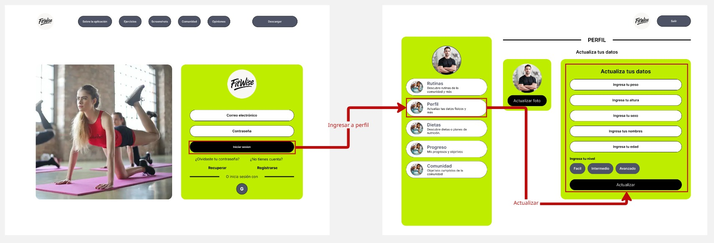

# VibeFit

**Producto: FitWise**

# Universidad Peruana de Ciencias Aplicadas

<p align="center">
  
</p>

### Carrera: Ingeniería de Software

### Ciclo: 7° ciclo

### Curso: Diseño de Experimentos de Ingeniería de Software

### Sección: 1ASI0732

### Profesor: Julio Manuel Noriega Melendez

## Informe de Trabajo Final

**Startup:** VibeFit  
**Producto:** FitWise

## Integrantes:

- **Ramiro Alexander Guzman Chavez** - U202217062
- **Farid Sebastian Briceño De La Cruz** - U20211F211
- **Muñoz Vilcapoma Mauricio Rigoberto** - U202217212
- **David Alexander Perez Garcia** - U202222942
- **Jhon Alexander Galvez Chambi** - U202323270

**Fecha:** Abril 2025  

**URL del proyecto:** [https://github.com/upc-pre-si732-2501-4436-G1-Galacticos](https://github.com/upc-pre-si732-2501-4436-G1-Galacticos)

---

# Registro de Versiones del Informe

| Versión | Fecha       | Autor | Descripción |
|---------|-------------|-------|-------------|
| TB1     | 12/04/2025  |  Ramiro Guzman     |   Desarrollé la carátula, la tabla de contenidos, la descripción de la Startup, la Solution Profile que abarca los Antecedentes y Problemática, definí los Segmentos Objetivos y el Diseño de las entrevistas.          |
| TB1     | 24/04/2025  |   Jhon Galvez  | Me enfoqué en el desarrollo de las historias de usuario, el backlog del producto, la guía de estilos, los lineamientos para el desarrollo del código fuente y las configuraciones para el despliegue de la landing page.    |
| TB1     | XX/XX/XXXX  |       |             |
| TB1     | XX/XX/XXXX  |       |             |
| TB1     | XX/XX/XXXX  |       |             |
| TB1     | XX/XX/XXXX  |       |             |
| TB1     | XX/XX/XXXX  |       |             |
| TB1     | XX/XX/XXXX  |       |             |
| TB1     | XX/XX/XXXX  |       |             |
| TB1     | XX/XX/XXXX  |       |             | 
| TB1     | XX/XX/XXXX  |       |             |
| TB1     | XX/XX/XXXX  |       |             |
| TB1     | XX/XX/XXXX  |       |             |

# Contenido

- [Universidad Peruana de Ciencias Aplicadas](#universidad-peruana-de-ciencias-aplicadas)
- [Informe de Trabajo Final](#informe-de-trabajo-final)
- [Registro de Versiones del Informe](#registro-de-versiones-del-informe)
- [Contenido](#contenido)
- [Student Outcome](#student-outcome)

## Capítulo I: Introducción

- [1.1. Startup Profile](#11-startup-profile)
  - [1.1.1. Descripción de la Startup](#111-descripción-de-la-startup)
  - [1.1.2. Perfiles de integrantes del equipo](#112-perfiles-de-integrantes-del-equipo)
- [1.2. Solution Profile](#12-solution-profile)
  - [1.2.1. Antecedentes y problemática](#121-antecedentes-y-problemática)
  - [1.2.2. Lean UX Process](#122-lean-ux-process)
    - [1.2.2.1. Lean UX Problem Statements](#1221-lean-ux-problem-statements)
    - [1.2.2.2. Lean UX Assumptions](#1222-lean-ux-assumptions)
    - [1.2.2.3. Lean UX Hypothesis Statements](#1223-lean-ux-hypothesis-statements)
    - [1.2.2.4. Lean UX Canvas](#1224-lean-ux-canvas)
- [1.3. Segmentos objetivo](#13-segmentos-objetivo)

## Capítulo II: Requirements Elicitation & Analysis

- [2.1. Competidores](#21-competidores)
  - [2.1.1. Análisis competitivo](#211-análisis-competitivo)
  - [2.1.2. Estrategias y tácticas frente a competidores](#212-estrategias-y-tácticas-frente-a-competidores)
- [2.2. Entrevistas](#22-entrevistas)
  - [2.2.1. Diseño de entrevistas](#221-diseño-de-entrevistas)
  - [2.2.2. Registro de entrevistas](#222-registro-de-entrevistas)
  - [2.2.3. Análisis de entrevistas](#223-análisis-de-entrevistas)
- [2.3. Needfinding](#23-needfinding)
  - [2.3.1. User Personas](#231-user-personas)
  - [2.3.2. User Task Matrix](#232-user-task-matrix)
  - [2.3.3. User Journey Mapping](#233-user-journey-mapping)
  - [2.3.4. Empathy Mapping](#234-empathy-mapping)
  - [2.3.5. As-is Scenario Mapping](#235-as-is-scenario-mapping)
- [2.4. Ubiquitous Language](#24-ubiquitous-language)

## Capítulo III: Requirements Specification

- [3.1. To-Be Scenario Mapping](#31-to-be-scenario-mapping)
- [3.2. User Stories](#32-user-stories)
- [3.3. Product Backlog](#33-product-backlog)
- [3.4. Impact Mapping](#34-impact-mapping)

## Capítulo IV: Product Design

- [4.1. Style Guidelines](#41-style-guidelines)
  - [4.1.1. General Style Guidelines](#411-general-style-guidelines)
  - [4.1.2. Web Style Guidelines](#412-web-style-guidelines)
  - [4.1.3. Mobile Style Guidelines](#413-mobile-style-guidelines)
    - [4.1.3.1. iOS Mobile Style Guidelines](#4131-ios-mobile-style-guidelines)
    - [4.1.3.2. Android Mobile Style Guidelines](#4132-android-mobile-style-guidelines)
- [4.2. Information Architecture](#42-information-architecture)
  - [4.2.1. Organization Systems](#421-organization-systems)
  - [4.2.2. Labeling Systems](#422-labeling-systems)
  - [4.2.3. SEO Tags and Meta Tags](#423-seo-tags-and-meta-tags)
  - [4.2.4. Searching Systems](#424-searching-systems)
  - [4.2.5. Navigation Systems](#425-navigation-systems)
- [4.3. Landing Page UI Design](#43-landing-page-ui-design)
  - [4.3.1. Landing Page Wireframe](#431-landing-page-wireframe)
  - [4.3.2. Landing Page Mock-up](#432-landing-page-mock-up)
- [4.4. Mobile Applications UX/UI Design](#44-mobile-applications-uxui-design)
  - [4.4.1. Mobile Applications Wireframes](#441-mobile-applications-wireframes)
  - [4.4.2. Mobile Applications Wireflow Diagrams](#442-mobile-applications-wireflow-diagrams)
  - [4.4.3. Mobile Applications Mock-ups](#443-mobile-applications-mock-ups)
  - [4.4.4. Mobile Applications User Flow Diagrams](#444-mobile-applications-user-flow-diagrams)
- [4.5. Mobile Applications Prototyping](#45-mobile-applications-prototyping)
  - [4.5.1. Android Mobile Applications Prototyping](#451-android-mobile-applications-prototyping)
  - [4.5.2. iOS Mobile Applications Prototyping](#452-ios-mobile-applications-prototyping)
- [4.6. Web Applications UX/UI Design](#46-web-applications-uxui-design)
  - [4.6.1. Web Applications Wireframes](#461-web-applications-wireframes)
  - [4.6.2. Web Applications Wireflow Diagrams](#462-web-applications-wireflow-diagrams)
  - [4.6.3. Web Applications Mock-ups](#463-web-applications-mock-ups)
  - [4.6.4. Web Applications User Flow Diagrams](#464-web-applications-user-flow-diagrams)
- [4.7. Web Applications Prototyping](#47-web-applications-prototyping)
- [4.8. Domain-Driven Software Architecture](#48-domain-driven-software-architecture)
  - [4.8.1. Software Architecture Context Diagram](#481-software-architecture-context-diagram)
  - [4.8.2. Software Architecture Container Diagrams](#482-software-architecture-container-diagrams)
  - [4.8.3. Software Architecture Components Diagrams](#483-software-architecture-components-diagrams)
- [4.9. Software Object-Oriented Design](#49-software-object-oriented-design)
  - [4.9.1. Class Diagrams](#491-class-diagrams)
  - [4.9.2. Class Dictionary](#492-class-dictionary)
- [4.10. Database Design](#410-database-design)
  - [4.10.1. Entity Relationship Diagrams](#4101-entity-relationship-diagrams)
  - [4.10.2. Relational Database Schemas](#4102-relational-database-schemas)

## Capítulo V: Product Implementation
- [5.1. Software Configuration Management](#51-software-configuration-management)

  - [5.1.1. Software Development Environment Configuration](#511-software-development-environment-configuration)
  - [5.1.2. Source Code Management](#512-source-code-management)
  - [5.1.3. Source Code Style Guide & Conventions](#513-source-code-style-guide--conventions)
  - [5.1.4. Software Deployment Configuration](#514-software-deployment-configuration)
- [5.2. Product Implementation & Deployment](#52-product-implementation--deployment)

  - [5.2.1. Sprint Backlogs](#521-sprint-backlogs)
  - [5.2.2. Implemented Landing Page Evidence](#522-implemented-landing-page-evidence)
  - [5.2.3. Implemented Frontend-Web Application Evidence](#523-implemented-frontend-web-application-evidence)
  - [5.2.4. Implemented Native-Mobile Application Evidence](#524-implemented-native-mobile-application-evidence)
  - [5.2.5. Implemented RESTful API and/or Serverless Backend Evidence](#525-implemented-restful-api-andor-serverless-backend-evidence)
  - [5.2.6. RESTful API documentation](#526-restful-api-documentation)
  - [5.2.7. Team Collaboration Insights](#527-team-collaboration-insights)
- [5.3. Video About-the-Product](#53-video-about-the-product)

## Capítulo VI: Conclusiones, Bibliografía y Anexos
- [6.1. Conclusiones](#61-conclusiones)
- [6.2. Bibliografía](#62-bibliografía)
- [6.3. Anexos](#63-anexos)
  
---

# Student Outcome

El curso contribuye al cumplimiento del Student Outcome ABET:  
**ABET – EAC - Student Outcome 4**

**Criterio:**  
La capacidad de reconocer responsabilidades éticas y profesionales en situaciones de ingeniería y hacer juicios informados, que deben considerar el impacto de las soluciones de ingeniería en contextos globales, económicos, ambientales y sociales.

| <div style="width:100px">Criterio específico</div> | <div align="center" style="width:250px">Acciones Realizadas</div> | <div align="center" style="width:250px">Conclusiones</div> |
|:-------------------:|-------------------|------------|
|4.c.1 Reconoce responsabilidad ética y profesional en situaciones de ingeniería de software  | **- Ramiro Guzman** <br> **TB1:** <br> **TP:** <br> **TB2:** <br> **TF:** <br> <br> **- Farid Briceño** <br> **TB1:** <br> **TP:** <br> **TB2:** <br> **TF:** <br> <br> **- Jhon Galvez** <br> **TB1:** A lo largo de esta primera fase, asimilé el código de conducta y la ética fundamentales para un desarrollador. Esto me impulsó a colaborar activamente en la recopilación de la información requerida para nuestra aplicación, con la meta clara de generar un impacto significativo en la salud y el bienestar de las personas. <br> **TP:** <br> **TB2:** <br> **TF:** <br> <br> **- Mauricio Muñoz** <br> **TB1:** <br> **TP:** <br> **TB2:** <br> **TF:** <br> <br> **- David Perez** <br> **TB1:** <br> **TP:** <br> **TB2:** <br> **TF:** <br> <br>| **TB1:** Cada miembro participó en sus actividades asignadas, manteniendo una comunicación activa y eficaz que fortaleció la confianza mutua. Esto mejoró el trabajo en equipo, un valor crucial para proyectos colaborativos |
|4.c.2 Emite juicios informados considerando el impacto de las soluciones de ingeniería de software en contextos globales, económicos, ambientales y sociales| **- Ramiro Guzman** <br> **TB1:** <br> **TP:** <br> **TB2:** <br> **TF:** <br> <br> **- Farid Briceño** <br> **TB1:** <br> **TP:** <br> **TB2:** <br> **TF:** <br> <br> **- Jhon Galvez** <br> **TB1:** He tomado conciencia de la crucial importancia de la salud en la sociedad contemporánea. El anhelo por el bienestar físico y mental es evidente, pero las dinámicas de la vida en la ciudad a menudo se interponen en la consecución de estos objetivos. En este sentido, considero que la propuesta que hemos concebido aborda esta problemática desde una perspectiva integral. <br> **TP:** <br> **TB2:** <br> **TF:** <br> <br> **- Mauricio Muñoz** <br> **TB1:** <br> **TP:** <br> **TB2:** <br> **TF:** <br> <br> **- David Perez** <br> **TB1:** <br> **TP:** <br> **TB2:** <br> **TF:** <br> <br> | **TB1:** Cada miembro participó en sus actividades asignadas, manteniendo una comunicación activa y eficaz que fortaleció la confianza mutua. Esto mejoró el trabajo en equipo, un valor crucial para proyectos colaborativos |

---

## Capítulo I: Introducción

### 1.1. Startup Profile

#### 1.1.1. Descripción de la Startup

VibeFit es una startup tecnológica enfocada en mejorar el bienestar físico y mental de las personas a través de soluciones digitales inteligentes. Su misión es simplificar, personalizar y acompañar el proceso hacia una vida saludable, especialmente para quienes enfrentan barreras como la falta de tiempo, motivación o conocimiento especializado.

Su producto principal, FitWise, es una aplicación disponible en versión web y móvil que crea rutinas de entrenamiento y planes nutricionales completamente personalizados. La plataforma se adapta a las características, objetivos y nivel físico de cada usuario, permitiendo que cualquier persona pueda incorporar hábitos saludables a su estilo de vida, sin importar su experiencia previa o disponibilidad horaria.

La propuesta de valor de VibeFit se centra en tres pilares clave:

- Adaptabilidad, para ajustarse a las necesidades individuales.
- Personalización, para ofrecer soluciones únicas y efectivas.
- Acompañamiento constante, mediante tecnología que guía, motiva y mide el progreso del usuario.

VibeFit nace para transformar la manera en que las personas se relacionan con su salud, derribando los obstáculos más comunes y convirtiendo el bienestar en una experiencia accesible, flexible y sostenible.

#### 1.1.2. Perfiles de integrantes del equipo

---

#### **Muñoz Vilcapoma Mauricio – Ingeniería de Software – U202217212**  

<p align="center">
  
</p>

Soy Muñoz Vilcapoma Mauricio, estudiante de Ingeniería de Software. Deseo desempeñar un papel fundamental en el mundo de la tecnología, creando soluciones innovadoras y avanzadas como desarrollador de Software. Estoy comprometido con mi desarrollo profesional y con hacer una diferencia en el campo de la ingeniería de software.

---

#### **Ramiro Alexander Guzman Chavez – Ingeniería de Software – U202217062**  

<p align="center">
  
</p>

Mi perfil se basa en ser una persona responsable, disciplinada en todo aspecto y comprometida con las actividades que me puedan tocar.
Considero que tengo una experiencia altamente capacitada para este tipo de tareas. Suelo desarrollarme de manera positiva en los trabajos grupales y tengo conocimientos en bases de datos, lo cual puede aportar de manera importante al equipo.
Además, cuento con conocimientos en lenguajes de programación como Java y JavaScript, lo que me permite desarrollar soluciones tanto del lado del backend como del frontend, contribuyendo a proyectos de desarrollo de software de manera integral.

---

#### **Farid Sebastian Briceño De La Cruz – Ingeniería de Software – U20211F211** 

<p align="center">
    
</p>

Soy estudiante de Ingeniería de Software con un fuerte interés en el desarrollo de productos digitales y la tecnología. En mi tiempo libre, me gusta jugar videojuegos. También tengo un interés especial en la música, lo que me ayuda a equilibrar mi vida académica y personal. Cuento con habilidades en gestión de bases de datos y tengo experiencia en análisis de datos, lo que me ayuda a tomar decisiones informadas y crear soluciones efectivas.

---

#### **David Alexander Perez Garcia – Ingeniería de Software – U202222942**

<p align="center">
    
</p>

Mi nombre es David, actualmente soy estudiante de Ingeniería de Software (7mo ciclo). Me especializo en el desarrollo de aplicaciones web, trabajando de forma independiente en proyectos de programación. Tengo experiencia en lenguajes como  TypeScript, Java y PHP, utilizando tecnologías modernas como React, Next.js, Spring Boot, Express y Laravel. Apasionado por la tecnología y el aprendizaje continuo, siempre busco mejorar mis habilidades y asumir nuevos desafíos en el mundo del desarrollo de software.

---

#### **Jhon Alexander Galvez Chambi – Ingeniería de Software – U202323270**  

<p align="center">
    
</p>

Soy una persona responsable y comprometida con la consecución de los mejores resultados en trabajo en equipo. Poseo experiencia en diversos lenguajes de programación, incluyendo Python, JavaScript y C++, así como en varios de los frameworks asociados a estos lenguajes. Además, tengo conocimientos en tecnologías emergentes como Cloud Computing e Internet de las Cosas (IoT), y estoy dispuesto a aportar mi experiencia en estas áreas para contribuir al éxito de los proyectos en los que participo.

---

### 1.2. Solution Profile

#### 1.2.1. Antecedentes y problemática

- **Who (¿Quiénes son los afectados?)**  
  Personas entre 18 y 40 años interesadas en mejorar su estado físico o mantener una vida saludable, pero que enfrentan obstáculos como la falta de tiempo, desconocimiento sobre rutinas de ejercicio y dificultad para seguir planes alimenticios realistas.

- **What (¿Qué sucede?)**  
  Existe una creciente demanda de soluciones fitness personalizadas; sin embargo, muchas aplicaciones actuales son genéricas, poco flexibles y no consideran la realidad del usuario en cuanto a tiempo, nivel, objetivos y cultura alimentaria. Esto genera frustración, abandono y poco progreso.

- **Where (¿Dónde ocurre?)**  
  Principalmente en contextos urbanos, especialmente en ciudades como Lima, donde factores como el tráfico, las largas jornadas laborales y el escaso acceso a asesoría personalizada dificultan la constancia en la actividad física y en la alimentación saludable.

- **When (¿Cuándo sucede?)**  
  De forma cotidiana, cuando las personas intentan adoptar una rutina saludable pero no encuentran un plan realista que se ajuste a su disponibilidad de tiempo y recursos personales.

- **Why (¿Por qué es un problema?)**  
  Porque afecta directamente la salud física y mental. Sin una guía adecuada y adaptada, las personas pierden motivación rápidamente, lo que impide la adquisición de hábitos saludables sostenibles en el tiempo.

- **How (¿Cómo se manifiesta?)**

  - Rutinas genéricas que no consideran el tiempo real disponible del usuario.
  - Planes de nutrición no adaptados a la gastronomía local.
  - Falta de seguimiento y visualización de progreso.
  - Escasa interacción humana o profesional en las plataformas actuales.

- **How Much (¿Cuán grande es el problema?)**  
  Según el Ministerio de Salud del Perú:

  - Más del **60%** de la población adulta presenta sobrepeso u obesidad.
  - Más del **70%** no realiza actividad física suficiente.

  Esto representa un problema de salud pública y una gran **oportunidad de mercado** para soluciones tecnológicas efectivas y accesibles como FitWise.

#### 1.2.2. Lean UX Process

##### 1.2.2.1. Lean UX Problem Statements

Nuestra plataforma (FitWise) fue diseñada para facilitar el acceso a rutinas de entrenamiento y planes nutricionales personalizados, adaptándose al estilo de vida, objetivos y nivel de experiencia de cada usuario. A través de nuestra solución, buscamos ofrecer una experiencia motivadora, intuitiva y basada en datos para ayudar a las personas a adoptar hábitos saludables de manera sostenible.

HHemos observado que los usuarios no logran mantener la constancia en sus rutinas debido a la falta de motivación inmediata y planes que se adapten a sus cambios de horarios o progreso. Asimismo, la oferta de apps genéricas de fitness (ej: planes no personalizados, recomendaciones estáticas) genera frustración en usuarios que buscan resultados específicos.

_¿Cómo podríamos mejorar FitWise para que los usuarios mantengan una adherencia constante a sus rutinas y planes nutricionales, aumentando así la retención y los resultados tangibles en salud?_

##### 1.2.2.2. Lean UX Assumptions

**Business Assumptions**

1. Creemos que nuestros clientes necesitan mantener hábitos saludables de manera sostenible, pero les falta motivación y orientación personalizada.
2. Estas necesidades se resuelven con una plataforma web/movil que centralice las actividades fisica y nutricionales, adaptadas a las preferencias establecidas por el usuario.
3. Nuestros clientes iniciales serán adultos de 25-40 años, que buscan mejorar su salud pero no tienen tiempo para planificar rutinas o dietas.
4. El valor más importante de lo que el cliente requiere de nuestro servicio es un plan de entrenamiento y nutrición 100% adaptado a sus horarios, nivel físico y metas, sin necesidad de tomar decisiones complejas.
5. El cliente puede tener los siguientes beneficios adicionales: Comunidad de apoyo, descuentos en productos saludables (a través de puntos) y seguimiento automatizado de su progreso.
6. Vamos a adquirir clientes mediante estrategias de marketing digital (SEO, redes sociales, influencers de fitness), alianzas con gimnasios locales y referencias de usuarios satisfechos.
7. Haremos dinero a través de suscripciones premium (planes avanzados + coaches certificados) y comisiones por partnerships con marcas de salud.
8. Nuestra competencia principal serán las apps genéricas de fitness (como Freeletics o MyFitnessPal) y la oferta de entrenadores en redes sociales.
9. Los venceremos ya que nuestra plataforma tiene capacidad de personalización dinámica (no solo planes estáticos) y la integración de tecnología pensada en motivar continuamente al usuario.
10. Nuestro mayor riesgo es que los usuarios no perciban valor en la adaptabilidad automática y prefieran soluciones más simples (aunque menos efectivas)
11. Resolveremos esto mediante estrategias de onboarding amigables, incentivos iniciales, experimentos continuos (A/B testing) para validar qué features generan más engagement en nuestro producto.
12. Qué otras suposiciones tenemos que, si resultan falsas, harán que nuestro negocio/proyecto fracase?
    - Que los usuarios no estén dispuestos a pagar por personalización

**User Assumptions**

1. ¿Quién será nuestro usuario?
   - Personas con poco conocimiento de fitness que buscan empezar, o intermedios que quieren mejorar su rendimiento.
2. ¿Dónde encaja nuestro producto en su vida?
   - En su rutina diaria: al despertar (para ver planes del día), durante breaks (para micro-entrenamientos) y por las noches (para registrar progreso)
3. ¿Qué problemas resuelve nuestro producto?
   - Falta de tiempo para planificar dietas o rutinas de ejercicio
   - Desmotivación por resultados lentos.
   - Desconocimiento de técnicas adecuadas para ejercitarse.
4. ¿Cómo y Cuándo es usado nuestro producto?
   - Antes del viaje (exploración y reservas) y durante el viaje (gestión de itinerarios y asistencia).
   - En dispositivos móviles y de escritorio, principalmente mediante el navegador web.
5. ¿Qué características son importantes?
   - Personalización automática, recordatorios inteligentes, comunidad motivacional y seguimiento visual del progreso (gráficos, badges).
6. ¿Cómo luce y se comporta nuestro producto?
   - Con una interfaz limpia, intuitiva y confiable, accesible para distintos niveles de experiencia tecnológica.
   - Mostrar colores energéticos (verde/azul), lenguaje cercano ("¡Vamos, María!") y flujos rápidos (máximo 3 clics para acciones clave).

##### 1.2.2.3. Lean UX Hypothesis Statements

- **Creemos que**, si ofrecemos a los usuarios una plataforma donde puedan explorar rutinas de ejercicio y dietas de acuedos a su nivel de experiencia, objetivos, disponibilidad e informacion fisica, entonces podrán alcanzar sus objetivos con mayor facilidad, mejorando su estado de forma. **Sabremos que** hemos logrado este resultado **cuando** observemos un incremento sostenido en la cantidad de registros exitosos y una tasa alta de satisfacción del usuario (medida por reseñas y feedback post-actividad).

- **Creemos que**, si permitimos a los usuarios definir sus objetivos físicos y zonas corporales a trabajar durante el onboarding, entonces las rutinas generadas tendrán mayor relevancia para ellos. **Sabremos que** esta hipótesis es válida **cuando** se registren un incremento en el porcentaje de usuarios que completa el onboarding y un declive en la tasa de abandono de rutinas por cada semana.

- **Creemos que**, si implementamos un sistema de badges y recompensas para usuarios que completen rutinas semanales, entonces aumentaremos su motivación y adherencia a los planes. **Sabremos que** esta hipótesis se confirma **cuando** veamos un aumento en el promedio de entrenamientos completados por semana.

##### 1.2.2.4. Lean UX Canvas

<p align="center">
    
</p>

### 1.3. Segmentos objetivo

#### Adultos jóvenes urbanos en búsqueda activa de bienestar (18 - 40 años)

**Descripción**  
Hombres y mujeres entre 18 y 40 años que viven en zonas urbanas como Lima Metropolitana, y están comprometidos (o en proceso de compromiso) con su bienestar físico. Incluye tanto a profesionales con rutinas demandantes como a estudiantes universitarios en formación. Tienen diferentes niveles de disponibilidad de tiempo y recursos, pero comparten la necesidad de una solución práctica, accesible, visualmente atractiva y motivadora que se adapte a sus estilos de vida. Son usuarios digitales habituales que buscan orientación, flexibilidad y personalización en su camino hacia una vida más saludable.

**Características clave**
- Viven en ciudades grandes, con acceso frecuente a internet y smartphones.  
- Nivel socioeconómico medio a medio-alto.  
- Nativos digitales o altamente activos en plataformas digitales.  
- Buscan herramientas intuitivas, visuales y gamificadas que los guíen y motiven.  
- Interesados en rutinas y recetas saludables, preferentemente peruanas y fáciles.  
- Quieren resultados reales y sostenibles, sin complicaciones ni pérdida de tiempo.

**Datos de sustento**
- Según la Encuesta Demográfica y de Salud Familiar (ENDES) 2023 del INEI, más del 70% de la población adulta joven no realiza actividad física suficiente, a pesar de tener intenciones de mejorar su salud y bienestar.  


- El Perfil de Salud 2023 elaborado por la Dirección General de Epidemiología indica que las enfermedades no transmisibles, como la hipertensión, diabetes y obesidad, son altamente prevalentes en población urbana y joven, lo cual refuerza la necesidad de intervenciones de prevención y promoción de salud desde plataformas digitales.  


- Según el Perfil de País elaborado por la Organización Panamericana de la Salud (OPS), el Perú enfrenta retos significativos en cuanto a estilos de vida poco saludables, especialmente en contextos urbanos. El informe destaca la importancia de adoptar tecnologías de salud digital para llegar efectivamente a las poblaciones más jóvenes.  
  

---

## Capítulo II: Requirements Elicitation & Analysis
### 2.1. Competidores
<table> <thead> <tr> <th>Nombre del Competidor</th> <th>Descripción</th> </tr> </thead> 
    <tbody>
        <tr>
            <td rowspan align="center">MyFitnessPal
            <td>App de seguimiento nutricional y calorías con base de datos extensa, enfocada en usuarios que desean controlar su alimentación y objetivos de salud<br>
            Página web:<a href="https://www.myfitnesspal.com/es">https://www.myfitnesspal.com/es</a>
        </tr>
        <tr>
            <td align="center">Freeletics
            <td>Entrenamientos personalizados sin equipo, con enfoque en la flexibilidad del usuario y coaching mediante inteligencia artificial.<br>
            Página web:<a href="https://www.freeletics.com/es/"> https://www.freeletics.com/es/</a>
        </tr>
        <tr>
           <td rowspan align="center">8fit<br> 
           <td>App que combina rutinas de ejercicio y planes alimenticios personalizados, con enfoque en principiantes y personas con tiempo limitado.<br>
           Página web:<a href="https://8fit.com/"> https://8fit.com/</a>
    </tbody>
</table>

#### 2.1.1. Análisis competitivo

<table style="width: 100%;"> <tr> <th colspan="6" style="padding: 8px; text-align: center;">Competitive Analysis Landscape</th> </tr> <tr> <td>¿Por qué llevar a cabo este análisis?</td> <td colspan="5">Para identificar ventajas comparativas y oportunidades de posicionamiento de FitWise frente a otras aplicaciones de fitness, mejorando su estrategia de producto y marketing hacia usuarios que inician su camino hacia un estilo de vida saludable.</td> </tr>
 <tr> <td colspan="2"></td> <td align="center"><strong>MyFitnessPal</strong></td> <td align="center"><strong>Freeletics</strong>
 </td> <td align="center"><strong>8fit</strong></td> <td align="center"><strong>FitWise</strong></td> </tr> <tr> <td rowspan="2" align="center">Perfil</td> <td>Overview</td> <td>App veterana en control de calorías y macronutrientes, centrada en autogestión del usuario.</td> <td>Entrenamiento personalizado con IA y sin necesidad de equipo, ideal para rutinas en casa.</td> <td>Planes de fitness y nutrición en un mismo lugar, dirigido a personas ocupadas.</td> <td>Asistente personalizado para fitness y nutrición, con enfoque en personas sin experiencia previa ni conocimientos técnicos.</td> </tr> <tr> <td>Ventaja competitiva
¿Qué valor ofrece a los clientes?</td> <td>Base de datos alimenticia muy amplia, historial comprobado y comunidad activa.</td> <td>Enfoque motivacional, rutinas adaptativas, coach digital.</td> <td>Combinación de entrenamiento + alimentación con interfaz amigable para novatos.</td> <td>Personalización profunda según estilo de vida, metas, tiempo disponible y acompañamiento constante para empezar desde cero.</td> </tr> <tr> <td rowspan="2" align="center">Perfil de Marketing</td> <td>Mercado objetivo</td> <td>Usuarios con experiencia en dietas y fitness que desean control detallado.</td> <td>Personas motivadas que buscan progresar desde casa con estructura y motivación.</td> <td>Usuarios principiantes con poco tiempo y ganas de hábitos saludables.</td> <td>Personas que desean mejorar su salud pero no saben por dónde empezar; estilo de vida ocupado.</td> </tr> <tr> <td>Estrategias de marketing</td> <td>SEO, comunidad online, integración con otras apps (Strava, Fitbit), contenido de expertos.</td> <td>Publicidad digital con mensajes aspiracionales, storytelling de usuarios, retos en redes.</td> <td>Anuncios orientados a principiantes, recomendaciones en tiendas de apps, testimonios.</td> <td>Marketing educativo, redes sociales con enfoque motivacional, onboarding guiado y testimonios de transformación real.</td> </tr> <tr> <td rowspan="3" align="center">Perfil del Producto</td> <td>Productos & Servicios</td> <td>Seguimiento calórico, macros, planes de comida, escáner de código de barras.</td> <td>Rutinas HIIT, coaching digital, planes progresivos.</td> <td>Ejercicios y recetas personalizadas, rutinas breves.</td> <td>App web y móvil con planes dinámicos de alimentación y entrenamiento según objetivos, nivel y estilo de vida.</td> </tr> <tr> <td>Precios & Costos</td> <td>Gratuita con funciones premium desde $9.99/mes</td> <td>Suscripción mensual desde $12.99/mes</td> <td>Freemium con planes desde $7.50/mes</td> <td>Modelo freemium, suscripción desde $5.99/mes (estimado)</td> </tr> <tr> <td>Canales de distribución</td> <td>iOS, Android, Web, integraciones con dispositivos</td> <td>iOS, Android, Web</td> <td>iOS, Android</td> <td>iOS, Android, Web, campañas en redes, alianzas con gimnasios locales</td> </tr> <tr> <td rowspan="4" align="center">Análisis SWOT</td> <td>Fortalezas</td> <td>Gran base de usuarios, amplia data nutricional, experiencia acumulada</td> <td>Entrenamientos adaptables sin equipo, coaching motivacional</td> <td>Fácil de usar, buena combinación entre nutrición y ejercicio</td> <td>Enfoque empático, personalización real, solución integral para novatos</td> </tr> <tr> <td>Debilidades</td> <td>Curva de aprendizaje, no apta para principiantes sin guía</td> <td>Poca personalización en planes nutricionales</td> <td>Limitada en métricas y seguimiento profesional</td> <td>App nueva en el mercado, aún sin comunidad consolidada</td> </tr> <tr> <td>Oportunidades</td> <td>Mayor integración con wearables y servicios de salud</td> <td>Gamificación y expansión a wellness mental</td> <td>Expansión con coaches humanos o retos grupales</td> <td>Capturar segmento desatendido que busca guía inicial sin complicaciones</td> </tr> <tr> <td>Amenazas</td> <td>Competencia con apps más simples o gratuitas</td> <td>Dependencia de motivación del usuario</td> <td>Mercado saturado de apps similares</td> <td>Dificultad para diferenciarse frente a marcas ya posicionadas</td> </tr> </table>

#### 2.1.2. Estrategias y tácticas frente a competidores

**Estrategias:**  
- **Diferenciación por personalización y acompañamiento inicial:**  
  Mientras muchas apps de salud y fitness ofrecen planes genéricos, **FitWise** se posiciona como un guía real para personas que no saben por dónde empezar. Desde el primer día, el usuario recibe orientación paso a paso, ayudándolo a establecer metas realistas, entendiendo su estado actual de salud y hábitos. Esto reduce la tasa de abandono en las primeras semanas y genera confianza desde el inicio.  

- **Enfoque en usuarios con poco tiempo y sin experiencia previa:**  
  La mayoría de las aplicaciones se centran en usuarios que ya tienen motivación o experiencia previa en fitness. **FitWise** rompe con ese enfoque y prioriza a quienes tienen jornadas exigentes, familias que atender, o inseguridad sobre cómo entrenar o comer mejor. El producto se adapta al usuario, no al revés, con rutinas de minutos, ajustes diarios y sin tecnicismos.

- **Mejora continua centrada en la experiencia del usuario:**  
  A diferencia de competidores que lanzan versiones estáticas, **FitWise** evoluciona con sus usuarios. Se recopila feedback constante para adaptar planes, eliminar fricciones de navegación, y reforzar aspectos motivacionales como avances visibles, recompensas y mensajes personalizados. Esta iteración rápida genera una experiencia más humana y cercana.

**Tácticas:**  
- **Campañas de retos “Empieza sin presión”:**  
  Se lanzarán desafíos accesibles para nuevos usuarios como “7 días para comenzar”, que combinan hábitos simples (caminar 10 min, hidratarse bien, cenar ligero) con mensajes motivacionales. Estos retos estarán integrados con notificaciones diarias, logros desbloqueables y recompensas virtuales (como niveles, stickers, badges) que refuercen la constancia sin agobiar.

- **Contenido educativo y emocional:**  
  Se desarrollará contenido multimedia centrado en eliminar la culpa, el miedo o la frustración asociada con el cambio de hábitos. Videos de 1 minuto, reels, posts y artículos con lenguaje amigable, comparaciones simples (“comer mejor no es comer menos”, “moverte no es ir al gym”), y testimonios reales que conecten emocionalmente con el usuario.

- **Alianzas con profesionales y centros de salud:**  
  Para reforzar la credibilidad y dar valor extra, se buscarán colaboraciones con nutricionistas, médicos, entrenadores y psicólogos. Estos expertos validarán el contenido de la app, brindarán webinars abiertos para usuarios activos, y generarán materiales especializados (ej. guías para diabéticos, personas con ansiedad alimentaria o movilidad limitada). También se explorará la integración con centros de salud o clínicas como canal de recomendación.
### 2.2. Entrevistas

#### 2.2.1. Diseño de entrevistas

### Segmento: Adultos jóvenes urbanos en búsqueda activa de bienestar (18 - 40 años)  
**Objetivo:** Explorar los hábitos, barreras, motivaciones y disposición del público objetivo frente al uso de soluciones digitales personalizadas para mejorar su bienestar físico y mental. Validar la propuesta de valor de FitWise y su encaje en el estilo de vida urbano y digital.

---

### 1. Datos Generales
1. ¿Cuál es tu nombre y edad?  
2. ¿Cuál es tu ocupación actual? ¿Estás trabajando, estudiando o ambas cosas?  
3. ¿En qué ciudad vives? ¿Consideras que tu rutina es principalmente urbana?

---

### 2. Estilo de vida y prioridades personales
4. ¿Cómo suele ser un día típico para ti entre semana?  
5. ¿Qué tan fácil o difícil es para ti encontrar tiempo para actividades relacionadas con tu bienestar (como hacer ejercicio, cocinar, descansar, etc.)?  
6. ¿Qué lugar ocupa tu salud física y mental dentro de tus prioridades actuales?

---

### 3. Motivaciones y obstáculos para una vida saludable
7. ¿Qué significa para ti llevar una vida saludable?  
8. ¿Cuáles son las principales dificultades que enfrentas para mantener hábitos saludables?  
9. ¿Has intentado antes seguir una rutina de ejercicio o alimentación? ¿Qué te funcionó y qué no?

---

### 4. Comportamiento digital y relación con la tecnología
10. ¿Usas alguna app o herramienta digital actualmente para tu salud, alimentación o actividad física? ¿Por qué esa?  
11. ¿Qué características valoras más en una app o plataforma de bienestar? (Por ejemplo: que sea visual, fácil de usar, flexible, motivadora, etc.)  
12. ¿Qué te motiva más: ver tu progreso, recibir recordatorios, contar con una comunidad, gamificación, o tener acompañamiento personalizado?

---

### 5. Validación de la propuesta FitWise (Producto de VibeFit)
13. Si existiera una app que te ofrezca rutinas de entrenamiento y planes nutricionales **personalizados**, **flexibles** y que se adapten a tu disponibilidad y nivel físico, ¿la usarías? ¿Qué te llamaría la atención o qué te haría dudar?  
14. ¿Te gustaría que esta app también te acompañe en el proceso con seguimiento, recordatorios, y herramientas para ver tu avance en tiempo real?  
15. ¿Estarías dispuesto/a a pagar por una plataforma como esta si realmente se adapta a ti y te ayuda a mantenerte motivado/a?

---

#### 2.2.2. Registro de entrevistas

**Entrevista para el Segmento Objetivo 1 - Adultos jóvenes urbanos en búsqueda activa de bienestar (18 - 40 años) :**

- **Entrevista 1:**

  **Entrevistador:** Jhon Alexander Galvez Chambi

  **Entrevistado:** Sebastian Rodriguez Macedo

  **Sexo:** Masculino

  **Edad:** 18

  **Domicilio:** La Perla, Callao

  **Inicio de la Entrevista:** 0:00

  **Duración de la Entrevista:** 7:09

  

  - **Resumen:** 
  Sebastián es estudiante de la Universidad Peruana de Ciencias Aplicadas. Su rutina diaria comienza temprano, dedicando tiempo a estudiar, planificar su alimentación y hacer algo de ejercicio. Aunque intenta mantener un equilibrio, siente que no tiene suficiente tiempo para organizar todas las actividades que le gustaría realizar. Para él, una vida saludable implica estar bien tanto física como mentalmente. Su mayor desafío para lograrlo es la alimentación. Aunque actualmente no utiliza ninguna aplicación para mantenerse en forma, le gustaría encontrar una que le permita hacer un seguimiento de su progreso en función de los objetivos físicos que establezca.

  Enlace al video: [Entrevista Sebastian](https://youtu.be/tBXV1LA4RdA)


- **Entrevista 2:**

  **Entrevistador:** Ramiro Alexander Guzman Chavez

  **Entrevistado:** Christopher Adrián Carlos Urcia Tardío

  **Sexo:** Masculino

  **Edad:** 27

  **Domicilio:** Bellavista Lima Peru

  **Inicio de la Entrevista:** 4:00

  **Duración de la Entrevista:** 5:22

  

  - **Resumen:** 
  Christopher trabaja como asistente en oficina, con una jornada de 9 a 5. Su rutina diaria incluye organizar reuniones, responder correos y colaborar en pequeños proyectos. Luego del trabajo, dedica tiempo al estudio y procura mantenerse activo a través del ejercicio, lectura o actividades recreativas. Considera muy importante llevar un estilo de vida saludable, aunque a veces enfrenta obstáculos como la falta de tiempo y motivación. Utiliza una aplicación para registrar su actividad física y alimentación, lo que le ayuda a mantenerse enfocado. Ha probado diferentes dietas, pero lo que más le ha funcionado es mantener hábitos sostenibles. Cree que la tecnología puede ser una gran aliada para organizar sus rutinas, reducir el estrés con herramientas como meditación, y recibir recordatorios personalizados. Le gustaría una app que se adapte a sus horarios, personalice entrenamientos y planes alimenticios, y que incluya funciones de comunidad, retos y seguimiento personalizado. Está dispuesto a pagar por una app que cumpla con estas expectativas.

  Enlace al video: [Entrevista Christopher](https://drive.google.com/file/d/1CefdfzctUQmsBDRiMwWRxyFM35zNvKiG/view?usp=sharing)


- **Entrevista 3:**

  **Entrevistador:** Jhon Alexander Galvez Chambi

  **Entrevistado:** Fabrizio Alberto Paredes Santos

  **Sexo:** Masculino

  **Edad:** 18

  **Domicilio:** San Miguel, Lima

  **Inicio de la Entrevista:** 0:00

  **Duración de la Entrevista:** 08:41

  

  - **Resumen:** 
  Fabrizio es estudiante de la Universidad Peruana de Ciencias Aplicadas. Su rutina diaria incluye asistir a clases, realizar sus tareas y aprovechar su tiempo libre realizando actividades recreativas, como ir al gimnasio. Sin embargo, considera que cuando la carga académica es alta, le resulta difícil mantener los hábitos saludables que tiene, como comer de manera sana. Para él, una vida saludable implica estar bien tanto física como mentalmente. Su principal desafío para llevar un estilo de vida saludable es la alimentación, ya que contar con la orientación de un profesional suele ser costoso. Actualmente, utiliza la aplicación Fitia para mejorar sus hábitos alimenticios. Además, considera que una aplicación intuitiva que muestre el progreso del usuario es clave para mantenerse motivado y alcanzar los objetivos establecidos. Fabrizio cree que una aplicación que combine el aspecto nutricional de Fitia con un plan de rutinas de ejercicio sería una propuesta innovadora que estaría dispuesto a probar.

  Enlace al video: [Entrevista Fabrizio](https://youtu.be/tp0VYYkMdFQ)


- **Entrevista 4:**

  **Entrevistador:** Jhon Alexander Galvez Chambi

  **Entrevistado:** Ivan Vilca Chambi

  **Sexo:** Masculino

  **Edad:** 29

  **Domicilio:** Callao, Callo

  **Inicio de la Entrevista:** 0:00

  **Duración de la Entrevista:** 5:30

  

  - **Resumen:** 
  Iván es un joven estudiante que vive en la ciudad del Callao. Siente que su rutina académica complica la planificación de actividades orientadas a su bienestar, el cual ha quedado relegado a un segundo plano en su estilo de vida. A pesar de esto, considera que tanto el deporte como una alimentación adecuada son fundamentales para mantener una vida sana. En el pasado, ha intentado incorporar rutinas de ejercicio, pero suele perder la motivación después de unos días. Actualmente, no utiliza ninguna aplicación para organizar sus actividades de bienestar, pero le gustaría encontrar una que sea fácil de usar, motivadora, que le permita seguir su progreso hacia los objetivos que se proponga y que se adapte a sus preferencias. Además, lo que más le interesaría de una aplicación de este tipo sería la posibilidad de realizar un seguimiento real de su progreso físico. No obstante, también le preocupa la seguridad e integridad de sus datos dentro de la aplicación.

  Enlace al video: [Entrevista Ivan](https://youtu.be/QHWPDbnKUhE)


- **Entrevista 5:**

  **Entrevistador:** David Alexander Pérez García

  **Entrevistado:** Sujey García

  **Sexo:** Femenina

  **Edad:** 30 años

  **Domicilio:** Comas Lima Peru

  **Inicio de la Entrevista:** 0:00

  **Duración de la Entrevista:** 3:30

  

- **Resumen:** 
En esta entrevista  para el segmento “adultos jóvenes urbanos en búsqueda activa de bienestar”, Sujei García, una mujer de 33 años que trabaja como asistente en psicología y vive en Lima, comparte su experiencia diaria marcada por una agenda ocupada entre el trabajo, el cuidado de su hija y las tareas del hogar, lo cual le impide priorizar su bienestar físico y mental. Aunque intenta mantener una alimentación saludable, no realiza actividad física por falta de tiempo. No utiliza actualmente ninguna aplicación de bienestar, pero considera ideal una plataforma que le ofrezca rutinas personalizadas, recordatorios, y acompañamiento virtual. Valora especialmente el seguimiento del progreso en tiempo real y estaría dispuesta a pagar por una herramienta que le ayude a mantenerse motivada y organizada en sus hábitos de salud

Enlace al video: [Entrevista Sujei](https://drive.google.com/file/d/113316BTQESZ3BF_1MPrYAFdxl9qdo4mX/view)

#### 2.2.3. Análisis de entrevistas

- Perfil del segmento entrevistado: La mayoría de los entrevistados son estudiantes universitarios (3 de 5), mientras que el resto trabaja en oficinas o como asistentes (2 de 5). La edad promedio estimada es de aproximadamente 25 años. Todos viven en Lima Metropolitana o Callao.

- Percepción del bienestar: El 100% de los entrevistados consideran que una vida saludable debe integrar tanto el bienestar físico como mental. Destacan la importancia de reducir el estrés, cuidar la alimentación y mantenerse activos. Se percibe un interés claro por herramientas que promuevan un enfoque holístico de la salud.

- Principales obstáculos: El 80% de los entrevistados mencionaron la falta de tiempo como principal barrera para cuidar su bienestar. El 60% reconoció perder la motivación fácilmente y el mismo porcentaje indicó que les resulta difícil mantener una alimentación saludable, especialmente por la carga académica o laboral. Solo un entrevistado mencionó que acceder a un profesional de salud o nutrición resulta costoso.

- Uso actual de aplicaciones de bienestar: El 60% de los entrevistados no utilizan actualmente ninguna aplicación de bienestar, aunque mostraron un alto interés en adoptar una. El 40% restante sí ha utilizado aplicaciones, como Fitia o apps de seguimiento de actividad física.

- Funcionalidades más deseadas: El 80% desea rutinas personalizadas que se adapten a sus horarios y objetivos. El mismo porcentaje busca realizar un seguimiento visual y real de su progreso físico. El 40% valoró los recordatorios inteligentes y el acompañamiento virtual, mientras que el 40% también mostró interés en combinar nutrición y ejercicio en una sola plataforma. Solo un entrevistado mencionó funciones sociales como retos o comunidad, y otro expresó preocupación por la seguridad de sus datos.

- Disposición a pagar: El 40% de los entrevistados afirmó estar dispuesto a pagar por una aplicación que cumpla con sus expectativas en cuanto a personalización, seguimiento y organización.

- Conclusión general para FitWise: El segmento muestra una necesidad real de una solución tecnológica que les ayude a organizar sus rutinas de bienestar de forma simple, motivadora y personalizada. Existe una oportunidad clara para diseñar una plataforma que combine aspectos nutricionales, rutinas de ejercicio, seguimiento de progreso y acompañamiento virtual. Además, es importante considerar una experiencia de usuario que se adapte a su estilo de vida dinámico y que transmita confianza respecto a la privacidad de sus datos. También se sugiere explorar un modelo freemium con funciones premium, dado que parte del segmento estaría dispuesto a pagar por un servicio completo.

### 2.3. Needfinding

#### 2.3.1. User Personas

- **Adultos jóvenes urbanos en búsqueda activa de bienestar (18 - 40 años)**
<p align="center">
  


#### 2.3.2. User Task Matrix

**Segmento considerado:**  
Adultos jóvenes urbanos (18 - 40 años) en búsqueda activa de bienestar, representados por el User Persona **Andre Robles**.


 **Tareas vs Frecuencia e Importancia**

| Tareas (Tasks)                                      | Frecuencia (Andre Robles) | Importancia (Andre Robles) |
|-----------------------------------------------------|----------------------------|-----------------------------|
| Buscar información sobre rutinas de ejercicio       | Alta                       | Alta                        |
| Planificar comidas saludables                       | Media                      | Alta                        |
| Probar recetas nuevas                               | Media                      | Media                       |
| Salir a caminar o hacer ejercicio al aire libre     | Alta                       | Alta                        |
| Compartir o buscar motivación en redes sociales     | Alta                       | Media                       |
| Medir su progreso físico (peso, energía, estado)    | Media                      | Alta                        |
| Investigar sobre apps o plataformas de bienestar    | Media                      | Media                       |
| Ajustar su rutina diaria para incluir bienestar     | Alta                       | Alta                        |
| Conversar con amigos sobre sus hábitos saludables   | Media                      | Media                       |
| Leer o ver contenido relacionado con salud mental   | Baja                       | Media                       |


 **Análisis del User Task Matrix**

Tareas con mayor frecuencia e importancia
- **Buscar información sobre rutinas de ejercicio**
- **Salir a caminar o hacer ejercicio al aire libre**
- **Ajustar su rutina diaria para incluir bienestar**

Estas tareas reflejan acciones clave en el compromiso de Andre con su salud física y bienestar diario.

**Tareas de alta importancia pero frecuencia media**
- **Planificar comidas saludables**
- **Medir su progreso físico**

Andre valora estas tareas pero aún no logra integrarlas por completo a su rutina, lo cual puede deberse a falta de tiempo, hábito o herramientas adecuadas.

**Tareas de importancia y frecuencia media**
- **Probar recetas nuevas**
- **Investigar sobre apps**
- **Conversar con amigos sobre hábitos saludables**

Estas actividades tienen un componente social o exploratorio, y suelen aparecer en momentos puntuales de motivación.

**Tarea de menor frecuencia**
- **Leer o ver contenido sobre salud mental**

Aunque la salud mental es relevante, Andre no la prioriza de forma activa, lo que representa una oportunidad para ampliar su enfoque de bienestar.


#### 2.3.3. User Journey Mapping

- **Adultos jóvenes urbanos en búsqueda activa de bienestar (18 - 40 años)**
<p align="center">
  

#### 2.3.4. Empathy Mapping

- **Adultos jóvenes urbanos en búsqueda activa de bienestar (18 - 40 años)**
<p align="center">
  

#### 2.3.5. As-is Scenario Mapping
<p align="center">


### 2.4. Ubiquitous Language

| Término              | Definición                                                                                     |
|----------------------|-----------------------------------------------------------------------------------------------|
| Rutina Personalizada | Conjunto de ejercicios adaptados al nivel, disponibilidad horaria y objetivos del usuario.    |
| Plan Nutricional     | Guía de alimentación ajustada a los objetivos físicos, preferencias alimenticias y estilo de vida del usuario. |
| Objetivo             | Meta personal del usuario, como bajar de peso, ganar masa muscular, o mejorar condición física. |
| Onboarding           | Proceso inicial donde el usuario define sus metas, horarios, nivel físico y preferencias.     |
| Seguimiento Visual   | Visualización del progreso a través de gráficos, badges, historial y feedback semanal.        |
| Badges               | Insignias otorgadas como recompensa por completar rutinas, cumplir objetivos o mantener constancia. |
| Break Fit            | Microentrenamientos diseñados para realizarse en espacios cortos durante el día (ej. en una pausa laboral). |
| Check-in Diario      | Registro automático/manual de la actividad del día (rutina completada, alimentación, estado físico). |
| Panel de Progreso    | Vista donde el usuario visualiza su evolución, logros y áreas a mejorar en tiempo real.        |
| Recompensas          | Beneficios que se obtienen al cumplir metas (descuentos, puntos, acceso a contenido premium).  |
| Coach Virtual        | Asistente inteligente que brinda recomendaciones y ajustes personalizados a las rutinas.      |
| Nivel de Experiencia | Clasificación del usuario según su condición física actual: principiante, intermedio, avanzado. |
| Motivadores          | Elementos dentro de la app que refuerzan el compromiso del usuario (notificaciones, mensajes personalizados, comunidad). |
| Adherencia           | Grado en el que el usuario sigue de forma constante su plan personalizado.                    |
| Feedback Inteligente | Retroalimentación automática basada en el progreso registrado, para reforzar o ajustar el plan. |

## Capítulo III: Requirements Specification

### 3.1. To-Be Scenario Mapping
<p align="center">


### 3.2. User Stories

<table>
  <thead>
    <tr>
      <th>EPIC / STORY ID</th>
      <th>TÍTULO</th>
      <th>DESCRIPCIÓN</th>
      <th>CRITERIO DE ACEPTACIÓN</th>
      <th>RELACIÓN</th>
    </tr>
  </thead>
  <tbody>
    <!-- Epic 1 -->
    <tr>
      <td><b>EP001</b></td>
      <td>Registro y Login de usuario</td>
      <td>Funcionalidades que permiten a los usuarios registrarse, iniciar sesión y gestionar el acceso seguro a la plataforma.</td>
      <td>-</td>
      <td>-</td>
    </tr>
    <tr>
      <td>US001</td>
      <td>Registro desde la Landing Page</td>
      <td>Como usuario nuevo, quiero ver botones de registro en la landing page, para acceder a FitWise.</td>
      <td>
        <ul>
          <li> Scenario 1: Uso del botón "Registrarme" <br> Given un nuevo usuario se encuentra en la barra de navegacion, When hace clic en "Registrarme", Then es redirigido al formulario de registro. </li>
          <li> Scenario 2: Uso del botón "Comenzar ahora" <br> Given un nuevo usuario se encuentra en la seccion "Nuestros servicios",  When hace clic en "Registrarme", Then es redirigido al formulario de registro. </li>          
        </ul>       
      </td>
      <td>EP001</td>
    </tr>
    <tr>
      <td>US002</td>
      <td>Registro con correo electrónico</td>
      <td>Como usuario nuevo, quiero registrarme con mi correo y contraseña, para acceder a la plataforma.</td>
      <td>
        <ul>
          <li> Scenario 1: Registro exitoso <br> Given un nuevo usuario se encuentra en el formulario de registro, When ingresa su correo y contraseña válidos, Then se debe crear una cuenta. </li>
          <li> Scenario 2: Correo ya registrado <br> Given un nuevo usuario se encuentra en el formulario de registro, When ingresa un correo ya registrado, Then se debe mostrar un mensaje "Este correo ya está en uso, por favor seleccione otro". </li>
          <li> Scenario 3: Contraseña inválida <br> Given un nuevo usuario se encuentra en el formulario de registro, When ingresa una contraseña con menos de 8 caracteres, Then el sistema muestra un mensaje: "La contraseña debe tener al menos 8 caracteres". </li>
        </ul>       
      </td>
      <td>EP001</td>
    </tr>
    <tr>
      <td>US003</td>
      <td>Uso de tokens para validacion y verificacion</td>
      <td>Como developer, quiero implementar un servicio de autenticación JWT para manejar sesiones seguras</td>
      <td>
        <ul>
          <li> Scenario 1: Request exitoso <br> Given un usuario autenticado, When hace una request al endpoint /api/profile, Then recibe un response 200 con el valor del user_id  </li>
          <li> Scenario 2: Request fallido <br> Given un usuario no autenticado, When hace una request al endpoint /api/profile, Then recibe un response 401 con el mensaje "Acceso no autorizado". </li>          
        </ul>       
      </td>
      <td>EP001</td>
    </tr>
    <tr>
      <td>US004</td>
      <td>Login con autenticación OAuth (Google)</td>
      <td>Como usuario frecuente, quiero iniciar sesión con Google, para acceder rápidamente.</td>
      <td>
        <ul>
          <li> Scenario 1: Autenticación exitosa <br> Given el usuario tiene una cuenta de Google, When selecciona "Iniciar sesión con Google" y acepta los permisos solicitados, Then accede al sistema y se vincula el correo al sistema. </li>
          <li> Scenario 2: Denegación de permisos <br> Given el usuario tiene una cuenta de Google, When selecciona "Iniciar sesión con Google" y deniega los permisos solicitados Then se debe mostrar un mensaje "Debes aceptar los permisos para continuar". </li>
          <li> Scenario 3: Cuenta Google no vinculada <br> Given un usuario que no tiene una cuenta de Google vinculada a FitWise, When intenta iniciar sesión con Google, Then el sistema redirige al formulario de registro para completar su perfil. </li>
        </ul>       
      </td>
      <td>EP001</td>
    </tr>
    <tr>
      <td>US005</td>
      <td>Recuperación de contraseña</td>
      <td>Como usuario, quiero recuperar mi contraseña si la olvido, para poder seguir usando la app.</td>
      <td>
        <ul>
          <li> Scenario 1: Solicitud exitosa <br> Given un usuario registrado, When selecciona "Olvidé mi contraseña" y envia su solicitud, Then recibe un correo con un enlace de recuperacion válido por 24 horas. </li>
          <li> Scenario 2: Correo no registrado <br> Given un usuario no registrado, When selecciona "Olvidé mi contraseña" y envia su solicitud, Then el sistema muestra un mensaje: "Este correo no está registrado. ¿Quieres crear una cuenta?" Y se redirige al formulario de registro </li>
          <li> Scenario 3: Enlace expirado <br> Given un usuario recibe el enlace de recuperacion, When intenta usarlo despues de 24 horas, Then el sistema redirige a una página para solicitar un nuevo enlace. </li>
        </ul>       
      </td>      
      <td>EP001</td>
    </tr>
    <!-- Epic 2 -->
    <tr>
      <td><b>EP002</b></td>
      <td>Personalizacion inicial</td>
      <td>Funcionalidades que permiten a los usuarios configurar su perfil físico y preferencias para generar contenido personalizado.</td>
      <td>-</td>
      <td>-</td>
    </tr>
    <tr>
      <td>US006</td>
      <td>Ingreso de datos físicos</td>
      <td>Como usuario nuevo, quiero ingresar mi peso, altura y sexo, para que las rutinas se ajusten.</td>
      <td>
        <ul>
          <li> Scenario 1: Datos físicos válidos <br> Given un usuario se encuentra en el formulario de personalización, When ingresa peso (ej: 70 kg), altura (ej: 175 cm) y sexo (ej: "Femenino"), Then el sistema guarda los datos y muestra un mensaje: "Datos guardados correctamente" </li>
          <li> Scenario 2: Datos físicos inválidos (ej: peso) <br> Given un usuario se encuentra en el formulario de personalización, When ingresa un campo inválido (ej: peso = -10 kg), Then el sistema el sistema muestra un mensaje: "El peso debe ser mayor a 0" </li>
          <li> Scenario 3: Datos incompletos <br> Given un usuario se encuentra en el formulario de personalización, When no ingresa un campo, Then el sistema muestra un mensaje: "Completa todos los campos obligatorios" </li>
        </ul>
      </td>
      <td>EP002</td>
    </tr>
    <tr>
      <td>US007</td>
      <td>Selección de zonas a trabajar</td>
      <td>Como usuario, quiero seleccionar las zonas del cuerpo que deseo mejorar para obtener mejores resultados</td>
      <td>
        <ul>
          <li> Scenario 1: Selección múltiple de zonas <br> Given un usuario se encuentra en la interfaz de personalización, When selecciona múltiples zonas (ej: Brazo y Abdomen), Then el sistema genera una rutina que incluye ejercicios por zona seleccionada </li>
          <li> Scenario 2: Ninguna zona seleccionada <br> Given un usuario se encuentra en la interfaz de personalización, When no selecciona ninguna zona, Then el sistema asigna una rutina general (ej: cuerpo completo) y muestra un mensaje: "Rutina predeterminada asignada" </li>          
        </ul>
      </td>
      <td>EP002</td>
    </tr>
    <tr>
      <td>US008</td>
      <td>Ingreso de nivel de experiencia</td>
      <td>Como usuario, quiero indicar mi nivel de experiencia física para poder realizar los ejercicios sin mucha dificultad</td>
      <td>
        <ul>
          <li> Scenario 1: Mostrar niveles disponibles <br> Given un usuario se encuentra en la interfaz de personalización, When hace clic en "Selecciona tu nivel", Then el sistema muestra las opciones "Principiante", "Intermedio" y "Avanzado" </li>
          <li> Scenario 2: Nivel seleccionado <br> Given un usuario se encuentra en la interfaz de personalización, When selecciona un nivel, Then el sistema muestra un mensaje: "Nivel asignado" y se ajusta el perfil de acuerdo al nivel elegido</li>  
          <li> Scenario 3: Nivel actualizado <br> Given un usuario con un nivel de experiencia asignado, When selecciona "Cambiar de nivel" y selecciona un nuevo nivel, Then el sistema muestra un mensaje: "Nivel actualizado" y actualiza el perfil del usuario </li>
        </ul>
      </td>
      <td>EP002</td>
    </tr>
    <tr>
      <td>US009</td>
      <td>Definir objetivo principal</td>
      <td>Como usuario, quiero establecer un objetivo principal para que el sistema sugiera una rutina de ejercicios y una dieta adecuadas</td>
      <td>
        <ul>          
          <li> Scenario 1: Mostrar objetivos disponibles <br> Given un usuario se encuentra en la interfaz de personalización, When hace clic en "Selecciona tu objetivo personal", Then el sistema muestra las opciones "Perder peso", "Mantenerse en forma" y "Aumentar masa muscular"</li>
          <li> Scenario 2: Seleccion de objetivo <br> Given un usuario se encuentra en la interfaz de personalización, When selecciona uno o multiples objetivos, Then el sistema genera un plan con ejercicios ajustados a sus preferencias.
          </li>
          <li> Scenario 3: Objetivo no seleccionado <br> Given un usuario se encuentra en el asistente de bienvenida, When no selecciona ningún objetivo, Then el sistema asigna "Mantenerse en forma" y muestra un mensaje: "Puedes cambiar esto luego en Configuración" </li>
        </ul>
      </td>
      <td>EP002</td>
    </tr>
    <!-- Epic 3 -->
    <tr>
      <td><b>EP003</b></td>
      <td>Dashboard Principal</td>
      <td>Funcionalidades relacionadas con la interfaz principal donde el usuario accede a su progreso, metas y contenido recomendado.</td>
      <td>-</td>
      <td>-</td>
    </tr>
    <tr>
      <td>US010</td>
      <td>Establecer objetivos personales</td>
      <td>Como usuario, quiero establecer un objetivo de dias por semana de actividad para que el sistema registre mi progreso</td>
      <td>
        <ul>
          <li> Scenario 1: Objetivo semanal válido <br> Given un usuario se encuentra en la sección "Mis Objetivos" del dashboard, When establece un valor en el rango de los 7 dias, Then el sistema guarda los datos y muestra un mensaje: "Datos guardados correctamente" </li>
          <li> Scenario 2: Objetivo semanal inválido <br> Given un usuario se encuentra en la sección "Mis Objetivos" del dashboard, When selecciona un valor fuera del rango de los 7 dias, Then el sistema muestra un mensaje: "Máximo 7 días permitidos" </li>
          <li> Scenario 3: Actualización del objetivo semanal <br> Given un usuario tiene un objetivo semanal establecido, When selecciona "Actualizar el objetivo semanal" y cambia a un valor válido, Then el sistema recalcula el progreso automáticamente. </li>
        </ul>
      </td>
      <td>EP003</td>
    </tr>
    <tr>
      <td>US011</td>
      <td>Visualizar progreso semanal</td>
      <td>Como usuario, quiero ver mi progreso semanal en el dashboard para no descuidar mis objetivos planteados</td>
      <td>
        <ul>
          <li> Scenario 1: Progreso con datos completos<br> Given un usuario completo 2 de 3 entrenamientos semanales, When ingresa a la seccion "Progreso actual" del dashboard, Then el sistema muestra un gráfico circular con "66% completado" y un mensaje motivador (ej: "¡Vas bien!") </li>
          <li> Scenario 2: Sin datos registrados <br> Given un usuario no he realizado entrenamientos esta semana, When ingresa a la seccion "Progreso actual" del dashboard, Then el sistema muestra un mensaje: "Comienza tu primer entrenamiento hoy" con un botón de "Comenzar" </li> 
        </ul>
      </td>
      <td>EP003</td>
    </tr>
    <tr>
      <td>US012</td>
      <td>Recibir ejercicios recomendados</td>
      <td>Como usuario, quiero recomendaciones diarias de ejercicios basados en mi perfil para agregarlos a mis rutinas</td>
      <td>
        <ul>
          <li> Scenario 1: Recomendación basada en objetivo<br> Given un usuario tiene un objetivo personal y un nivel de experiencia asignados, When accede al dashboard, Then el sistema muestra 3 ejercicios ajustados a su perfil </li>
          <li> Scenario 2: Rotación diaria de recomendaciones <br> Given un usuario completo los ejercicios recomendados ayer, When accede al dashboard al dia siguiente, Then el sistema muestra 3 nuevos ejercicios ajustados a su perfil </li> 
        </ul>
      </td>
      <td>EP003</td>
    </tr>
    <tr>
      <td>US013</td>
      <td>Ver rutinas y dietas de usuarios con objetivos similares</td>
      <td>Como usuario, quiero ver rutinas y dietas de otros usuarios con objetivos similares para motivarme.</td>
      <td>
        <ul>
          <li> Scenario 1: Rutinas de ejercicios de usuarios similares<br> Given un usuario tiene un objetivo personal, When accede al dashboard y accede a la seccion "Rutinas de usuarios como tu", Then el sistema muestra rutinas populares de otros usuarios con el mismo objetivo</li>
          <li> Scenario 2: Planes de nutricion de usuarios similares <br> Given un usuario tiene un objetivo personal, When accede al dashboard y accede a la seccion "Dietas de usuarios como tu", Then el sistema muestra dietas populares de otros usuarios con el mismo objetivo </li> 
        </ul>
      </td>
      <td>EP003</td>
    </tr>
    <!-- Epic 4 -->
    <tr>
      <td><b>EP004</b></td>
      <td>Informe de Progreso</td>
      <td>Funcionalidades que permiten al usuario analizar su progreso, ver estadísticas e informes gráficos.</td>
      <td>-</td>
      <td>-</td>
    </tr>
    <tr>
      <td>US014</td>
      <td>Visualizar progreso diario</td>
      <td>Como usuario, quiero ver mi progreso diario para saber </td>
      <td>
        <ul>          
          <li> Scenario 1: Progreso con datos completos<br> Given un usuario completo 2 de 3 entrenamientos semanales, When ingresa a la seccion "Progreso actual" del dashboard, Then el sistema muestra un gráfico circular con "66% completado" y un mensaje motivador (ej: "¡Vas bien!") </li>
          <li> Scenario 2: Sin datos registrados <br> Given un usuario no he realizado entrenamientos esta semana, When ingresa a la seccion "Progreso actual" del dashboard, Then el sistema muestra un mensaje: "Comienza tu primer entrenamiento hoy" con un botón de "Comenzar" </li>
          <li> Scenario 3: Comparativa semanal <br> Given un usuario se encuentra en la seccion "Informe de Progreso", When selecciona "Historial, Then el sistema muestra comparativas del progreso realizado en distintas semanas</li>      
        </ul>
      </td>
      <td>EP004</td>
    </tr>
    <tr>
      <td>US015</td>
      <td>Ver IMC en gráfico</td>
      <td>Como usuario, quiero ver una gráfica de mi IMC para saber si me encuentro en mi rango adecuado</td>
      <td>
        <ul>          
          <li> Scenario 1: Gráfico interactivo<br> Given un usuario tiene registros de altura y peso, When ingresa a la seccion "Mi Salud", Then el sistema muestra una gráfica de lineas con el IMC actual </li>
          <li> Scenario 2: Gráfico con histórico <br> Given un usuario tiene registros de cambios en su IMC, When ingresa a la seccion "Mi Salud" y va al apartado "Historico", Then el sistema muestra un gráfica de líneas con los IMC registrados en el sistema </li>
          <li> Scenario 3: Zona de riesgo <br> Given un usuario tiene un IMC, When su valor alcanza niveles riesgoso, Then el sistema destaca el área en rojo y sugiere: "Consulta a un especialista"</li>      
        </ul>
      </td>
      <td>EP004</td>
    </tr>  
    <tr>
      <td>US016</td>
      <td>Actualizar peso y altura</td>
      <td>Como usuario, quiero actualizar mis datos físicos para que mis rutinas se ajusten a mis cambios fisico</td>
      <td>
        <ul>          
          <li> Scenario 1: Actualización de peso y altura válida<br> Given un usuario ingresa a la seccion "Configuracion" y entra en "Actualizar peso y altura", When introduce un valor dentro del rango (80cm-250cm) para altura y el rango (20 kg-250kg) , Then el sistema muestra el mensaje "Tu peso y altura han sido modificados correctamente" y ajusta el perfil del usuario </li>
          <li> Scenario 2: Peso invalido <br> Given un usuario se encuentra en la pantalla "Actualizar peso y altura", When ingresa un valor fuera del rango valido para el peso, Then el sistema muestra un mensaje: "Por favor, introduce un peso válido (minimo 20 kg - máximo 250 kg)." </li>
          <li> Scenario 3: Altura fuera de rango <br> Given un usuario se encuentra en la pantalla "Actualizar peso y altura", When ingresa un valor fuera del rango valido para la altura, Then el sistema muestra un mensaje: "Por favor, introduce una altura válida (minimo 80 cm - máximo 250 cm)."</li>      
        </ul>
      </td>
      <td>EP004</td>
    </tr>
    <tr>
      <td>US017</td>
      <td>Exportar informe en PDF</td>
      <td>Como usuario, quiero exportar mi progreso en PDF para tener un consolidado de mi progreso</td>
      <td>
        <ul>          
          <li> Scenario 1: Generación de reporte exitosa<br> Given un usuario tiene al menos un entrenamiento completado, When ingresa a la seccion "Progreso actual" y entra en "Exportar progreso", Then el sistema genera un archivo PDF que incluye el logo de FitWise, graficos de proceso, resumen por metricas </li>
          <li> Scenario 2: Sin datos suficientes <br> Given un usuario no tiene entrenamientos completado, When ingresa a la seccion "Progreso actual" y entra en "Exportar progreso", Then el sistema muestra un mensaje: "necesitas al menos un entrenamiento completado" para generar un informe </li>            
        </ul>
      </td>
      <td>EP004</td>
    </tr>
    <!-- Epic 5 -->
    <tr>
      <td><b>EP005</b></td>
      <td>Funciones Complementarias</td>
      <td>Características adicionales como motivación visual, comunidad, soporte y personalización estética que enriquecen la experiencia del usuario.</td>
      <td>-</td>
      <td>-</td>
    </tr>
    <tr>
      <td>US018</td>
      <td>Recibir mensajes motivacionales diarios</td>
      <td>Como usuario, quiero recibir frases motivacionales diarias, para mantener el ánimo alto.</td>
      <td>
        <ul>          
          <li> Scenario 1: Frases segun el progreso<br> Given un usuario ha cumplido 3 dias seguidos de entrenamiento, When ingresa a la aplicacion, Then se le muestra un mensaje motivador: "Tu consistencia está dando resultados 🔥" </li>
          <li> Scenario 2: Primer acceso del dia  <br> Given un usuario ingresa por primera vez un dia, When accede a la pantalla del dashboard, Then el sistema muestra un mensaje de bienvenida: "Buenos días [Nombre], hoy es un gran día para..." </li> 
          <li>Scenario 3: Sin actividad reciente <br> Given un usuario lleva mas de 5 dias sin entrenar, When accede a la pantalla de nuevo, Then el sistema muestra el mensaje: "Te hemos extrañado [Nombre]❤️ ¿Listo para retomar tu rutina desde donde la dejaste? "</li>
        </ul>
      </td>
      <td>EP005</td>
    </tr>    
    <tr>
      <td>US019</td>
      <td>Personalizar colores de la app</td>
      <td>Como usuario, quiero poder elegir el tema visual de la app, para que sea más atractiva para mí.</td>
      <td>
        <ul>          
          <li> Scenario 1: cambio de tema oscuro/claro<br> Given un usuario se encuentra en la seccion "Configuracion > Apariencia", When selecciona "Modo oscuro", Then el sistema adopta el nuevo tema instantaneamente </li>
          <li> Scenario 2: Tema personalizado <br> Given un usuario se encuentra en la seccion "Configuracion > Apariencia", When selecciona un color (ej:"Verde"), Then el sistema adopta el nuevo tema instantaneamente </li>
          <li> Scenario 3: Tema por defecto <br> Given un usuario se encuentra en la seccion "Configuracion > Apariencia", When selecciona "Restaurar tema original", Then el sistema cambia a los colores de FitWise </li>
        </ul>
      </td>
      <td>EP005</td>
    </tr>
    <tr>
      <td>US020</td>
      <td>Ver testimonios de usuarios satisfechos con la personalizacion</td>
      <td>Como visitante de la Landing Page, quiero ver un carrusel con testimonios reales, para sentirme inspirado a registrarme</td>
      <td>
        <ul>          
          <li> Scenario 1: Testimonios visibles en el carrusel<br> 
            Given un visitante de la Landing Page, When accede a la sección de testimonios, Then el sistema muestra un carrusel con testimonios reales de usuarios satisfechos.
          </li>
          <li> Scenario 2: Testimonios no disponibles<br> 
            Given un visitante de la Landing Page, When accede a la sección de testimonios y no hay testimonios disponibles, Then el sistema muestra un mensaje: "Pronto compartiremos más historias inspiradoras".
          </li>            
        </ul>
      </td>
      <td>EP005</td>
    </tr>
    <!-- Epic 6 -->
    <tr>
      <td><b>EP006</b></td>
      <td>Nutrición Personalizada</td>
      <td>Funcionalidades enfocadas en ofrecer recomendaciones de planes alimenticios y recetas saludables adaptadas al usuario.</td>
      <td>-</td>
      <td>-</td>
    </tr>
    <tr>
      <td>US021</td>
      <td>Recibir plan nutricional semanal</td>
      <td>Como usuario, quiero recibir sugerencias de comidas semanales, para complementar mi rutina de ejercicio.</td>
      <td>
        <ul>          
          <li> Scenario 1: Plan basado en objetivos<br> Given un usuario tiene un objetivo establecido en su perfil (Ej:"Perder peso"), When ingresa a la seccion "Plan Nutricional", Then el sistema muestra un menu recomendado para complementar su rutina personalizada </li>
          <li> Scenario 2: Restricciones alimentarias<br> Given un usuario tiene restricciones alimentarias configuradas en su perfil (Ej: "Sin gluten"),When ingresa a la sección "Plan Nutricional", Then el sistema muestra un menú semanal que excluye alimentos restringidos y sugiere alternativas adecuadas.</li>
          <li> Scenario 3: Sin objetivos definidos<br> Given un usuario no tiene un objetivo establecido en su perfil, When ingresa a la sección "Plan Nutricional", Then el sistema muestra un menú general balanceado y un mensaje: "Establece un objetivo para recibir recomendaciones personalizadas". </li> 
        </ul>
      </td>
      <td>EP006</td>
    </tr>
    <tr>
      <td>US022</td>
      <td>Filtrar recetas por nivel de dificultad</td>
      <td>Como usuario, quiero elegir recetas fáciles según mi tiempo libre, para poder cocinarlas sin complicaciones.</td>
      <td>
        <ul>
          <li>Scenario 1: Filtrar recetas fáciles<br> Given un usuario se encuentra en la sección "Recetas", When selecciona el filtro "Fácil" en el nivel de dificultad, Then el sistema muestra una lista de recetas rápidas y sencillas de preparar.</li>
          <li>Scenario 2: Sin recetas disponibles para el filtro<br> Given un usuario se encuentra en la sección "Recetas", When selecciona un filtro de dificultad que no tiene recetas disponibles, Then el sistema muestra un mensaje: "No se encontraron recetas para este nivel de dificultad. Intenta con otro filtro."</li>            
        </ul>
      </td>
      <td>EP006</td>
    </tr>  
    <tr>
      <td>US023</td>
      <td>Ver recetas saludables peruanas</td>
      <td>Como usuario, quiero ver recetas saludables locales, para mantenerme sano sin salir de mi cultura.</td>
      <td>
        <ul>
          <li>Scenario 1: Recetas disponibles<br> Given un usuario se encuentra en la sección "Recetas Peruanas", When selecciona una categoría (ej: "Desayunos"), Then el sistema muestra una lista de recetas saludables peruanas relacionadas con esa categoría.</li>
          <li>Scenario 2: Filtro por ingredientes<br> Given un usuario se encuentra en la sección "Recetas Peruanas", When utiliza el filtro de ingredientes (ej: "Quinua"), Then el sistema muestra recetas saludables peruanas que incluyan ese ingrediente.</li>
          <li>Scenario 3: Sin recetas disponibles<br> Given un usuario se encuentra en la sección "Recetas Peruanas", When no hay recetas disponibles para la categoría seleccionada, Then el sistema muestra un mensaje: "Estamos trabajando en nuevas recetas para esta categoría. ¡Vuelve pronto!".</li>
        </ul>
      </td>
      <td>EP006</td>
    </tr>    
    <!-- Epic 7 -->
    <tr>
      <td><b>EP007</b></td>
      <td>Gestión de Cuenta</td>
      <td>Funcionalidades para permitir al usuario actualizar, modificar o eliminar su cuenta y gestionar su información personal.</td>
      <td>-</td>
      <td>-</td>
    </tr>
    <tr>
      <td>US024</td>
      <td>Cambiar datos de cuenta</td>
      <td>Como usuario, quiero editar mi nombre y correo electrónico, para mantener mis datos actualizados</td>
      <td>
        <ul>
          <li>Scenario 1: Actualización exitosa<br> Given un usuario autenticado se encuentra en la sección "Configuración > Cuenta", When edita su nombre y correo electrónico con valores válidos y guarda los cambios, Then el sistema actualiza los datos y muestra un mensaje: "Tus datos han sido actualizados correctamente".</li>
          <li>Scenario 2: Correo electrónico ya registrado<br>Given un usuario autenticado se encuentra en la sección "Configuración > Cuenta", When intenta guardar un correo electrónico que ya está registrado en el sistema, Then el sistema muestra un mensaje: "Este correo ya está en uso. Por favor, elige otro".</li>
          <li>Scenario 3: Datos inválidos<br>Given un usuario autenticado se encuentra en la sección "Configuración > Cuenta", When intenta guardar un nombre vacío o un correo electrónico con formato inválido, Then el sistema muestra un mensaje: "Por favor, ingresa un nombre válido y un correo electrónico en el formato correcto".</li>
        </ul>
      </td>
      <td>EP007</td>
    </tr>
    <tr>
      <td>US025</td>
      <td>Contactar al soporte tecnico</td>
      <td>Como usuario, quiero enviar un mensaje al soporte si tengo problemas, para recibir ayuda de calidad.</td>
      <td>
        <ul>
          <li>Scenario 1: Envío exitoso de mensaje<br>Given un usuario autenticado se encuentra en la sección "Ayuda y Soporte", When escribe un mensaje describiendo su problema y lo envía, Then el sistema confirma el envío con un mensaje: "Tu solicitud ha sido enviada. Nos pondremos en contacto contigo pronto."</li>
          <li>Scenario 2: Mensaje vacío<br>Given un usuario autenticado se encuentra en la sección "Ayuda y Soporte", When intenta enviar un mensaje sin contenido, Then el sistema muestra un mensaje de error: "Por favor, escribe un mensaje antes de enviarlo."</li>
          <li>Scenario 3: Error en el envío<br>Given un usuario autenticado se encuentra en la sección "Ayuda y Soporte", When intenta enviar un mensaje pero ocurre un problema técnico, Then el sistema muestra un mensaje: "Hubo un error al enviar tu solicitud. Por favor, inténtalo nuevamente más tarde."</li>
        </ul>
      </td>
      <td>EP007</td>
    </tr>  
    <tr>
      <td>US026</td>
      <td>Eliminar cuenta</td>
      <td>Como usuario, quiero poder eliminar mi cuenta si ya no deseo usar la app, para proteger mis datos personales.</td>
      <td>
        <ul>
          <li>Scenario 1: Eliminación exitosa<br>Given un usuario autenticado se encuentra en la sección "Configuración > Cuenta", When selecciona la opción "Eliminar cuenta" y confirma la acción, Then el sistema elimina la cuenta y muestra un mensaje: "Tu cuenta ha sido eliminada correctamente."</li>
          <li>Scenario 2: Cancelación de la eliminación<br>Given un usuario autenticado se encuentra en la sección "Configuración > Cuenta", When selecciona la opción "Eliminar cuenta" pero cancela la acción en el cuadro de confirmación, Then el sistema no realiza ningún cambio y muestra un mensaje: "La eliminación de tu cuenta ha sido cancelada."</li>
          <li>Scenario 3: Error técnico durante la eliminación<br>Given un usuario autenticado se encuentra en la sección "Configuración > Cuenta", When selecciona la opción "Eliminar cuenta" pero ocurre un problema técnico, Then el sistema muestra un mensaje: "Hubo un error al intentar eliminar tu cuenta. Por favor, inténtalo nuevamente más tarde."</li>
        </ul>
      </td>
      <td>EP007</td>
    </tr>    
  </tbody>
</table>

### 3.3. Product Backlog

Para elaborar nuestro product backlog hemos utilizado la escala de Fibonacci (1, 2, 3, 5, 8). Esto con el propósito de optimizar el nivel de las tareas.

**Historia de usuario base:**

US010  
**Título:** Recibir ejercicios recomendados  
**Descripción:** Como usuario, quiero recomendaciones diarias de ejercicios.  
**Puntaje asignado:** 5  


| # ORDEN | USER STORY ID | TÍTULO                             | DESCRIPCIÓN                                                                                                      | PRIORIDAD | STORY POINTS |
| ------: | ------------- | ---------------------------------- | ---------------------------------------------------------------------------------------------------------------- | --------- | ------------ |
|       1 | US001         | Registro desde la landing page     | Como visitante, quiero ver botones de registro visibles en la landing page para acceder a FitWise.               | Alta      | 3            |
|       2 | US002         | Registro con correo electrónico    | Como nuevo usuario, quiero registrarme con correo y contraseña para comenzar a usar la plataforma.               | Alta      | 3            |
|       3 | US003         | Autenticación JWT                  | Como desarrollador, quiero implementar autenticación JWT para sesiones seguras.                                  | Alta      | 5            |
|       4 | US004         | Login con cuenta de Google         | Como usuario frecuente, quiero iniciar sesión con Google para entrar rápidamente.                                | Alta      | 3            |
|       5 | US005         | Recuperar contraseña               | Como usuario, quiero recuperar mi contraseña para no perder el acceso a mi cuenta.                               | Media     | 5            |
|       6 | US006         | Ingreso de datos físicos iniciales | Como nuevo usuario, quiero ingresar peso, altura y sexo para personalizar mis rutinas.                           | Alta      | 3            |
|       7 | US008         | Selección de nivel de actividad    | Como usuario, quiero indicar mi nivel de actividad física para recibir ejercicios acordes.                       | Media     | 3            |
|       8 | US009         | Definir objetivo principal         | Como usuario, quiero establecer un objetivo (ganar músculo, bajar de peso, etc.) para recibir rutinas adecuadas. | Alta      | 5            |
|       9 | US010         | Recibir recomendaciones FitWise    | Como usuario, quiero recibir planes recomendados con base en mi perfil para alcanzar mis objetivos.              | Alta      | 8            |
|      10 | US013         | Ver rutinas y dietas similares     | Como usuario, quiero ver rutinas y dietas existentes para comparar y actualizar mi plan.                         | Media     | 5            |
|      11 | US014         | Ver FitWise Score en gráfico       | Como usuario, quiero visualizar mi FitWise Score en una gráfica para monitorear mi progreso.                     | Media     | 3            |
|      12 | US015         | Actualizar datos físicos           | Como usuario, quiero actualizar peso y altura para mantener mis rutinas personalizadas.                          | Media     | 3            |
|      13 | US019         | Ver testimonios en carrusel        | Como visitante, quiero ver testimonios de otros usuarios en un carrusel para motivarme a registrarme.            | Baja      | 3            |
|      14 | US023         | Editar datos de cuenta             | Como usuario, quiero editar mi nombre y correo para mantener mi información actualizada.                         | Baja      | 3            |
|      15 | US025         | Eliminar cuenta                    | Como usuario, quiero eliminar mi cuenta para proteger mis datos si ya no uso la app.                             | Baja      | 3            |
|      16 | US026         | Establecer objetivos semanales     | Como usuario, quiero definir cuántos días por semana deseo entrenar para llevar un control de progreso.          | Media     | 5            |


**Enlace del Product Backlog en la herramienta Jira: [https://fitwise-si732.atlassian.net/jira/software/projects/SCRUM/summary](https://fitwise-si732.atlassian.net/jira/software/projects/SCRUM/summary)**

### 3.4. Impact Mapping

El Impact Mapping de FitWise es una herramienta estratégica que alinea los objetivos de negocio con los comportamientos deseados en sus principales usuarios: personas sin experiencia en fitness y profesionales de la salud. La técnica permite identificar los impactos necesarios, los entregables que los habilitan y las historias de usuario que aseguran una implementación centrada en la experiencia. Así, FitWise busca facilitar el inicio de hábitos saludables sostenibles y ofrecer herramientas útiles para el seguimiento y mejora continua, fomentando la adopción de la app como un aliado diario en el bienestar personal y profesional.

<br><br>

## Capítulo IV: Product Design

### 4.1. Style Guidelines

Esta sección establece los lineamientos visuales y comunicacionales esenciales para asegurar una identidad de marca coherente, accesible y reconocible en todas las plataformas del producto digital FitWise. Esta guía servirá como un repositorio central de uso común para los equipos de diseño, desarrollo y contenido, facilitando la colaboración y promoviendo la consistencia.

#### 4.1.1. General Style Guidelines

- **Branding:**  
  El logotipo de FitWise refleja una marca dinámica y juvenil, con una tipografía manuscrita fluida y enérgica sobre un fondo oscuro que acentúa el contraste y la modernidad. El estilo caligráfico transmite cercanía y entusiasmo, alineándose con el espíritu activo y personalizado del producto. La curvatura del trazo inferior aporta movimiento, simbolizando progreso y continuidad en el bienestar físico y mental del usuario.

<p align="center">
    
    
</p>

- **Typography:**  
  Para mantener coherencia con el logo, se utilizará una combinación de fuentes tipográficas que equilibre personalidad y legibilidad:  
    - **Primaria:** Poppins Semi-Bold – para títulos, headers y llamados a la acción (evoca modernidad y dinamismo).  
    - **Secundaria:** Open Sans Regular – para cuerpos de texto, descripciones y formularios (alta legibilidad y neutralidad).  
  Estas fuentes garantizan consistencia entre marca y contenido, y su estructura geométrica facilita la lectura en interfaces digitales.

- **Color Palette:**  
  Inspirados en el logo y sus contrastes vibrantes sobre un fondo claro, se utilizará la siguiente paleta base:  
    - **Fondo base:** Blanco puro (#FFFFFF) – utilizado como color de fondo principal.  
    - **Primario:** Gris claro (#4E5366) – transmite seriedad, foco y modernidad.  
    - **Acentos:** Verde lima (#BEED00) – utilizados en botones y elementos interactivos para dar vitalidad y frescura.

<p align="center">
    
</p>

- **Spacing & Layout:**  
  Se adoptará un sistema basado en una grilla de 8px, promoviendo un diseño limpio, balanceado y altamente escalable. Se priorizará el uso del espacio negativo para mantener una experiencia visual aireada y sin saturación.

- **Tone of Communication:**  
  La voz de la marca FitWise será:  
    - **Divertida y motivacional:** cercana al usuario, con un lenguaje que inspire acción sin caer en lo informal extremo.  
    - **Empática y entusiasta:** enfocada en acompañar, celebrar logros y mantener el compromiso con el bienestar del usuario.  
    - **Positiva y clara:** evitando tecnicismos, centrada en la simplicidad y la motivación personal.

- **Design Principles:**  
  Los principios rectores para todas las decisiones visuales y de interacción son:  
    - Consistencia visual y funcional.  
    - Diseño centrado en la experiencia del usuario (UX-first).  
    - Accesibilidad: contraste adecuado, fuentes legibles, navegación simple.  
    - Mobile-first: el diseño comienza en entornos móviles, adaptándose progresivamente a pantallas mayores.  
    - Claridad y propósito: cada componente visual debe tener un propósito funcional y estético claro.

#### 4.1.2. Web Style Guidelines

Esta sección establece los lineamientos visuales, estructurales y de interacción para ofrecer una interfaz centrada en el usuario, moderna, accesible y completamente responsive.

**1. Enfoque Central: Plataforma Web como Experiencia Principal**  
Toda la experiencia de FitWise se construye primero para el entorno web. El diseño no solo se adapta a múltiples tamaños de pantalla, sino que es optimizado principalmente para escritorios y laptops, aprovechando el espacio disponible para brindar mayor contexto, paneles interactivos, visualización de métricas y navegación fluida.

**2. Sistema de Diseño y Componentes**  
FitWise Web UI se basa en un sistema modular de componentes reutilizables que siguen principios de diseño accesible, minimalismo funcional y claridad visual. Los elementos clave incluyen:  
- **Botones:** Prominentes, con colores vibrantes (verde lima y acentos en blanco/azul oscuro), estados de hover y foco.  
- **Inputs:** Limpios, con labels persistentes, validación visual clara y errores accesibles.  
- **Tablas y paneles:** Estructura tipo dashboard, uso de tarjetas para métricas, bordes redondeados, sombra sutil.  
- **Modales y overlays:** Animación suave de entrada/salida, enfoque en acción principal.  

**3. Tipografía y Jerarquía Visual**  
La plataforma adopta una tipografía moderna y altamente legible:  
- **Títulos (Poppins Bold):** Para secciones y llamadas a la acción.  
- **Cuerpo (Open Sans Regular):** Para contenido, descripciones y formularios.  

Escala de tipografía adaptativa con unidades REM:  
- **h1:** 2.5rem — Título principal  
- **h2:** 2rem — Subtítulo  
- **h3:** 1.5rem — Sección  
- **Texto base:** 1rem (16px)  

El diseño jerárquico está reforzado por espaciado, color y tamaño de texto, facilitando la navegación visual.

**4. Diseño Responsive y Adaptabilidad**  
Aunque la prioridad es el entorno de escritorio, se asegura una experiencia fluida en tablets y móviles con breakpoints bien definidos:  
- **≥ 1440px:** Pantallas grandes, dashboards extendidos  
- **1024–1439px:** Desktop estándar, experiencia completa  
- **768–1023px:** Tablets, navegación colapsada  
- **≤ 767px:** Mobile, vista simplificada con navegación hamburguesa  

**5. Interacción, Feedback y Animaciones**  
Cada acción genera una respuesta visual clara:  
- Botones con animación de clic  
- Hover y foco en elementos interactivos  
- Skeleton loaders para cargas de datos  
- Transiciones suaves (200–300ms) para desplazamientos y overlays  

**6. Accesibilidad y Buenas Prácticas**  
- Navegación por teclado asegurada en todos los componentes  
- Etiquetas `aria` en elementos interactivos  
- Imágenes con texto alternativo  
- Compatible con lectores de pantalla  

**7. Ejemplo Aplicado: Dashboard de Usuario**  
- **Sidebar fija:** Con navegación icónica y labels colapsables.  
- **Panel central:** Con estadísticas, metas y progreso visual.  
- **Gráficas dinámicas:** Con datos de actividad.  
- **CTA claros:** Para iniciar rutinas, ajustar metas o contactar coach.  

#### 4.1.3. Mobile Style Guidelines

 La aplicación móvil será una extensión indispensable que brindará acceso ágil a funcionalidades clave. Su diseño se centrará en la simplicidad, el enfoque en la salud y el bienestar, y la conexión directa con las necesidades cotidianas de los usuarios en movimiento. Esta guía establece los principios visuales, de interacción y consistencia entre plataformas móviles iOS y Android, manteniendo la esencia de la identidad visual de FitWise.

#### 4.1.3.1. iOS Mobile Style Guidelines

El diseño para dispositivos Apple se alinea con las **Human Interface Guidelines** de Apple, optimizando la experiencia para usuarios de iPhone y iPad. La aplicación se integrará con servicios nativos de iOS como **Apple HealthKit** para sincronización de datos.

**Principios de diseño y estilo:**

- **Navegación principal:** Uso de `UITabBarController` con íconos claros para Home, Rutinas, Progreso y Perfil.  
- **Gestos intuitivos:** Deslizamientos para avanzar entre secciones, especialmente en rutinas y calendarios.  
- **Diseño modular:** Bloques reutilizables de contenido en tarjetas, con sombras suaves y bordes redondeados.  
- **Botones de acción primaria:** Ubicados consistentemente al pie de cada vista, con colores acentuados de la paleta FitWise.  
- **Interacción nativa:** Uso de Haptics, FaceID/TouchID para autenticación y Push Notifications enriquecidas para motivación y alertas.  
- **Modo claro/oscuro:** Completamente soportado para mantener accesibilidad y bienestar visual.  

**Especificaciones técnicas y visuales:**

| **Elemento UI**       | **Detalles**                                                                 |
|------------------------|-----------------------------------------------------------------------------|
| **Fuente principal**   | San Francisco, dinámicamente escalable                                     |
| **Tamaño base de texto** | 16pt (adaptativo)                                                         |
| **Íconos**             | SF Symbols o diseño personalizado en línea monocromática                   |
| **Paleta de color**    | Fondo oscuro: `#2F3545` / Acento: `#00C897`                                |
| **Padding estándar**   | 16pt horizontal / 24pt vertical entre secciones                            |


##### 4.1.3.2. Android Mobile Style Guidelines

La aplicación Android será desarrollada siguiendo **Material Design 3 (Material You)**, brindando una experiencia completamente adaptativa y contextual según las preferencias del usuario.

**Principios de diseño y estilo:**

- **Navegación inferior:** Barra con iconografía clara para acceso a las secciones principales.  
- **Componentes de interfaz:** Uso intensivo de **Jetpack Compose** para interfaces modernas, flexibles y reactivas.  
- **Soporte de temas dinámicos:** Integración con el color del sistema del usuario para una experiencia personalizada.  
- **Accesos rápidos:** Floating Action Button para iniciar una nueva rutina, registrar progreso o sincronizar dispositivos.  
- **Integración con servicios Android:** Google Fit, notificaciones contextuales y acciones por voz a través de Google Assistant.  
- **Responsive y adaptable:** Compatible con pantallas pequeñas, medianas y tablets.  

**Especificaciones técnicas y visuales:**

| **Elemento UI**       | **Detalles**                                                                 |
|------------------------|-----------------------------------------------------------------------------|
| **Fuente principal**   | Roboto                                                                     |
| **Tamaño base de texto** | 14sp a 18sp (según jerarquía)                                              |
| **Íconos**             | Material Icons personalizados con líneas delgadas                          |
| **Paleta de color**    | Primario: `#00C897` / Secundario: `#2F3545` / Fondo: `#FFFFFF`             |
| **Elevación por defecto** | 4dp en tarjetas, 8dp en botones flotantes                                |


### 4.2. Information Architecture

La arquitectura de información de FitWise se ha diseñado para facilitar la comprensión, navegación y uso del sistema por parte de sus usuarios desde el primer contacto con la plataforma (landing page) hasta su experiencia diaria con las herramientas de personalización, progreso y motivación.

Se prioriza una estructura jerárquica clara, minimalista, progresiva y modular, donde el usuario siempre sepa dónde está, qué puede hacer y cómo avanzar hacia sus objetivos.

Esta arquitectura aplica tanto para la versión web (principal) como para la versión móvil complementaria.

#### 4.2.1. Organization Systems

Se emplearán los siguientes esquemas de organización según el tipo de contenido:

| **Tipo de Contenido**         | **Sistema de Organización aplicado**                                                                 |
|-------------------------------|-----------------------------------------------------------------------------------------------------|
| **Secciones generales de la plataforma** | Jerárquico visual – el contenido se estructura de mayor a menor importancia en pantalla.                       |
| **Proceso de onboarding**     | Secuencial – guía paso a paso desde el registro hasta la personalización.                                             |
| **Rutinas, planes y recetas** | Categorización por tópicos – musculación, cardio, recetas peruanas, etc.                                               |
| **Progreso del usuario**      | Cronológico – visualización de estadísticas por días/semanas.                                                         |
| **Comunidad y logros**        | Por audiencia/rol – contenido visible según tipo de usuario (principiante, avanzado).                                  |

Además, se incorporarán sistemas matriciales en secciones interactivas como:  
- Comparación entre rutinas según objetivos.  
- Selección de recetas por nivel de dificultad y tipo de dieta.  

#### 4.2.2. Labeling Systems

Las etiquetas se diseñarán para ser:  
- **Claras y autoexplicativas**, evitando tecnicismos innecesarios.  
- **Breves**, con un máximo de 2–3 palabras.  
- **Consistentes en tono**, siguiendo la guía de estilo verbal (motivacional, clara, cercana).  

**Ejemplos de etiquetas a aplicar:**

| **Área**         | **Etiquetas utilizadas**                          |
|-------------------|--------------------------------------------------|
| **Navegación**    | Inicio, Plan, Progreso, Perfil                   |
| **Rutinas**       | Calentamiento, Cardio, Fuerza                    |
| **Recetas**       | Rápidas, Peruanas, Proteicas                     |
| **Progreso**      | Hoy, Esta semana, Historial                      |
| **Gamificación**  | Nivel actual, Meta semanal, Medallas             |

Para evitar ambigüedad, se utilizarán **íconos universales acompañados de etiquetas textuales** en todas las interfaces.

#### 4.2.3. SEO Tags and Meta Tags

Para asegurar que la plataforma FitWise sea fácilmente encontrada y correctamente interpretada por los motores de búsqueda, se han definido los siguientes lineamientos para la aplicación de SEO Tags y Meta Tags tanto en la Landing Page como en la Aplicación Web.

**Landing Page**

- **Title:**  
  `FitWise | Tu rutina personalizada de ejercicio y nutrición`  
  *(50–60 caracteres, recomendado para SEO óptimo)*

- **Meta Description:**  
  `Descubre FitWise, la plataforma inteligente que crea rutinas de entrenamiento y planes nutricionales adaptados a tu estilo de vida. Mejora tu bienestar físico y mental con soluciones personalizadas.`  
  *(150–160 caracteres, dentro del límite recomendado)*

- **Meta Keywords:** *(Opcional, ya que Google no la utiliza para SEO moderno)*  
  `rutinas personalizadas, ejercicios en casa, salud, nutrición, app fitness, bienestar, entrenamiento online, fitness Perú`

- **Meta Author:**  
  `VibeFit`

- **Open Graph Tags (para compartir en redes sociales):**  
  ```html
  <meta property="og:title" content="FitWise | Tu camino hacia una vida saludable">
  <meta property="og:description" content="Entrena, come mejor y mejora tu salud con planes personalizados según tu estilo de vida y objetivos.">
  <meta property="og:image" content="/assets/meta-fitwise-preview.jpg">
  <meta property="og:url" content="https://fitwise.app">

- **Twitter Card Tags:**
  ```html
  <meta name="twitter:card" content="summary_large_image">
  <meta name="twitter:title" content="FitWise | Bienestar personalizado">
  <meta name="twitter:description" content="Rutinas y planes de alimentación creados para ti. ¡Empieza hoy tu transformación!">
  <meta name="twitter:image" content="/assets/meta-fitwise-preview.jpg">

**Aplicacion Web**

En la aplicación web, las meta etiquetas se ajustarán dinámicamente en función de la página o vista activa, siguiendo estos lineamientos:

|Página |	Title	| Meta Description|
|---|---|---|
|Panel principal |	`Dashboard	| FitWise`|
|Rutinas	|`Rutinas personalizadas| 	FitWise`|
|Plan de comidas|	`Nutrición para ti	| FitWise`|
|Progreso|	`Mi progreso	| FitWise`|


Se integrará estructura de datos (schema.org) para mejorar la visibilidad en motores de búsqueda:

- Organización (Startup): Información sobre VibeFit.
- Producto Software: Detalles sobre FitWise como producto digital.
- Opiniones de usuarios: Ratings y reviews para destacar en resultados de búsqueda.
- Preguntas frecuentes (FAQ Page): Respuestas a preguntas comunes para mejorar la experiencia del usuario y el SEO.

``` 
🧑‍💻 Nota:
Aunque <meta name="keywords"> es técnicamente válida, se considera obsoleta para SEO moderno. Puede mantenerse para compatibilidad extendida, pero no es prioritaria. 
```

#### 4.2.4. Searching Systems

Para garantizar que los usuarios puedan acceder fácilmente a la información dentro de la plataforma FitWise, se han diseñado sistemas de búsqueda intuitivos, eficientes y adaptados a los distintos módulos de la aplicación web. Estas decisiones están centradas en reducir la fricción, minimizar la sobrecarga cognitiva y mejorar la experiencia general del usuario, especialmente considerando los dos segmentos objetivos definidos: adultos jóvenes ocupados y jóvenes universitarios saludables en formación.

**Tipos de Búsqueda Disponibles**

1. **Búsqueda Global (barra principal):**  
   - **Ubicación:** Parte superior de la interfaz web (header) en todas las vistas principales.  
   - **Alcance:** Permite buscar contenido en múltiples categorías (ejercicios, recetas, artículos, rutinas, desafíos, comunidad).  
   - **Autocompletado:** Sugiere resultados a medida que el usuario escribe, con categorías diferenciadas.  

2. **Búsqueda Contextual (por módulo):**  
   - **Ubicación:** Dentro de módulos como "Mis rutinas", "Mi progreso", "Plan nutricional", "Explorar comunidad", entre otros.  
   - **Alcance:** Se limita a contenidos del módulo en el que se encuentra el usuario.  
   - **Filtros específicos:** Permite realizar búsquedas con filtros como nivel de dificultad, duración del ejercicio, tipo de dieta, fecha o etiquetas personalizadas.  

3. **Búsqueda Rápida con Filtros Inteligentes:**  
   - **Filtros disponibles según la categoría:**  
     - **Ejercicios:** Nivel, duración, zona muscular, tipo (cardio, fuerza, estiramiento).  
     - **Recetas:** Ingredientes disponibles, tipo de comida, tiempo de preparación, valor nutricional.  
     - **Progreso:** Por fecha, métrica (peso, grasa corporal, resistencia), comparación entre semanas.  
     - **Contenido educativo:** Por categoría (hábitos, nutrición, motivación), popularidad o fecha de publicación.  
   - **Diseño UI:** Controles desplegables, chips seleccionables y sliders para facilitar la interacción.  

4. **Historial y búsquedas recientes:**  
   - El sistema registra las últimas búsquedas para ofrecer acceso rápido a información previamente consultada.  
   - Se mostrará al enfocar el campo de búsqueda sin necesidad de escribir texto.  

**Presentación de Resultados**

- Los resultados se presentan de forma visual, utilizando **tarjetas (cards)** organizadas en una cuadrícula limpia y responsiva.  
- Las tarjetas incluyen:  
  - Título.  
  - Ícono o imagen destacada.  
  - Etiquetas principales (por ejemplo: “30 min”, “Alta intensidad”, “Vegetariano”).  
  - Botón de acción rápida.  
- Se incluirán **badges** para marcar contenido nuevo o destacado (“Popular”, “Recomendado para ti”, “Nuevo”).  

**Accesibilidad y Rendimiento**

- **Rendimiento:** Los resultados aparecerán rápidamente incluso en conexiones móviles.  
- **Atajos de teclado:** El campo de búsqueda será accesible con atajos (ej. `/` para enfocarlo).  
- **Optimización móvil:** La búsqueda estará optimizada para dispositivos móviles con pantalla táctil y entrada por voz en futuras versiones.  

#### 4.2.5. Navigation Systems

La navegación dentro de la plataforma web FitWise ha sido diseñada para brindar una experiencia fluida, intuitiva y consistente, permitiendo que los usuarios —tanto nuevos como recurrentes— puedan alcanzar sus objetivos sin fricción, con claridad visual y accesos directos a las funcionalidades más utilizadas.

**Estructura General de Navegación**

1. **Menú Principal (Navbar Fijo):**  
   - Presente en todas las vistas del sitio, tanto en desktop como en versión móvil (menú hamburguesa).  
   - **Ítems principales:**  
     - Inicio  
     - Explorar (rutinas, ejercicios, recetas)  
     - Mi Progreso  
     - Mi Plan  
     - Comunidad  
     - Perfil  
   - Acompañado por íconos simples e identificables.  
   - Elemento destacado visualmente para el botón **"Comenzar entrenamiento"**, que redirige al flujo de acción principal del usuario.  

2. **Subnavegación Contextual:**  
   - Dependiendo del módulo o sección, se presenta un submenú lateral o pestañas horizontales que agrupan funcionalidades relacionadas.  
   - Ejemplo:  
     - En **“Mi Plan”**: pestañas para “Rutina semanal”, “Plan nutricional” y “Preferencias”.  
     - En **“Progreso”**: pestañas para “Gráficos”, “Historial”, “Metas”.  

3. **Footer (pie de página) informativo:**  
   - Incluye accesos rápidos a:  
     - Sobre nosotros  
     - Términos y condiciones  
     - Preguntas frecuentes  
     - Contacto  
     - Redes sociales  
   - Disponible solo en la Landing Page y vistas públicas. No aparece durante sesiones activas para evitar distracciones.  

**Guía de Usuario Dentro del Producto**

1. **Breadcrumbs (rastro de navegación):**  
   - Se usará en rutas profundas como por ejemplo:  
     `Inicio / Explorar / Rutinas / Fuerza para piernas`  
   - Facilita el retorno a niveles superiores y brinda claridad de ubicación dentro de la plataforma.  

2. **Llamadas a la acción (CTAs) constantes:**  
   - Botones estratégicos como:  
     - “Iniciar ahora”  
     - “Agregar a mi plan”  
     - “Ver progreso”  
     - “Compartir”  
   - Destacados visualmente con colores primarios, reforzando el flujo deseado.  

3. **Sistema de progreso y feedback visual:**  
   - Avances dentro de formularios o personalizaciones (como en el onboarding o creación de rutina) se representarán con pasos numerados o indicadores visuales.  
   - Retroalimentación inmediata tras una acción (ej. “Rutina agregada exitosamente”).  

**Navegación Adaptativa**

1. **Responsive Design:**  
   - Toda la estructura de navegación está optimizada para adaptarse a diferentes tamaños de pantalla (desktop, tablet, móvil).  

2. **Menús colapsables y fijos en scroll:**  
   - En dispositivos móviles, la barra de navegación se oculta al hacer scroll hacia abajo y reaparece al subir, maximizando el espacio útil en pantalla sin perder la orientación del usuario.  

**Enlace con el Objetivo del Usuario**

Cada sección está pensada para responder directamente a los objetivos primarios de los segmentos definidos:  
- **Adultos jóvenes:** Acceso rápido a lo esencial (rutinas, progreso, recomendaciones).  
- **Jóvenes universitarios:** Exploración, descubrimiento y facilidad para compartir contenido dentro de una interfaz motivadora.  


### 4.3. Landing Page UI Design

El Landing Page de FitWise representa la materialización visual de las decisiones tomadas en torno a la arquitectura de información, la identidad de marca y las guías de estilo establecidas previamente.

El diseño del Landing Page ha sido pensado para captar la atención de los visitantes desde el primer momento, comunicar de forma clara el valor diferencial de la plataforma, y facilitar una navegación intuitiva y responsiva hacia los distintos componentes clave del sitio.

Este diseño refleja:

- La jerarquía visual establecida en los Organization Systems, priorizando elementos como el mensaje principal, el buscador de experiencias, y los llamados a la acción (CTAs).

- La coherencia con el Design System de FitWise, respetando la paleta cromática corporativa inspirada en su logotipo, el uso tipográfico moderno y legible, y los principios de accesibilidad e inclusión.

- Una arquitectura de información que orienta al usuario de manera fluida, reduciendo la carga cognitiva y facilitando la conversión desde la primera interacción.

- La incorporación de patrones reconocibles en UI/UX para generar confianza, claridad y familiaridad con la experiencia.


#### 4.3.1. Landing Page Wireframe

<p align="center">

</p>

#### 4.3.2. Landing Page Mock-up

<p align="center">

</p>

<p align="center">

</p>

### 4.4. Mobile Applications UX/UI Design

#### 4.4.1. Mobile Applications Wireframes

#### 4.4.2. Mobile Applications Wireflow Diagrams

#### 4.4.3. Mobile Applications Mock-ups

#### 4.4.4. Mobile Applications User Flow Diagrams

### 4.5. Mobile Applications Prototyping

#### 4.5.1. Android Mobile Applications Prototyping

#### 4.5.2. iOS Mobile Applications Prototyping

### 4.6. Web Applications UX/UI Design
En esta sección, te presentamos nuestra propuesta visual y de interacción para las aplicaciones que son el núcleo de la experiencia de usuario en nuestros productos digitales. Con un enfoque fresco y detallado en el diseño UX/UI, buscamos crear interfaces intuitivas y atractivas que mejoren la usabilidad y proporcionen una experiencia satisfactoria. Cada componente del diseño ha sido cuidadosamente elaborado para garantizar una interacción fluida y coherente. A continuación, compartimos nuestra propuesta para las aplicaciones, resaltando los aspectos visuales y de interacción que hacen única la experiencia del usuario
#### 4.6.1. Web Applications Wireframes
- Boceto de Log-in:  
<p align="center">


- Boceto Sign-in:  
<p align="center">


- Boceto de Home rutinas:

<p align="center">


- Boceto de Home Dietas:

<p align="center">


- Boceto de Home Perfil:

<p align="center">


- Boceto de Home Comunidad:

<p align="center">


- Boceto de Home progreso:

<p align="center">


#### 4.6.2. Web Applications Wireflow Diagrams

#### User goal: 

Registrarse en la aplicación

Como usuario, quiero registrarme en la aplicación.

**Task Flow:**
- El usuario se encuentra en el login.
- El usuario se dirige a "Sign Up".
- El usuario rellena el formulario.
- El usuario crea su cuenta.

<p align="center">

</p>

---

#### User goal: 

Agregar una rutina

Como usuario, quiero agregar una rutina en la aplicación.

**Task Flow:**
- El usuario inicia sesión.
- El usuario se dirige a la sección de rutinas.
- El usuario rellena los datos del formulario.
- El usuario crea la rutina.

<p align="center">

</p>

---

#### User goal: 

Agregar una dieta

Como usuario, quiero agregar una dieta en la aplicación.

**Task Flow:**
- El usuario inicia sesión.
- El usuario se dirige a la sección de dieta.
- El usuario rellena los datos del formulario.
- El usuario crea la dieta.

<p align="center">

</p>

---

#### User goal: 

Actualizar perfil

Como usuario, quiero actualizar mi perfil en la aplicación.

**Task Flow:**
- El usuario inicia sesión.
- El usuario se dirige a la sección de perfil.
- El usuario rellena los datos del formulario.
- El usuario actualiza sus datos.

<p align="center">

</p>

---

#### User goal: 

Seleccionar rutina

Como usuario, quiero seleccionar una rutina de la comunidad en la aplicación.

**Task Flow:**
- El usuario inicia sesión.
- El usuario se dirige a la sección de rutina.
- El usuario selecciona una rutina de la lista.
- El usuario selecciona el intervalo de tiempo a cumplir.
- El usuario se inscribe aceptando el objetivo de la rutina.

<p align="center">

</p>

---

#### User goal: 

Seleccionar dieta

Como usuario, quiero seleccionar una dieta de la comunidad en la aplicación.

**Task Flow:**
- El usuario inicia sesión.
- El usuario se dirige a la sección de dieta.
- El usuario selecciona una dieta de la lista.
- El usuario selecciona el intervalo de tiempo a cumplir.
- El usuario se inscribe aceptando el objetivo de la dieta.

<p align="center">

</p>

---

#### 4.6.3. Web Applications Mock-ups

- **Boceto de Login:**  
<p align="center">

</p>

- **Boceto de Sign Up:**  
<p align="center">

</p>

- **Boceto de Home - Rutinas:**  
<p align="center">

</p>

- **Boceto de Home - Dietas:**  
<p align="center">

</p>

- **Boceto de Home - Perfil:**  
<p align="center">

</p>

- **Boceto de Home - Comunidad:**  
<p align="center">

</p>

- **Boceto de Home - Progreso:**  
<p align="center">

</p>


#### 4.6.4. Web Applications User Flow Diagrams

#### User Flow Nº1

**a) User Goal:**  
Registrarse en la aplicación.  
Como usuario, quiero registrarme en la aplicación.

**b) Task Flow:**
- El usuario se encuentra en el login.
- El usuario se dirige a "Sign Up".
- El usuario rellena el formulario.
- El usuario crea su cuenta.

**c) User Flow:**  
<p align="center">

</p>

---

#### User Flow Nº2

**a) User Goal:**  
Agregar una rutina.  
Como usuario, quiero agregar una rutina en la aplicación.

**b) Task Flow:**
- El usuario inicia sesión.
- El usuario se dirige a la sección de rutinas.
- El usuario rellena los datos del formulario.
- El usuario crea la rutina.

**c) User Flow:**  
<p align="center">

</p>

---

#### User Flow Nº3

**a) User Goal:**  
Agregar una dieta.  
Como usuario, quiero agregar una dieta en la aplicación.

**b) Task Flow:**
- El usuario inicia sesión.
- El usuario se dirige a la sección de dieta.
- El usuario rellena los datos del formulario.
- El usuario crea la dieta.

**c) User Flow:**  
<p align="center">

</p>

---

#### User Flow Nº4

**a) User Goal:**  
Actualizar perfil.  
Como usuario, quiero actualizar mi perfil en la aplicación.

**b) Task Flow:**
- El usuario inicia sesión.
- El usuario se dirige a la sección de perfil.
- El usuario rellena los datos del formulario.
- El usuario actualiza sus datos.

**c) User Flow:**  
<p align="center">

</p>

---

#### User Flow Nº5

**a) User Goal:**  
Seleccionar rutina.  
Como usuario, quiero seleccionar una rutina de la comunidad en la aplicación.

**b) Task Flow:**
- El usuario inicia sesión.
- El usuario se dirige a la sección de rutina.
- El usuario selecciona una rutina de la lista.
- El usuario selecciona el intervalo de tiempo a cumplir.
- El usuario se inscribe aceptando el objetivo de la rutina.

**c) User Flow:**  
<p align="center">

</p>

---

#### User Flow Nº6

**a) User Goal:**  
Seleccionar dieta.  
Como usuario, quiero seleccionar una dieta de la comunidad en la aplicación.

**b) Task Flow:**
- El usuario inicia sesión.
- El usuario se dirige a la sección de dieta.
- El usuario selecciona una dieta de la lista.
- El usuario selecciona el intervalo de tiempo a cumplir.
- El usuario se inscribe aceptando el objetivo de la dieta.

**c) User Flow:**  
<p align="center">

</p>

---

## 4.7. Applications Prototyping.

En el desarrollo de nuestra aplicación web, hemos priorizado la creación de una experiencia simple, funcional y motivadora para los usuarios interesados en mejorar su salud física a través de rutinas de ejercicios y planes alimenticios personalizados. A continuación, se describen las principales funcionalidades prototipadas:

**1. Registro en la Aplicación:** 
El proceso de registro es rápido e intuitivo. El usuario puede crear una cuenta mediante correo electrónico o iniciar sesión con google.

**2. Agregar una rutina o dieta:** 
El usuario puede cargar sus propias rutinas de ejercicios o planes de alimentacións. Se pueden agregar descripciones, tiempos, niveles de dificultad y objetivos específicos (por ejemplo, pérdida de peso, ganancia muscular, mantenimiento).

**3. Seleccionar una rutina o dieta:** 
El usuario accede a un catálogo organizado por objetivos y nivel. Al seleccionar una rutina o dieta, se despliega una vista detallada con días, horarios, recetas o ejercicios.

**4. Editar Perfil:**  Durante este proceso, se recopilan datos relevantes como edad, peso, objetivos y nivel de experiencia para personalizar la experiencia desde el inicio.

**5. Ver progresos o logros de la comunidad:** 
El usuario puede explorar una sección comunitaria donde ve los logros de otros miembros, lo que crea un ambiente motivacional.

<p align="center">

</p>

  Enlace al video: [https://upcedupe-my.sharepoint.com/:v:/g/personal/u202222942_upc_edu_pe/ESTK0xG2xV5Aut6tKahxD84BAMaj_tVt1y_6GQJg4hiw4Q?nav=eyJyZWZlcnJhbEluZm8iOnsicmVmZXJyYWxBcHAiOiJPbmVEcml2ZUZvckJ1c2luZXNzIiwicmVmZXJyYWxBcHBQbGF0Zm9ybSI6IldlYiIsInJlZmVycmFsTW9kZSI6InZpZXciLCJyZWZlcnJhbFZpZXciOiJNeUZpbGVzTGlua0NvcHkifX0&e=cKimYd](https://upcedupe-my.sharepoint.com/:v:/g/personal/u202222942_upc_edu_pe/ESTK0xG2xV5Aut6tKahxD84BAMaj_tVt1y_6GQJg4hiw4Q?nav=eyJyZWZlcnJhbEluZm8iOnsicmVmZXJyYWxBcHAiOiJPbmVEcml2ZUZvckJ1c2luZXNzIiwicmVmZXJyYWxBcHBQbGF0Zm9ybSI6IldlYiIsInJlZmVycmFsTW9kZSI6InZpZXciLCJyZWZlcnJhbFZpZXciOiJNeUZpbGVzTGlua0NvcHkifX0&e=cKimYd)


### 4.8. Domain-Driven Software Architecture

#### 4.8.1. Software Architecture Context Diagram

  

#### 4.8.2. Software Architecture Container Diagrams

  

#### 4.8.3. Software Architecture Components Diagrams

  

### 4.9. Software Object-Oriented Design

El diseño orientado a objetos del software será esencial para nuestro proyecto. Estructuramos nuestro software de acuerdo a nuestras reglas de
negocio para poder crear componentes que puedan ser entendibles para su desarrollo en un sistema real, y sean fáciles de modificar para
nosotros.

#### 4.9.1. Class Diagrams

<p align="center">
  
</p>

#### 4.9.2. Class Dictionary

| Clase               | Atributo              | Descripción                                                      | Tipo de Dato               |
|---------------------|------------------------|------------------------------------------------------------------|----------------------------|
| **User**            | id                     | Identificador único del usuario                                  | int                        |
| **User**            | name                   | Nombre del usuario                                               | String                     |
| **User**            | email                  | Correo electrónico                                               | String                     |
| **User**            | password               | Contraseña del usuario                                           | String                     |
| **User**            | dateOfBirth            | Fecha de nacimiento                                              | Date                       |
| **User**            | gender                 | Género del usuario                                               | String                     |
| **User**            | height                 | Altura del usuario                                               | int                        |
| **User**            | weight                 | Peso del usuario                                                 | int                        |\
| **User**            | authId                 | Autenticación del usuario                                        | int                        |
| **User**            | activityLevel          | Nivel de actividad física                                        | String                     |
| **User**            | subscriptionPlan       | Plan de suscripción activo                                       | bool                       |
| **Goal**            | id                     | Identificador del objetivo                                       | int                        |
| **Goal**            | userId                 | ID del usuario asociado                                          | int                        |
| **Goal**            | title                  | Título del objetivo                                              | String                     |
| **Goal**            | description            | Descripción del objetivo                                         | String                     |
| **Goal**            | targetDate             | Fecha límite del objetivo                                        | Date                       |
| **Goal**            | isAchieved             | Indicador de logro del objetivo                                  | bool                       |
| **Goal**            | progressPercentage     | Progreso en porcentaje                                           | int                        |
| **ProgressTracker** | id                     | Identificador del registro de progreso                           | int                        |
| **ProgressTracker** | userId                 | ID del usuario asociado                                          | int                        |
| **ProgressTracker** | date                   | Fecha del registro                                               | Date                       |
| **ProgressTracker** | weight                 | Peso del usuario ese día                                         | int                        |
| **ProgressTracker** | bodyFatPercentage      | Porcentaje de grasa corporal                                     | int                        |
| **ProgressTracker** | workoutsCompleted      | Cantidad de rutinas completadas                                  | int                        |
| **Notification**    | id                     | Identificador de la notificación                                 | int                        |
| **Notification**    | content                | Contenido del mensaje                                            | String                     |
| **Notification**    | date                   | Fecha de envío                                                   | Date                       |
| **Notification**    | read                   | Indicador de lectura                                             | bool                       |
| **Notification**    | type                   | Tipo de notificación                                             | String                     |
| **Notification**    | priority               | Prioridad (alta/media/baja)                                      | String                     |
| **Notification**    | relatedEntityId        | ID de entidad relacionada                                        | int                        |
| **SubscriptionPlan**| id                     | Identificador del plan                                           | int                        |
| **SubscriptionPlan**| name                   | Nombre del plan                                                  | String                     |
| **SubscriptionPlan**| price                  | Precio del plan                                                  | int                        |
| **SubscriptionPlan**| durationInMonths       | Duración del plan en meses                                       | int                        |
| **SubscriptionPlan**| features               | Características incluidas                                        | String                     |
| **PaymentMethod**   | id                     | Identificador del método de pago                                 | int                        |
| **PaymentMethod**   | type                   | Tipo de tarjeta                                                  | String                     |
| **PaymentMethod**   | cardNumber             | Número de tarjeta                                                | String                     |
| **PaymentMethod**   | expiryDate             | Fecha de vencimiento                                             | Date                       |
| **Trainer**         | id                     | Identificador del entrenador                                     | int                        |
| **Trainer**         | name                   | Nombre del entrenador                                            | String                     |
| **Trainer**         | speciality             | Especialidad del entrenador                                      | String                     |
| **Trainer**         | available              | Disponibilidad actual                                            | bool                       |
| **Trainer**         | email                  | Correo electrónico                                               | String                     |
| **Trainer**         | password               | Contraseña del entrenador                                        | String                     |
| **Trainer**         | authId                 | Autenticación del entrenador                                        | int                     |
| **TrainerAssignment**| id                    | ID del registro de asignación                                    | int                        |
| **TrainerAssignment**| trainerId             | ID del entrenador asignado                                       | int                        |
| **TrainerAssignment**| userId                | ID del usuario asignado                                          | int                        |
| **TrainerAssignment**| assignedDate          | Fecha de asignación                                              | Date                       |
| **TrainerAssignment**| workoutId             | ID del entrenamiento asignado                                    | int                        |
| **TrainerAssignment**| dietId                | ID de la dieta asignada                                          | int                        |
| **Workout**         | id                     | Identificador del entrenamiento                                  | int                        |
| **Workout**         | title                  | Nombre o título del workout                                      | String                     |
| **Workout**         | description            | Descripción de la rutina                                         | String                     |
| **Workout**         | difficultyLevel        | Nivel de dificultad                                              | String                     |
| **Workout**         | duration               | Duración estimada                                                | String                     |
| **Workout**         | exercises              | Lista de ejercicios incluidos                                    | List<Exercise>             |
| **Exercise**        | id                     | Identificador del ejercicio                                      | int                        |
| **Exercise**        | name                   | Nombre del ejercicio                                             | String                     |
| **Exercise**        | type                   | Tipo de ejercicio (cardio, fuerza, etc.)                         | String                     |
| **Exercise**        | repetitions            | Número de repeticiones                                           | int                        |
| **Exercise**        | sets                   | Número de sets                                                   | int                        |
| **Exercise**        | duration               | Duración del ejercicio                                           | String                     |
| **Diet**            | id                     | Identificador de la dieta                                        | int                        |
| **Diet**            | mealPlan               | Lista de comidas incluidas                                       | List<Meal>                 |
| **Diet**            | calories               | Calorías totales                                                 | int                        |
| **Diet**            | macros                 | Información de macronutrientes                                   | String                     |
| **Meal**            | id                     | Identificador de la comida                                       | int                        |
| **Meal**            | mealType               | Tipo de comida (desayuno, almuerzo, etc.)                        | String                     |
| **Meal**            | calories               | Calorías por comida                                              | int                        |
| **Meal**            | ingredients            | Ingredientes de la comida                                        | String                     |
| **Meal**            | instructions           | Instrucciones de preparación                                     | String                     |


### 4.10. Database Design

El diseño de la base de datos será fundamental para nuestro proyecto, ya que proporcionará la estructura subyacente para almacenar y gestionar
los datos de manera eficiente y segura. Esto nos permitirá organizar los datos de manera lógica y coherente, facilitando su recuperación y
manipulación en respuesta a las solicitudes de los usuarios.

#### 4.10.1. Relational/Non-Relational Database Diagram

<p align="center">
  
</p>

## Capítulo V: Product Implementation

### 5.1. Software Configuration Management.

Para asegurar la consistencia, trazabilidad y calidad del producto digital  durante todo su ciclo de vida, el equipo ha definido una estrategia de gestión de configuración de software. Esta estrategia cubre la configuración del entorno de desarrollo, la gestión del código fuente, las convenciones de codificación y la configuración del despliegue de los productos. El enfoque está alineado con buenas prácticas de ingeniería de software y metodologías ágiles.

#### 5.1.1. Software Development Environment Configuration.

| Categoría | Herramienta | Propósito | Tipo de acceso/enlace |
|:----:|:----:|:----:|:----:|
| Project Management | Jira | Gestión del backlog y tareas del equipo mediante tableros Kanban. | https://www.atlassian.com/es/software/jira |
| Requirements Management | UXPressia | Creación y documentación de User Personas y customer journeys. | https://uxpressia.com |
| Product UX/UI Design | Figma | Creación de wireframes y mockups de la interfaz de usuario. | https://figma.com |
| Modelado de Software | Visual Paradigm | Modelado de arquitectura de software: diagramas de contexto, Bounded Contexts, etc. | https://visual-paradigm.com |
| Frontend Development | Visual Studio Code | Editor de código para el desarrollo del Landing Page y Frontend (Angular). | https://code.visualstudio.com |
| Backend Development | IntelliJ IDEA | Entorno de desarrollo para el backend en Java con Spring Boot. | https://www.jetbrains.com/idea/ |
| Version Control | GitHub | Repositorio de control de versiones para todos los productos digitales. | https://github.com |
| Software Documentation | Markdown | Redacción de documentación técnica del proyecto. | Compatible con GitHub / editores de texto |

#### 5.1.2. Source Code Management

El equipo de FitWise utiliza Git como sistema de control de versiones y GitHub como plataforma de alojamiento y colaboración en el desarrollo de los distintos productos digitales que conforman la solución. Esta estrategia garantiza un seguimiento efectivo de los cambios realizados en el código fuente, la colaboración entre miembros del equipo, y la trazabilidad de las decisiones tomadas durante el ciclo de desarrollo.

Nuestra organizacion es la siguiente: https://github.com/upc-pre-si732-2501-4436-G1-Galacticos

Los repositorios utilizados para el desarrollo de código fuente son los siguientes:

<div align="center">

| Producto Digital | URL del Repositorio | 
|:----------------:|:-------------------:|
| Landing Page | https://github.com/upc-pre-si732-2501-4436-G1-Galacticos/landing-page | 
| Web Services (Backend API) | https://github.com/upc-pre-si732-2501-4436-G1-Galacticos/backend|
| Frontend Web Application | https://github.com/upc-pre-si732-2501-4436-G1-Galacticos/frontend|

</div>

**Modelos de Ramificación**

- **Repositorios con Código Fuente (Landing Page, Frontend, Backend):**

    Para estos repositorios se implementará GitFlow, un modelo de ramificación más estructurado, el cual permite separar de manera clara las etapas de desarrollo, pruebas, liberación y mantenimiento. GitFlow resulta adecuado para mantener la estabilidad del código sin depender de estas herramientas externas.

    **La estructura de ramas en GitFlow será:**

    - _Main_: Contiene el código en estado estable y listo para producción.
    - _Develop_: Rama de integración para desarrollo activo.
    - _Feature branches_: Para nuevas funcionalidades.
        - Convención: `feature/nombre-descriptivo`  
        - Ejemplo: `feature/US007-business-profiles`
    - _Release branches_: Para preparar versiones antes de pasar a producción.
        - Convención: `release/X.Y.Z`  
        - Ejemplo: `release/1.0.0`
    - _Hotfix branches_: Para correcciones urgentes.
        - Convención: `hotfix/X.Y.Z`  
        - Ejemplo: `hotfix/1.0.1`        

    **Versionado Semántico (Semantic Versioning)**

    - Se utiliza Semantic Versioning 2.0.0, con el esquema MAJOR.MINOR.PATCH:

        - **MAJOR:** Cambios incompatibles.
        - **MINOR:** Funcionalidades nuevas retrocompatibles.
        - **PATCH:** Correcciones retrocompatibles.

        **Ejemplos de versiones:**  
        `v1.0.0`, `v1.1.0`, `v1.1.1`.
    
    **Convenciones para Commits**

    El equipo sigue el estándar de Conventional Commits para los mensajes de commits, lo que permite claridad en el historial y facilita la generación automática de changelogs:

    `<type>[optional scope]: <description>`

    Tipos comunes:

    - `feat`: Nueva funcionalidad.
    - `fix`: Corrección de errores.
    - `docs`: Cambios en documentación.
    - `style`: Cambios de formato sin impacto funcional.
    - `refactor`: Reestructuración del código.
    - `test`: Relacionados con pruebas.
    - `chore`: Tareas de mantenimiento.

    Ejemplo:
    ```plaintext
    feat(auth): implement login via OAuth
    fix(api): handle null user tokens

#### 5.1.3. Source Code Style Guide & Conventions
El equipo ha adoptado guías de estilo y convenciones de codificación para cada uno de los lenguajes utilizados. Estas convenciones permiten que todos los miembros del equipo desarrollen bajo un estándar común y que el código sea comprensible tanto para desarrolladores actuales como futuros.

**Nomenclatura general:**

- Todos los identificadores, comentarios y documentación del código se escribirán en inglés.
- Se utilizará el sistema de control de calidad en revisiones por pull request para verificar que las convenciones se cumplan antes de fusionar el código a la rama `develop`.

---

**Backend: Java con Spring Boot**

Para el desarrollo de los servicios web de FitWise, se utilizará **Java 21** junto con el framework **Spring Boot**. Se adoptan las siguientes convenciones:

- **Guía de estilo base:**  
  [Google Java Style Guide](https://google.github.io/styleguide/javaguide.html)

- **Estructura de paquetes basada en Domain-Driven Design (DDD):**  
  - `com.FitWise.domain`  
  - `com.FitWise.application`  
  - `com.FitWise.infrastructure`  
  - `com.FitWise.api`  

- **Nomenclatura:**  
  - Clases nombradas en **CamelCase**:  
    Ejemplo: `FitnessExperienceService`, `UserProfileRepository`  
  - Métodos y variables en **lowerCamelCase**:  
    Ejemplo: `findAllRecipes()`, `userEmail`  

- **Documentación:**  
  - Uso obligatorio de **Javadoc** para describir métodos y clases públicas.

- **Separación lógica del código:**  
  - Cada capa debe tener responsabilidades claras:  
    - Controladores (`@RestController`)  
    - Servicios (`@Service`)  
    - Repositorios (`@Repository`)  
    - Modelos  

- **Anotaciones de Spring:**  
  - Uso de anotaciones como `@RestController`, `@Service`, `@Repository` para reforzar la estructura y mantener la claridad del código.

---

**Frontend: Angular Framework (TypeScript, HTML, CSS)**

Para el desarrollo del frontend, el equipo utilizará **Angular 19**, basado en **TypeScript**, junto con **HTML** y **CSS**. Las convenciones son:

- **Guías de estilo base:**  
  - [Angular Style Guide (Oficial)](https://angular.io/guide/styleguide)  
  - [Google TypeScript Style Guide](https://google.github.io/styleguide/tsguide.html)

- **Estructura modular y escalable:**  
  - Cada componente, servicio o módulo tendrá su propio directorio.

- **Nomenclatura de archivos:**  
  - Archivos nombrados con **kebab-case**:  
    - Componentes: `featured-experience.component.ts`  
    - Servicios: `auth.service.ts`  
    - HTML y CSS asociados seguirán el mismo nombre base.

- **Nomenclatura de clases y componentes:**  
  - Componentes y clases en **UpperCamelCase**:  
    Ejemplo: `FeaturedExperienceComponent`, `AuthService`, `UserModel`  
  - Variables, métodos y propiedades en **lowerCamelCase**.

- **Modelos de datos:**  
  - Uso de **interfaces** para definir modelos de datos (e.g., `User`, `Plan`, `Recipe`) y asegurar tipado fuerte.

- **HTML:**  
  - Buenas prácticas semánticas y accesibles:  
    Uso de etiquetas apropiadas (`<main>`, `<section>`, `<button>`, etc.).

- **CSS:**  
  - Convenciones basadas en el [Google HTML/CSS Style Guide](https://google.github.io/styleguide/htmlcssguide.html):  
    - Nombres de clase descriptivos en inglés:  
      Ejemplo: `.experience-card`
    - Agrupación por tipo de selector.  
    - Estilos reutilizables mediante clases utilitarias.

#### 5.1.4. Software Deployment Configuration
La configuración de despliegue para FitWise contempla mecanismos organizados para publicar correctamente cada uno de los productos digitales del sistema: **Landing Page**, **Web Services (Backend)** y **Frontend Web Application**. Esta configuración garantiza que el equipo pueda replicar y mantener el proceso de despliegue con consistencia y trazabilidad.

---

**Despliegue del Landing Page**

- **Tecnología:**  
  HTML5, CSS3, JavaScript (Vanilla), diseño responsivo.

- **Plataforma de despliegue:**  
  GitHub Pages

- **Método de despliegue:**  
  - La rama `main` contiene la versión estable y publicada del sitio.  
  - El contenido del directorio raíz se mantiene como fuente para GitHub Pages.  
  - Los cambios aprobados en `develop` son fusionados a `main` mediante pull request.  
  - GitHub Pages actualiza automáticamente la publicación al detectar cambios en `main`.

---

**Despliegue del Backend (Web Services)**

- **Tecnología:**  
  Java 21 + Spring Boot.

- **Plataforma de despliegue:**  
  Render o Railway (por definir).

- **Método de despliegue:**  
  - El backend se empaqueta como un archivo `.jar` con Gradle o Maven.  
  - Se configura un pipeline de despliegue automático o manual desde el repositorio hacia el servicio en la nube.  
  - Las variables de entorno (como credenciales de base de datos) se almacenan de forma segura en la plataforma de hosting.  
  - El servicio se expone mediante una URL pública que el frontend puede consumir vía HTTP/REST.

---

**Despliegue del Frontend Web Application**

- **Tecnología:**  
  Angular 19 (TypeScript, HTML, SCSS/CSS).

- **Plataforma de despliegue:**  
  Vercel o Netlify (por definir).

- **Método de despliegue:**  
  - Angular se compila con `ng build --prod` para generar los archivos estáticos de producción.  
  - La rama `main` sirve como fuente para el despliegue.  
  - La plataforma detecta cambios en `main` y publica automáticamente la nueva versión del frontend.  
  - El archivo `environment.ts` de producción incluirá la URL pública del backend para permitir integración total.

---

**Consideraciones Finales**

- Los entornos de desarrollo y producción estarán claramente separados mediante archivos de configuración.  
- Se establecerán pruebas manuales básicas post-despliegue para verificar la disponibilidad y funcionalidad de los servicios.  


### 5.2. Product Implementation & Deployment

#### 5.2.1. Sprint Backlogs

En esta parte mostramos las tareas desarrolladas para este sprint:

Enlace Jira: https://fitwise-si732.atlassian.net/jira/software/projects/SCRUM/boards/1/timeline?atlOrigin=eyJpIjoiZWIyNzUyNmE0YjE1NDU2YWExYTdkMmY3ZmZkODdiNWYiLCJwIjoiaiJ9

<p align="center">
  
</p>

<p align="center">
  
</p>

Durante la primera iteración de desarrollo, implementamos los componentes esenciales de la página de inicio, los elementos de interfaz y el menú de navegación


|Sprint #|Sprint 1|||||||
| :- | :- | :- | :- | :- | :- | :- | :- |
|User Story|Work-Item / Task|||||||
|Id|Title|Id|Title|Description|<p>Estimation</p><p>(Hours)</p>|Assigned To|<p>Status</p><p>(To-do /</p><p>InProcess /</p><p>ToReview /</p><p>Done)</p>|
|US-26|Registro básico desde la landing|T01|Desarrollar un sistema de registro de usuarios.|La página web debe incluir una funcionalidad que permita a los usuarios registrarse o crear una cuenta personal.|1|Jhon Galvez|Done|
|US-27|Inicio de sesión desde la vista de registro|T02|Desarrollo del módulo de inicio de sesión|Es necesario desarrollar un sistema que permita a los usuarios ya registrados ingresar sus credenciales para acceder a su perfil personal.|1|Jhon Galvez|Done|
|US-31|Navegación por el landing page|T03|Construcción de la plataforma web|Se debe desarrollar la estructura base del sitio web, garantizando su correcta navegación y funcionamiento, como punto de partida para implementar la landing page.|3|Jhon Galvez|Done|
|US-28|Pantalla responsiva|T04|Navegacion responsive|La landing page debe ser adaptable a cualquier tipo de pantalla |1|Jhon Galvez|Done|
|US-31|Conocer la misión de la startup|T05|Información de la misión de la Startup|Agregar un apartado que exponga claramente la misión de la startup.|0\.5|Jhon Galvez|Done|
|US-30|Contactar al equipo de soporte |T06|Incluir informacion de contacto para soporte|Incorporar una seccion dentro de la landing page que permita a los usuarios enviar consultas o mensajes al equipo de atención al cliente o soporte técnico.|2|Jhon Galvez|Done|
|US-16|Testimonios de usuarios|T07|Ver opiniones de usuarios|El sitio web debe estar mostrar una seccion para que los usuarios conozcan la opinion de otros|2|Jhon Galvez|Done|


#### 5.2.2. Implemented Landing Page Evidence

- Deploy: https://upc-pre-si732-2501-4436-g1-galacticos.github.io/landing-page/

- Repositorio: https://github.com/upc-pre-si732-2501-4436-G1-Galacticos/landing-page

<p align="center">
  
</p>

<p align="center">
  
</p>


<p align="center">
  
</p>


#### 5.2.3. Implemented Frontend-Web Application Evidence

#### 5.2.4. Implemented Native-Mobile Application Evidence

#### 5.2.5. Implemented RESTful API and/or Serverless Backend Evidence

#### 5.2.6. RESTful API documentation

#### 5.2.7. Team Collaboration Insights

**TB1:**

Para esta primera entrega, se ha conseguido desplegar la la nding page gracias a GitHub Pages. Las analiticas del repositorio se muestran a continuacion:

- Usuario: Chaomeum (Jhon Galvez)

  <p align="center">
    
  </p>

  <p align="center">
    
  </p>

### 5.3. Video About-the-Product


### 6.1. Conclusiones


### 6.2. Bibliografía


### 6.3. Anexos
