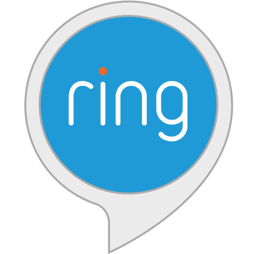
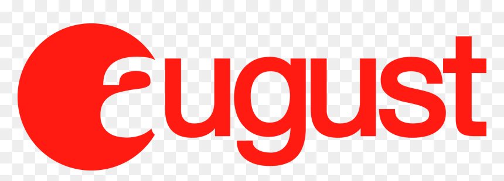

# **Capítulo II: Requirements Elicitation & Analysis**

## 2.1. Competidores.

<table>
    <thead>
        <tr>
            <th>Nombre del Competidor</th>
            <th>Descripción</th>
        </tr>
    </thead>
    <tbody>
        <tr>
            <td rowspan="2" align="center">
                
                 Ring (Amazon)
            </td>
            <td>Ring ofrece un sistema completo de seguridad para el hogar, incluyendo videoporteros y cámaras de seguridad conectadas. Está integrado con Alexa y los servicios de Amazon.</td>
        </tr>
        <tr>
            <td>Página web: <a href="https://ring.com" target="_blank">https://ring.com</a></td>
        </tr>
        <tr>
            <td rowspan="2" align="center">
                
                 Nest (Google)
            </td>
            <td>Nest ofrece un ecosistema de automatización del hogar con productos como cámaras, termostatos, sensores y sistemas de seguridad. Está fuertemente integrado con Google Home.</td>
        </tr>
        <tr>
            <td>Página web: <a href="https://store.google.com/us/category/connected_home" target="_blank">https://store.google.com/us/category/connected_home</a></td>
        </tr>
        <tr>
            <td rowspan="2" align="center">
                
                 August
            </td>
            <td>August es conocida por sus cerraduras inteligentes y soluciones de acceso sin llaves. Compatible con Alexa, Google Assistant y Siri para control remoto y acceso inteligente.</td>
        </tr>
               <tr>
            <td>Página web: <a href="https://august.com/" target="_blank">https://august.com</a></td>
        </tr>
    </tbody>
</table>

### 2.1.1. Análisis competitivo.

<table style="width: 100%;">
  <tr>
    <th colspan="6" style="padding: 8px; text-align: center;"> Competitive Analysis Landscape</th>
  </tr>
  <tr>
    <td>¿Por qué llevar a cabo este análisis?</td>
    <td colspan="5">Para identificar fortalezas, oportunidades y áreas de mejora frente a los competidores; posicionar mejor el producto FaceLoock en el mercado y tomar decisiones estratégicas de desarrollo, marketing y precios.
</td>
  </tr>
  <tr>
    <td colspan="2"></td>
  <td align="center"> </td>
  <td align="center"> </td>
  <td align="center"> </td>
  <td align="center"> </td>
  </tr>
<tr>
  <td rowspan="2" align="center">Perfil</td>
  <td align="center">Overview</td>
  <td>Sistema de seguridad inteligente con enfoque en videoporteros y cámaras conectadas, con fuerte integración en el ecosistema de Amazon y Alexa.</td>
  <td>Solución integral de domótica y seguridad, integrada completamente con Google Home, que incluye cámaras, sensores y automatización del hogar.</td>
  <td>Empresa especializada en cerraduras inteligentes enfocadas en accesos remotos sin llaves, con compatibilidad con Siri, Alexa y Google Assistant.</td>
  <td>Sistema de acceso residencial basado en reconocimiento facial, diseñado para ofrecer seguridad manos libres, especialmente para personas con movilidad reducida.</td>
</tr>
<tr>
  <td>Ventaja competitiva ¿Qué valor ofrece a los clientes?</td>
  <td>Integración nativa con Amazon, dispositivos múltiples, y monitoreo en tiempo real accesible desde cualquier lugar.</td>
  <td>Automatización total del hogar con inteligencia artificial, respaldado por la infraestructura de Google.</td>
  <td>Acceso sin llaves cómodo, instalación sencilla y control remoto seguro desde el smartphone.</td>
  <td>Acceso 100% biométrico sin contacto, pensado para usabilidad inclusiva y seguridad avanzada sin necesidad de llaves ni códigos.</td>
</tr>
 <tr>
  <td rowspan="2" align="center">Perfil de Marketing</td>
  <td>Mercado objetivo</td>
  <td>Propietarios de viviendas inteligentes, usuarios del ecosistema Amazon, y personas que buscan seguridad conectada.</td>
  <td>Usuarios de productos Google, hogares domóticos, early adopters tecnológicos.</td>
  <td>Usuarios urbanos, tecnófilos, anfitriones de alquiler vacacional.</td>
  <td>Personas con movilidad reducida, adultos mayores, familias que valoran accesibilidad e innovación en seguridad.</td>
</tr>
<tr>
  <td>Estrategias de marketing</td>
  <td>Integración con Amazon Prime, promociones en ecommerce, presencia fuerte en redes sociales y YouTube.</td>
  <td>Marketing digital integrado en Google Ads y YouTube, promociones en Google Store, influencers tech.</td>
  <td>Alianzas con Airbnb y Apple, marketing de producto simple, publicidad en redes.</td>
  <td>Campañas centradas en accesibilidad, ferias tecnológicas, demos en asociaciones de asistencia y canales sociales.</td>
</tr>

<tr>
  <td rowspan="3" align="center">Perfil del Producto</td>
  <td>Productos & Servicios</td>
  <td>Videoporteros, cámaras de seguridad, sensores de movimiento, app de control remoto.</td>
  <td>Cámaras Nest, sensores, termostatos inteligentes, app Nest, Nest Aware.</td>
  <td>Cerraduras inteligentes, sensores de puerta, teclados inalámbricos, app móvil.</td>
  <td>Dispositivo de reconocimiento facial, app de control, integración con asistentes y domótica.</td>
</tr>
<tr>
  <td>Precios & Costos</td>
  <td>$99–$349 + suscripciones mensuales desde $3</td>
  <td>$129–$399 + Nest Aware desde $6/mes</td>
  <td>$149–$250 por cerradura, sin suscripción obligatoria</td>
  <td>$120–$200 por dispositivo, sin suscripción obligatoria (estimado)</td>
</tr>
<tr>
  <td>Canales de distribución (Web y/o Móvil)</td>
  <td>Amazon, Web oficial, App (iOS/Android), tiendas físicas</td>
  <td>Google Store, Web oficial, App (iOS/Android), minoristas</td>
  <td>Apple Store, Amazon, Web oficial, App (iOS/Android)</td>
  <td>Web oficial, App (iOS/Android), asociaciones, tiendas aliadas</td>
</tr>

<tr>
  <td rowspan="4" align="center">Análisis SWOT</td>
  <td>Fortalezas</td>
  <td>Reconocimiento global, ecosistema Amazon, facilidad de uso</td>
  <td>Infraestructura de Google, IA integrada, diseño avanzado</td>
  <td>Instalación fácil, integración con múltiples asistentes, diseño moderno</td>
  <td>Innovación en accesibilidad, enfoque en biometría, uso manos libres</td>
</tr>
<tr>
  <td>Debilidades</td>
  <td>Problemas de privacidad, dependencia del ecosistema Amazon</td>
  <td>Costos elevados, dependencia del ecosistema Google</td>
  <td>Enfoque limitado al acceso, sin oferta integral de seguridad</td>
  <td>Marca nueva, poca visibilidad aún, sin historial de confianza</td>
</tr>
<tr>
  <td>Oportunidades</td>
  <td>Crecimiento del mercado smart home, expansión internacional</td>
  <td>Mejoras en IA, sinergia con otros dispositivos Google</td>
  <td>Alianzas con plataformas de alojamiento y empresas de seguridad</td>
  <td>Mercado no atendido (PMR), regulación que impulse accesibilidad</td>
</tr>
<tr>
  <td>Amenazas</td>
  <td>Competencia intensa, regulación sobre vigilancia</td>
  <td>Competencia directa con Amazon, saturación de mercado</td>
  <td>Competidores más grandes replicando su tecnología</td>
  <td>Copias de grandes marcas, barreras de entrada al retail</td>
</tr>
<table>

### 2.1.2. Estrategias y tácticas frente a competidores.

**Estrategias:**  
- **Diferenciación por accesibilidad biométrica:** Enfocar la propuesta de valor en el acceso facial sin contacto como una solución única frente a sistemas tradicionales basados en llaves, códigos o móviles.  
- **Segmentación en nichos desatendidos:** Atacar segmentos poco explotados por los grandes competidores, como personas con movilidad reducida, adultos mayores y familias con necesidades de accesibilidad.  
- **Innovación continua centrada en el usuario:** Iterar el producto con base en retroalimentación de usuarios reales, con mejoras funcionales y de UX que los gigantes no adaptan con rapidez.

**<strong>Tácticas:</strong>**  
- **Demostraciones en asociaciones y eventos de salud:** Presentar el producto en espacios donde los beneficios de accesibilidad y seguridad inclusiva tengan mayor impacto.  
- **Campañas de contenido educativo:** Crear contenido enfocado en explicar los riesgos de seguridad actuales y cómo FaceLoock los soluciona sin fricción.  
- **Alianzas estratégicas con organizaciones de asistencia:** Colaborar con entidades que trabajen con personas con discapacidad o adultos mayores para validar, distribuir y promover el producto.
