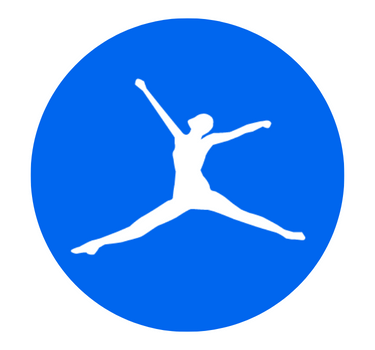
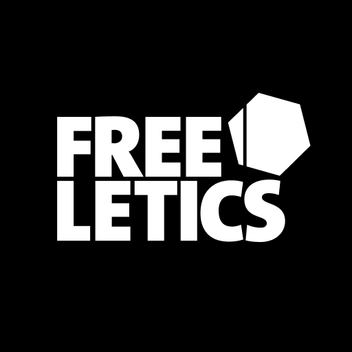
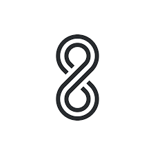

# **Capítulo II: Requirements Elicitation & Analysis**

## 2.1. Competidores.

<table> <thead> <tr> <th>Nombre del Competidor</th> <th>Descripción</th> </tr> </thead> 
    <tbody>
        <tr>
            <td rowspan align="center">MyFitnessPal
            <td>App de seguimiento nutricional y calorías con base de datos extensa, enfocada en usuarios que desean controlar su alimentación y objetivos de salud 
            Página web:<a href="https://www.myfitnesspal.com/es">https://www.myfitnesspal.com/es</a>
        </tr>
        <tr>
            <td align="center">Freeletics
            <td>Entrenamientos personalizados sin equipo, con enfoque en la flexibilidad del usuario y coaching mediante inteligencia artificial. 
            Página web:<a href="https://www.freeletics.com/es/"> https://www.freeletics.com/es/</a>
        </tr>
        <tr>
           <td rowspan align="center">8fit  
           <td>App que combina rutinas de ejercicio y planes alimenticios personalizados, con enfoque en principiantes y personas con tiempo limitado. 
           Página web:<a href="https://8fit.com/"> https://8fit.com/</a>
    </tbody>

 </table>

### 2.1.1. Análisis competitivo.

<table style="width: 100%;"> <tr> <th colspan="6" style="padding: 8px; text-align: center;">Competitive Analysis Landscape</th> </tr> <tr> <td>¿Por qué llevar a cabo este análisis?</td> <td colspan="5">Para identificar ventajas comparativas y oportunidades de posicionamiento de FitWise frente a otras aplicaciones de fitness, mejorando su estrategia de producto y marketing hacia usuarios que inician su camino hacia un estilo de vida saludable.</td> </tr>
 <tr> <td colspan="2"></td> <td align="center"><strong>MyFitnessPal</strong></td> <td align="center"><strong>Freeletics</strong>
 </td> <td align="center"><strong>8fit</strong></td> <td align="center"><strong>FitWise</strong></td> </tr> <tr> <td rowspan="2" align="center">Perfil</td> <td>Overview</td> <td>App veterana en control de calorías y macronutrientes, centrada en autogestión del usuario.</td> <td>Entrenamiento personalizado con IA y sin necesidad de equipo, ideal para rutinas en casa.</td> <td>Planes de fitness y nutrición en un mismo lugar, dirigido a personas ocupadas.</td> <td>Asistente personalizado para fitness y nutrición, con enfoque en personas sin experiencia previa ni conocimientos técnicos.</td> </tr> <tr> <td>Ventaja competitiva
¿Qué valor ofrece a los clientes?</td> <td>Base de datos alimenticia muy amplia, historial comprobado y comunidad activa.</td> <td>Enfoque motivacional, rutinas adaptativas, coach digital.</td> <td>Combinación de entrenamiento + alimentación con interfaz amigable para novatos.</td> <td>Personalización profunda según estilo de vida, metas, tiempo disponible y acompañamiento constante para empezar desde cero.</td> </tr> <tr> <td rowspan="2" align="center">Perfil de Marketing</td> <td>Mercado objetivo</td> <td>Usuarios con experiencia en dietas y fitness que desean control detallado.</td> <td>Personas motivadas que buscan progresar desde casa con estructura y motivación.</td> <td>Usuarios principiantes con poco tiempo y ganas de hábitos saludables.</td> <td>Personas que desean mejorar su salud pero no saben por dónde empezar; estilo de vida ocupado.</td> </tr> <tr> <td>Estrategias de marketing</td> <td>SEO, comunidad online, integración con otras apps (Strava, Fitbit), contenido de expertos.</td> <td>Publicidad digital con mensajes aspiracionales, storytelling de usuarios, retos en redes.</td> <td>Anuncios orientados a principiantes, recomendaciones en tiendas de apps, testimonios.</td> <td>Marketing educativo, redes sociales con enfoque motivacional, onboarding guiado y testimonios de transformación real.</td> </tr> <tr> <td rowspan="3" align="center">Perfil del Producto</td> <td>Productos & Servicios</td> <td>Seguimiento calórico, macros, planes de comida, escáner de código de barras.</td> <td>Rutinas HIIT, coaching digital, planes progresivos.</td> <td>Ejercicios y recetas personalizadas, rutinas breves.</td> <td>App web y móvil con planes dinámicos de alimentación y entrenamiento según objetivos, nivel y estilo de vida.</td> </tr> <tr> <td>Precios & Costos</td> <td>Gratuita con funciones premium desde $9.99/mes</td> <td>Suscripción mensual desde $12.99/mes</td> <td>Freemium con planes desde $7.50/mes</td> <td>Modelo freemium, suscripción desde $5.99/mes (estimado)</td> </tr> <tr> <td>Canales de distribución</td> <td>iOS, Android, Web, integraciones con dispositivos</td> <td>iOS, Android, Web</td> <td>iOS, Android</td> <td>iOS, Android, Web, campañas en redes, alianzas con gimnasios locales</td> </tr> <tr> <td rowspan="4" align="center">Análisis SWOT</td> <td>Fortalezas</td> <td>Gran base de usuarios, amplia data nutricional, experiencia acumulada</td> <td>Entrenamientos adaptables sin equipo, coaching motivacional</td> <td>Fácil de usar, buena combinación entre nutrición y ejercicio</td> <td>Enfoque empático, personalización real, solución integral para novatos</td> </tr> <tr> <td>Debilidades</td> <td>Curva de aprendizaje, no apta para principiantes sin guía</td> <td>Poca personalización en planes nutricionales</td> <td>Limitada en métricas y seguimiento profesional</td> <td>App nueva en el mercado, aún sin comunidad consolidada</td> </tr> <tr> <td>Oportunidades</td> <td>Mayor integración con wearables y servicios de salud</td> <td>Gamificación y expansión a wellness mental</td> <td>Expansión con coaches humanos o retos grupales</td> <td>Capturar segmento desatendido que busca guía inicial sin complicaciones</td> </tr> <tr> <td>Amenazas</td> <td>Competencia con apps más simples o gratuitas</td> <td>Dependencia de motivación del usuario</td> <td>Mercado saturado de apps similares</td> <td>Dificultad para diferenciarse frente a marcas ya posicionadas</td> </tr> </table>

### 2.1.2. Estrategias y tácticas frente a competidores.

**Estrategias:**  
- **Diferenciación por personalización y acompañamiento inicial:** Posicionar FitWise como la mejor opción para quienes quieren mejorar su salud pero no saben cómo empezar, con orientación guiada desde el día uno.  
- **Enfoque en usuarios con poco tiempo y sin experiencia previa:** Atacar el segmento que suele abandonar por falta de tiempo o conocimiento, ofreciendo planes realistas y adaptables.  
- **Mejora continua centrada en la experiencia del usuario:** Iterar constantemente en base al feedback real, simplificando la interfaz, ajustando planes y mejorando la motivación del usuario con seguimiento activo.

**Tácticas:**  
- **Campañas de retos “Empieza sin presión”:** Lanzar desafíos para nuevos usuarios, como “7 días para comenzar” con mensajes motivacionales y recompensas digitales.  
- **Contenido educativo y emocional:** Crear publicaciones, videos y artículos que expliquen conceptos básicos de salud, alimentación y ejercicio, sin tecnicismos, con ejemplos de la vida real.  
- **Alianzas con profesionales y centros de salud:** Colaborar con nutricionistas, entrenadores personales y psicólogos para validar el contenido de la app, brindar webinars y generar confianza.

