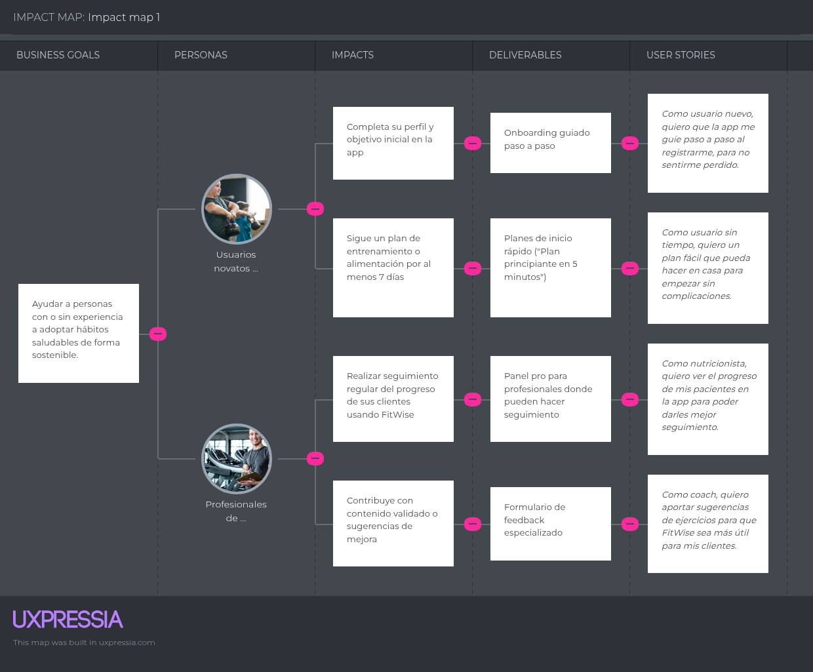

# Capítulo III: Requirements Specification
## 3.3. Impact Mapping.

l Impact Mapping de FitWise es una herramienta estratégica que alinea los objetivos de negocio con los comportamientos deseados en sus principales usuarios: personas sin experiencia en fitness y profesionales de la salud. La técnica permite identificar los impactos necesarios, los entregables que los habilitan y las historias de usuario que aseguran una implementación centrada en la experiencia. Así, FitWise busca facilitar el inicio de hábitos saludables sostenibles y ofrecer herramientas útiles para el seguimiento y mejora continua, fomentando la adopción de la app como un aliado diario en el bienestar personal y profesional.

  