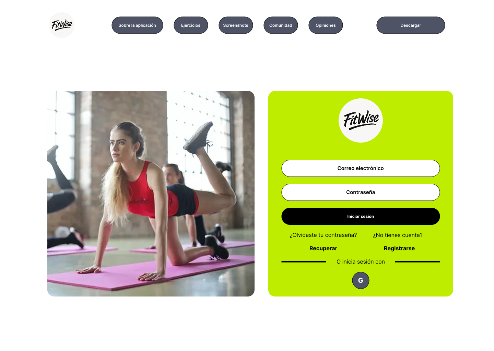

### 4.6. Web Applications UX/UI Design
En esta sección, te presentamos nuestra propuesta visual y de interacción para las aplicaciones que son el núcleo de la experiencia de usuario en nuestros productos digitales. Con un enfoque fresco y detallado en el diseño UX/UI, buscamos crear interfaces intuitivas y atractivas que mejoren la usabilidad y proporcionen una experiencia satisfactoria. Cada componente del diseño ha sido cuidadosamente elaborado para garantizar una interacción fluida y coherente. A continuación, compartimos nuestra propuesta para las aplicaciones, resaltando los aspectos visuales y de interacción que hacen única la experiencia del usuario
#### 4.6.1. Web Applications Wireframes
- Boceto de Log-in:  

- Boceto Sign-in:  

- Boceto de Home rutinas:

- Boceto de Home Dietas:

- Boceto de Home Perfil:

- Boceto de Home Comunidad:

- Boceto de Home progreso:

#### 4.6.2. Web Applications Wireflow Diagrams

#### User goal: 

Registrarse en la aplicación

Como usuario, quiero registrarme en la aplicación.

**Task Flow:**
- El usuario se encuentra en el login.
- El usuario se dirige a "Sign Up".
- El usuario rellena el formulario.
- El usuario crea su cuenta.

---

#### User goal: 

Agregar una rutina

Como usuario, quiero agregar una rutina en la aplicación.

**Task Flow:**
- El usuario inicia sesión.
- El usuario se dirige a la sección de rutinas.
- El usuario rellena los datos del formulario.
- El usuario crea la rutina.

---

#### User goal: 

Agregar una dieta

Como usuario, quiero agregar una dieta en la aplicación.

**Task Flow:**
- El usuario inicia sesión.
- El usuario se dirige a la sección de dieta.
- El usuario rellena los datos del formulario.
- El usuario crea la dieta.

---

#### User goal: 

Actualizar perfil

Como usuario, quiero actualizar mi perfil en la aplicación.

**Task Flow:**
- El usuario inicia sesión.
- El usuario se dirige a la sección de perfil.
- El usuario rellena los datos del formulario.
- El usuario actualiza sus datos.

---

#### User goal: 

Seleccionar rutina

Como usuario, quiero seleccionar una rutina de la comunidad en la aplicación.

**Task Flow:**
- El usuario inicia sesión.
- El usuario se dirige a la sección de rutina.
- El usuario selecciona una rutina de la lista.
- El usuario selecciona el intervalo de tiempo a cumplir.
- El usuario se inscribe aceptando el objetivo de la rutina.

---

#### User goal: 

Seleccionar dieta

Como usuario, quiero seleccionar una dieta de la comunidad en la aplicación.

**Task Flow:**
- El usuario inicia sesión.
- El usuario se dirige a la sección de dieta.
- El usuario selecciona una dieta de la lista.
- El usuario selecciona el intervalo de tiempo a cumplir.
- El usuario se inscribe aceptando el objetivo de la dieta.

---

#### 4.6.3. Web Applications Mock-ups

- **Boceto de Login:**  

- **Boceto de Sign Up:**  

- **Boceto de Home - Rutinas:**  

- **Boceto de Home - Dietas:**  

- **Boceto de Home - Perfil:**  

- **Boceto de Home - Comunidad:**  

- **Boceto de Home - Progreso:**  

#### 4.6.4. Web Applications User Flow Diagrams

#### User Flow Nº1

**a) User Goal:**  
Registrarse en la aplicación.  
Como usuario, quiero registrarme en la aplicación.

**b) Task Flow:**
- El usuario se encuentra en el login.
- El usuario se dirige a "Sign Up".
- El usuario rellena el formulario.
- El usuario crea su cuenta.

**c) User Flow:**  

---

#### User Flow Nº2

**a) User Goal:**  
Agregar una rutina.  
Como usuario, quiero agregar una rutina en la aplicación.

**b) Task Flow:**
- El usuario inicia sesión.
- El usuario se dirige a la sección de rutinas.
- El usuario rellena los datos del formulario.
- El usuario crea la rutina.

**c) User Flow:**  

---

#### User Flow Nº3

**a) User Goal:**  
Agregar una dieta.  
Como usuario, quiero agregar una dieta en la aplicación.

**b) Task Flow:**
- El usuario inicia sesión.
- El usuario se dirige a la sección de dieta.
- El usuario rellena los datos del formulario.
- El usuario crea la dieta.

**c) User Flow:**  

---

#### User Flow Nº4

**a) User Goal:**  
Actualizar perfil.  
Como usuario, quiero actualizar mi perfil en la aplicación.

**b) Task Flow:**
- El usuario inicia sesión.
- El usuario se dirige a la sección de perfil.
- El usuario rellena los datos del formulario.
- El usuario actualiza sus datos.

**c) User Flow:**  

---

#### User Flow Nº5

**a) User Goal:**  
Seleccionar rutina.  
Como usuario, quiero seleccionar una rutina de la comunidad en la aplicación.

**b) Task Flow:**
- El usuario inicia sesión.
- El usuario se dirige a la sección de rutina.
- El usuario selecciona una rutina de la lista.
- El usuario selecciona el intervalo de tiempo a cumplir.
- El usuario se inscribe aceptando el objetivo de la rutina.

**c) User Flow:**  

---

#### User Flow Nº6

**a) User Goal:**  
Seleccionar dieta.  
Como usuario, quiero seleccionar una dieta de la comunidad en la aplicación.

**b) Task Flow:**
- El usuario inicia sesión.
- El usuario se dirige a la sección de dieta.
- El usuario selecciona una dieta de la lista.
- El usuario selecciona el intervalo de tiempo a cumplir.
- El usuario se inscribe aceptando el objetivo de la dieta.

**c) User Flow:**  

---

## 4.7. Applications Prototyping.

En el desarrollo de nuestra aplicación web, hemos priorizado la creación de una experiencia simple, funcional y motivadora para los usuarios interesados en mejorar su salud física a través de rutinas de ejercicios y planes alimenticios personalizados. A continuación, se describen las principales funcionalidades prototipadas:

**1. Registro en la Aplicación:** 
El proceso de registro es rápido e intuitivo. El usuario puede crear una cuenta mediante correo electrónico o iniciar sesión con google.

**2. Agregar una rutina o dieta:** 
El usuario puede cargar sus propias rutinas de ejercicios o planes de alimentacións. Se pueden agregar descripciones, tiempos, niveles de dificultad y objetivos específicos (por ejemplo, pérdida de peso, ganancia muscular, mantenimiento).

**3. Seleccionar una rutina o dieta:** 
El usuario accede a un catálogo organizado por objetivos y nivel. Al seleccionar una rutina o dieta, se despliega una vista detallada con días, horarios, recetas o ejercicios.

**4. Editar Perfil:**  Durante este proceso, se recopilan datos relevantes como edad, peso, objetivos y nivel de experiencia para personalizar la experiencia desde el inicio.

**5. Ver progresos o logros de la comunidad:** 
El usuario puede explorar una sección comunitaria donde ve los logros de otros miembros, lo que crea un ambiente motivacional.

  Enlace al video: [https://upcedupe-my.sharepoint.com/:v:/g/personal/u202222942_upc_edu_pe/ESTK0xG2xV5Aut6tKahxD84BAMaj_tVt1y_6GQJg4hiw4Q?nav=eyJyZWZlcnJhbEluZm8iOnsicmVmZXJyYWxBcHAiOiJPbmVEcml2ZUZvckJ1c2luZXNzIiwicmVmZXJyYWxBcHBQbGF0Zm9ybSI6IldlYiIsInJlZmVycmFsTW9kZSI6InZpZXciLCJyZWZlcnJhbFZpZXciOiJNeUZpbGVzTGlua0NvcHkifX0&e=cKimYd](https://upcedupe-my.sharepoint.com/:v:/g/personal/u202222942_upc_edu_pe/ESTK0xG2xV5Aut6tKahxD84BAMaj_tVt1y_6GQJg4hiw4Q?nav=eyJyZWZlcnJhbEluZm8iOnsicmVmZXJyYWxBcHAiOiJPbmVEcml2ZUZvckJ1c2luZXNzIiwicmVmZXJyYWxBcHBQbGF0Zm9ybSI6IldlYiIsInJlZmVycmFsTW9kZSI6InZpZXciLCJyZWZlcnJhbFZpZXciOiJNeUZpbGVzTGlua0NvcHkifX0&e=cKimYd)

